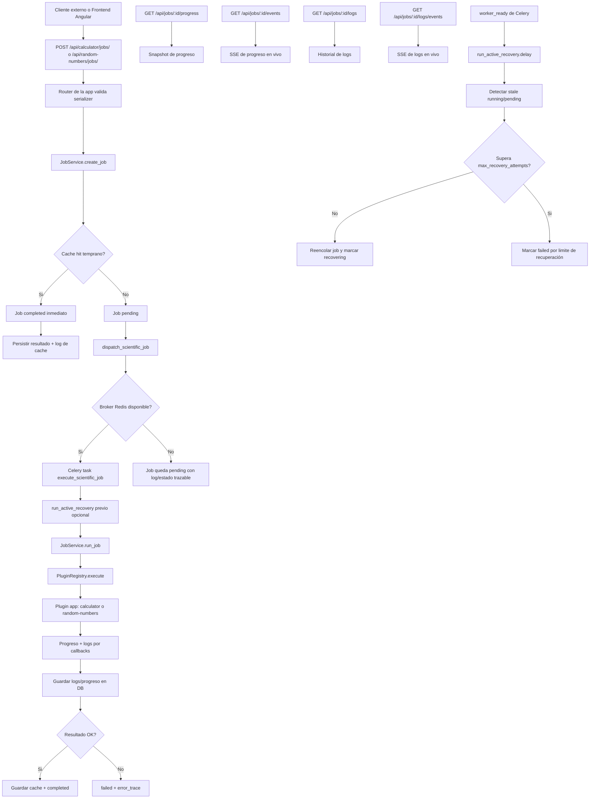

# Chemistry Apps

Plataforma científica modular con backend Django y frontend Angular para ejecutar jobs asíncronos tipados, con observabilidad (progreso + logs), cache por hash y contratos OpenAPI.

## Objetivos técnicos

- Mantener arquitectura por capas y responsabilidades separadas.
- Exponer contratos OpenAPI completos y tipados para frontend.
- Permitir ejecución desacoplada por plugins científicos.
- Soportar recuperación activa de jobs interrumpidos.
- Evitar acoplar UI a código autogenerado de OpenAPI.

## Arquitectura de alto nivel

Flujo backend:

1. Router recibe request HTTP y valida serializer.
2. Service orquesta negocio y transiciones de estado.
3. Ports definen contratos de infraestructura.
4. Adapters implementan persistencia/progreso/logs.
5. Processing ejecuta plugin registrado.
6. Tasks Celery ejecutan jobs en background y recovery.

Flujo frontend:

1. Wrapper API en core/api encapsula cliente OpenAPI generado.
2. Facades/workflows gestionan estado de UI y streams SSE.
3. Componentes renderizan formularios, progreso, resultados, logs e historial.

## Flujo de tareas (API, apps externas y recuperación)

Este es el flujo real implementado para ejecutar tareas científicas de apps (calculator/random-numbers), tanto desde frontend como desde clientes externos (Postman, curl, otro servicio HTTP):



### Ejecución por API (incluye clientes externos)

Los endpoints de apps científicas están listos para consumo por frontend y por aplicaciones externas:

1. Crear job de calculadora: `POST /api/calculator/jobs/`
2. Crear job de random-numbers: `POST /api/random-numbers/jobs/`
3. Consultar un job específico de app: `GET /api/calculator/jobs/{id}/` o `GET /api/random-numbers/jobs/{id}/`
4. Consultar job genérico y observabilidad: `GET /api/jobs/{id}/`, `GET /api/jobs/{id}/progress/`, `GET /api/jobs/{id}/events/`, `GET /api/jobs/{id}/logs/`, `GET /api/jobs/{id}/logs/events/`

Ejemplo mínimo con cliente externo (curl):

```bash
curl -X POST "http://localhost:8000/api/calculator/jobs/" \
  -H "Content-Type: application/json" \
  -d '{
    "version": "1.0",
    "op": "mul",
    "a": 6,
    "b": 7
  }'
```

### Recuperación activa implementada

La recuperación ya está implementada y operativa en el núcleo:

1. Se ejecuta al levantar el worker (`worker_ready`) y también antes de procesar cada tarea Celery.
2. Detecta jobs stale (`running` y opcionalmente `pending`) usando `JOB_RECOVERY_STALE_SECONDS`.
3. Reencola jobs con intento disponible y marca trazabilidad de recuperación.
4. Si un job supera `JOB_RECOVERY_MAX_ATTEMPTS`, se marca `failed` con razón explícita.
5. Toda la trazabilidad queda persistida en progreso, logs y `error_trace`.

### Variables de settings relevantes para operación externa y recovery

1. `DJANGO_ALLOWED_HOSTS`: hosts permitidos por Django para acceso HTTP.
2. `DJANGO_DEBUG_ALLOW_ALL_HOSTS`: en `DEBUG=true`, permite `*` para facilitar pruebas desde IP/LAN.
3. `ENABLE_CORS`: habilita `django-cors-headers` cuando se requiere frontend en otro origen.
4. `CORS_ALLOWED_ORIGINS` y `CORS_ALLOWED_ORIGIN_REGEXES`: controlan orígenes permitidos para clientes web externos.
5. `CSRF_TRUSTED_ORIGINS`: orígenes de confianza para peticiones con credenciales.
6. `JOB_RECOVERY_ENABLED`: habilita o deshabilita recuperación automática.
7. `JOB_RECOVERY_STALE_SECONDS`: define a partir de cuándo un job se considera stale.
8. `JOB_RECOVERY_MAX_ATTEMPTS`: límite de reintentos de recuperación por job.
9. `JOB_RECOVERY_INCLUDE_PENDING`: incluye jobs `pending` stale en recuperación activa.

## Estado funcional actual

- Jobs genéricos en core: create/list/retrieve/progress/events/logs.
- Apps científicas activas: calculator y random-numbers.
- Recovery activo con heartbeat y reencolado automático.
- Logs de job persistidos + stream SSE de logs.
- Frontend con monitor global de jobs y visor de logs.

## Capacidad de ciclo de vida (importante)

- Implementado hoy:
1. pending/running/completed/failed.
2. Etapas finas: pending/queued/running/recovering/caching/completed/failed.
3. Recovery automático por stale jobs.
4. Heartbeats de ejecución.
5. Retries de recuperación con límite.

- No implementado hoy:
1. Endpoints de pause/resume/cancel.
2. Estado paused/cancelled en modelo core.

Más abajo se incluye blueprint completo para agregar pausa cooperativa sin romper la arquitectura.

## Requisitos del entorno

- Python 3.11+ (recomendado 3.12).
- Django 6.x.
- Node.js + npm.
- Redis o Valkey para cola Celery.

## Arranque local correcto

### Backend

```bash
cd backend
python -m venv venv
source venv/bin/activate
pip install -r requirements.txt
cp .env.example .env
python manage.py migrate
python manage.py up
```

Notas:

- manage.py up levanta runserver + worker Celery y, si hace falta, intenta iniciar redis-server o valkey-server.
- Si deseas solo API sin Celery: python manage.py up --without-celery.

### Frontend

```bash
cd frontend
npm install
npm start
```

## OpenAPI y cliente Angular

Comando oficial desde raíz del repositorio:

```bash
python scripts/create_openapi.py
```

Si estás dentro de backend:

```bash
cd ..
python scripts/create_openapi.py
```

Qué hace el script:

1. Valida entorno Python activo.
2. Valida npm y dependencias frontend.
3. Genera backend/openapi/schema.yaml.
4. Ejecuta npm run api:generate para regenerar frontend/src/app/core/api/generated.

Regla clave:

- No modificar manualmente frontend/src/app/core/api/generated.
- Toda modificación de contrato se hace en backend y luego se regenera.

## Verificación continua recomendada

```bash
cd backend && ./venv/bin/python manage.py check
cd backend && ./venv/bin/python manage.py test apps.core.tests apps.calculator.tests apps.random_numbers.tests
cd frontend && npm test -- --watch=false
cd frontend && npm run build
```

## Auditoría técnica (resumen ejecutado)

Validaciones realizadas en el estado actual:

1. Django system check: OK.
2. Tests backend (core/calculator/random_numbers): OK.
3. Tests frontend: OK.
4. Build frontend: OK con warnings de presupuesto CSS en componentes grandes.
5. Búsqueda de placeholders y suppressions:
5.1. No se detectaron TODO/FIXME funcionales en código fuente principal.
5.2. noqa existente en apps.py de calculator/random_numbers es intencional para auto-registro del plugin.

Riesgo técnico pendiente:

- Los componentes calculator, random-numbers y jobs-monitor exceden presupuesto de estilos por componente. No rompe ejecución, pero conviene extraer estilos comunes para reducir tamaño y duplicación.

## Inventario documentado de archivos fuente

### Raíz

- README.md: documentación principal del proyecto.
- scripts/create_openapi.py: generación end-to-end OpenAPI + cliente Angular.

### Backend base

- backend/manage.py: entrypoint Django.
- backend/requirements.txt: dependencias Python.
- backend/.env.example: variables de entorno de referencia.
- backend/config/settings.py: configuración Django/Celery/DRF.
- backend/config/urls.py: rutas globales API y docs.
- backend/config/celery.py: inicialización de Celery y hooks de worker.
- backend/config/asgi.py, backend/config/wsgi.py, backend/config/__init__.py: bootstrap de runtime.

### Backend core (núcleo transversal)

- backend/apps/core/apps.py: AppConfig de core.
- backend/apps/core/definitions.py: constantes de rutas/estados permitidos.
- backend/apps/core/types.py: tipos estrictos de dominio (JSONMap, stages, logs).
- backend/apps/core/models.py: entidades ScientificJob, ScientificCacheEntry, ScientificJobLogEvent.
- backend/apps/core/schemas.py: serializers de requests/responses de core.
- backend/apps/core/ports.py: puertos de dominio desacoplados.
- backend/apps/core/adapters.py: implementación Django de puertos.
- backend/apps/core/factory.py: wiring de service + puertos.
- backend/apps/core/services.py: casos de uso principales del dominio.
- backend/apps/core/processing.py: PluginRegistry y ejecución de plugins.
- backend/apps/core/cache.py: utilidades de hash/cache.
- backend/apps/core/tasks.py: tasks Celery (ejecución + recovery).
- backend/apps/core/routers.py: JobViewSet, SSE de progreso y logs.
- backend/apps/core/tests.py: pruebas de integración y servicios core.
- backend/apps/core/app_registry.py: validación de unicidad de apps científicas.
- backend/apps/core/migrations/0001_initial.py: baseline único de esquema core.
- backend/apps/core/management/commands/up.py: comando de desarrollo para levantar stack local.

### Backend calculator

- backend/apps/calculator/apps.py: registro de app y plugin.
- backend/apps/calculator/definitions.py: constantes de ruta/plugin/version.
- backend/apps/calculator/tests.py: pruebas de contrato y flujo.

### Backend random_numbers

- backend/apps/random_numbers/apps.py: registro de app y plugin.
- backend/apps/random_numbers/definitions.py: constantes de ruta/plugin/version.
- backend/apps/random_numbers/types.py: tipos de entrada/salida.
- backend/apps/random_numbers/schemas.py: contratos OpenAPI de random_numbers.
- backend/apps/random_numbers/plugin.py: generación por lotes con semilla, progreso y logs.
- backend/apps/random_numbers/routers.py: endpoints de random_numbers.
- backend/apps/random_numbers/tests.py: pruebas de flujo y validaciones.

### OpenAPI backend

- backend/openapi/schema.yaml: contrato consolidado para generación de cliente.

### Frontend base

- frontend/src/main.ts: bootstrap Angular.
- frontend/src/index.html: host HTML.
- frontend/src/styles.scss: estilos globales.
- frontend/src/environments/environment.model.ts: tipo de environment.
- frontend/src/environments/environment.ts: config dev.
- frontend/src/environments/environment.production.ts: config prod.

### Frontend app shell

- frontend/src/app/app.ts: root component.
- frontend/src/app/app.html: layout principal.
- frontend/src/app/app.scss: estilos del shell.
- frontend/src/app/app.config.ts: providers globales.
- frontend/src/app/app.routes.ts: rutas de navegación.
- frontend/src/app/app.spec.ts: tests básicos del shell.

### Frontend core shared

- frontend/src/app/core/shared/constants.ts: constantes globales (incluye API_BASE_URL).
- frontend/src/app/core/shared/scientific-apps.config.ts: catálogo de apps navegables.

### Frontend core API

- frontend/src/app/core/api/jobs-api.service.ts: wrapper estable sobre cliente generado.
- frontend/src/app/core/application/calculator-workflow.service.ts: flujo de calculadora.
- frontend/src/app/core/application/random-numbers-workflow.service.ts: flujo random-numbers.
- frontend/src/app/core/application/jobs-monitor.facade.service.ts: estado y filtros del monitor.
### Frontend componentes de dominio

- frontend/src/app/apps-hub/apps-hub.component.ts: hub de acceso a apps.
- frontend/src/app/calculator/calculator.component.ts: UI calculadora.
- frontend/src/app/random-numbers/random-numbers.component.ts: UI random-numbers.
- frontend/src/app/jobs-monitor/jobs-monitor.component.ts: monitor global + visor de logs.

## Reglas de diseño para mantener calidad

1. No duplicar lógica entre routers.
2. Mantener validación de contrato en serializers.
3. Mantener lógica de negocio en services/plugins, no en routers.
4. Usar nombres de variables descriptivos en inglés y comentarios aclaratorios en español.
5. Evitar dependencias no necesarias.
6. Cubrir con tests cualquier cambio funcional.
7. No acoplar componentes al cliente generado: usar wrappers/facades.

Sección solicitada para implementar apps con input/output, errores, recuperación y pausa cooperativa.

### 1. Definir alcance de la app

Antes de codificar, especifica:

1. Caso de uso científico.
2. Entrada tipada mínima y opcional.
3. Salida tipada esperada.
4. Errores de dominio esperados.
5. Si requiere ejecución larga por lotes.

### 2. Crear estructura de archivos backend

Ejemplo app llamada kinetics:

```text
backend/apps/kinetics/
  __init__.py
  apps.py
  definitions.py
  types.py
  schemas.py
  plugin.py
  routers.py
  tests.py
```

### 3. Definir constants y tipos estrictos

En definitions.py:

1. PLUGIN_NAME.
2. APP_ROUTE_PREFIX.
3. APP_API_BASE_PATH.
4. DEFAULT_ALGORITHM_VERSION.

En types.py:

1. TypedDict para input.
2. TypedDict para output.
Debe incluir:

1. Serializer de creación con validaciones de negocio.
2. Serializer de output tipado.
3. Serializer de respuesta job de la app.
4. Ejemplos realistas en OpenApiExample para request y response.

### 5. Implementar plugin con observabilidad

Recomendación de firma:

```python
def kinetics_plugin(
    parameters: JSONMap,
    progress_callback: PluginProgressCallback,
    log_callback: PluginLogCallback | None = None,
) -> JSONMap:
    ...
```

Buenas prácticas:

1. Validar input al inicio y fallar con ValueError específico.
2. Emitir logs estructurados por etapas.
3. Emitir progreso incremental coherente.
4. Evitar efectos secundarios irreversibles por iteración.

### 6. Manejo de errores recomendado

1. Capturar errores esperables (ValueError, URLError, etc.).
2. Registrar log warning/error con contexto.
3. Propagar excepción clara para que core marque failed con error_trace.

En core ya existe:

1. Finalización failed con progreso terminal.
2. Persistencia de error_trace.
3. Logs de runtime y plugin.

### 7. Recuperación activa (ya soportada por core)

La app nueva debe ser compatible con recovery sin cambios extra si usa el flujo estándar.

Puntos claves:

1. Jobs en running/pending stale se reevalúan automáticamente.
2. Heartbeat se actualiza al publicar progreso.
3. Si se excede max_recovery_attempts, el job queda failed con trazabilidad.

### 8. Pausa cooperativa (blueprint recomendado)

Estado actual: core no expone aún endpoints pause/resume/cancel.

Estrategia recomendada para implementar pausa sin romper arquitectura:

1. Extender core/types.py con estados paused/cancelled y snapshots de control.
2. Extender models.py con banderas de control (is_pause_requested, is_cancel_requested).
3. Añadir acciones en core/routers.py: pause, resume, cancel.
4. Exponer en services.py transiciones válidas de estado.
5. En plugin, entre iteraciones largas:
5.1. Consultar callback o estado de control.
5.2. Guardar checkpoint de avance.
5.3. Si pause, finalizar ciclo en estado paused sin perder progreso.
6. En resume, continuar desde checkpoint.

Mientras se implementa lo anterior, usar recuperación activa para resiliencia ante interrupciones.

### 9. Registrar app y rutas

1. En apps.py registrar ScientificAppDefinition en ready().
2. En urls.py agregar router de la nueva app.
3. En settings.py incluir app en INSTALLED_APPS.

### 10. Crear pruebas completas

Mínimo:

1. Test de serializer (input válido/inválido).
2. Test de plugin (resultado esperado y errores).
3. Test de router create/retrieve.
4. Test de progreso/logs.
5. Test de recovery para jobs stale.

### 11. Regenerar OpenAPI y frontend

```bash
python scripts/create_openapi.py
```

### 12. Integrar frontend sin acoplarse al generado

1. Actualizar wrapper en core/api/jobs-api.service.ts o crear wrapper específico.
2. Crear workflow/facade para estado de formulario, progreso, logs e historial.
3. Crear componente visual desacoplado.
4. Añadir ruta y entrada en scientific-apps.config.ts.
5. Cubrir con tests unitarios del workflow/facade.

## Checklist final para aceptar una app nueva

1. Contrato OpenAPI completo con ejemplos reales.
2. Tipado estricto sin Any ni colecciones no tipadas.
3. Logs estructurados y progreso incremental.
4. Manejo de errores específico.
5. Compatibilidad con recovery core.
6. Pruebas backend y frontend en verde.
7. Build frontend en verde.
8. Sin edición manual de código generado.
