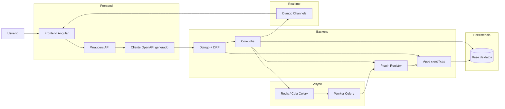
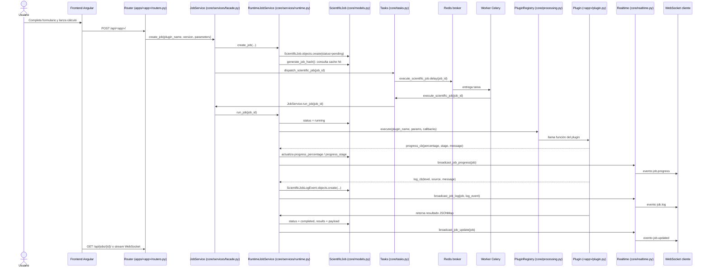
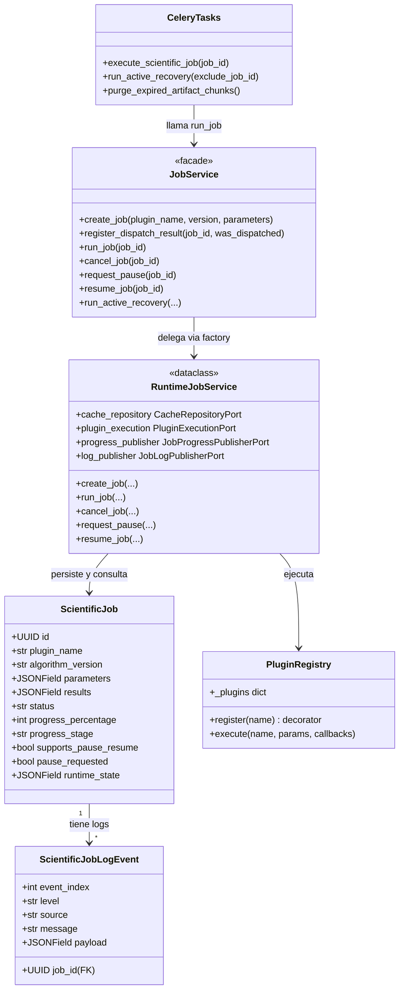
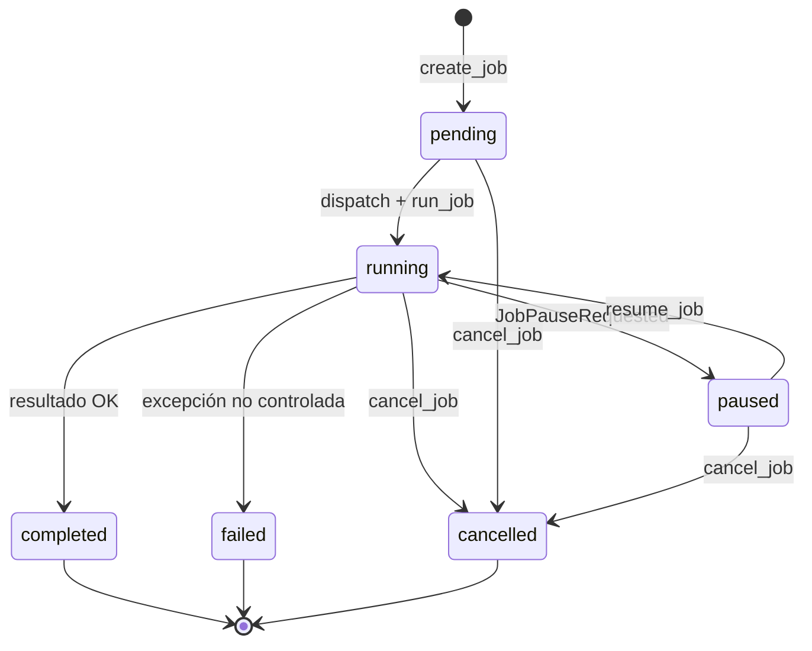
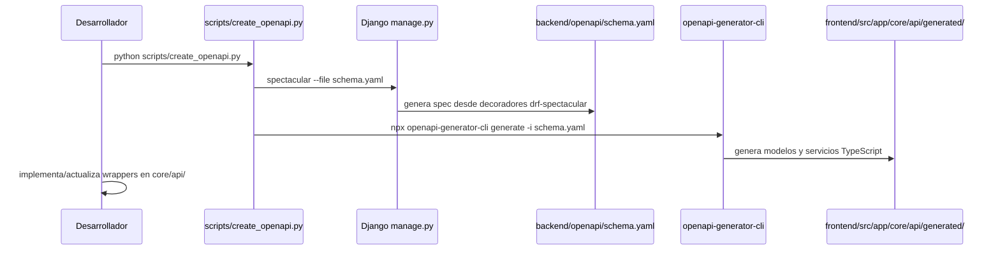

# Chemistry Apps

Repositorio monolítico para aplicaciones científicas de química. El backend en Django orquesta jobs asíncronos reproducibles y el frontend en Angular consume los contratos HTTP generados desde OpenAPI. Cada capacidad científica vive como un plugin independiente que se integra al core sin modificarlo.

---

## Tabla de contenidos

1. [Requisitos del sistema](#1-requisitos-del-sistema)
2. [Estructura del repositorio](#2-estructura-del-repositorio)
3. [Arquitectura general](#3-arquitectura-general)
4. [Ciclo de vida de un job](#4-ciclo-de-vida-de-un-job)
5. [Core del backend](#5-core-del-backend)
6. [Sistema de plugins](#6-sistema-de-plugins)
7. [Apps científicas](#7-apps-científicas)
8. [Frontend Angular](#8-frontend-angular)
9. [Realtime y WebSocket](#9-realtime-y-websocket)
10. [Sistema de caché determinista](#10-sistema-de-caché-determinista)
11. [Artefactos de entrada](#11-artefactos-de-entrada)
12. [Inicio rápido local](#12-inicio-rápido-local)
13. [Docker Compose](#13-docker-compose)
14. [Flujo OpenAPI](#14-flujo-openapi)
15. [CI/CD y despliegue](#15-cicd-y-despliegue)
16. [Calidad de código y SonarQube](#16-calidad-de-código-y-sonarqube)
17. [Agregar una nueva app científica](#17-agregar-una-nueva-app-científica)
18. [Convenciones del proyecto](#18-convenciones-del-proyecto)

---

## 1) Requisitos del sistema

| Herramienta | Versión mínima | Uso |
|---|---|---|
| Python | 3.12 | Runtime del backend |
| Django | 6.x | Framework web y ORM |
| Node.js | 20 | Compilación y servidor de desarrollo frontend |
| npm | 11 | Gestión de paquetes frontend |
| Redis | 7 | Broker de Celery y backend de resultados |
| Daphne | — | Servidor ASGI para HTTP + WebSocket en producción |

En desarrollo local se pueden levantar todos los servicios con Docker Compose o bien de forma nativa con un Redis externo.

---

## 2) Estructura del repositorio

```
chemistry-apps/
├── backend/               # Django 6, DRF, Celery, Channels
│   ├── apps/
│   │   ├── core/          # Infraestructura transversal de jobs
│   │   ├── calculator/    # Plugin aritmético de referencia
│   │   ├── random_numbers/
│   │   ├── molar_fractions/
│   │   ├── tunnel/
│   │   ├── easy_rate/
│   │   ├── marcus/
│   │   ├── smileit/
│   │   ├── sa_score/
│   │   └── toxicity_properties/
│   ├── config/            # Settings, urls, celery, asgi, wsgi
│   └── libs/              # Librerías científicas internas
│       ├── gaussian_log_parser/
│       ├── admet_ai/
│       ├── ambit/
│       ├── brsascore/
│       └── rdkit_sa/
├── frontend/              # Angular 21, standalone components
│   └── src/app/
│       ├── core/          # API wrappers, servicios, tipos
│       ├── jobs-monitor/  # Monitor global de jobs
│       ├── apps-hub/      # Catálogo navegable de apps
│       ├── calculator/
│       ├── random-numbers/
│       ├── molar-fractions/
│       ├── tunnel/
│       ├── easy-rate/
│       ├── marcus/
│       ├── smileit/
│       ├── sa-score/
│       └── toxicity-properties/
├── scripts/               # Generación OpenAPI y reportes de calidad
├── deprecated/            # Código histórico fuera de uso
└── tools/                 # Runtimes Java para librerías externas
```

La carpeta `deprecated/` contiene código anterior sin uso activo. En documentación antigua puede aparecer como `legacy/`.

---

## 3) Arquitectura general

El sistema está dividido en cuatro capas con responsabilidades claras:



**Capa de presentación**: Angular con lazy loading por ruta. Cada app científica es un componente standalone que únicamente conoce los tipos del cliente generado y los servicios de aplicación de `core/api/`.

**Capa de contrato HTTP**: El cliente OpenAPI se genera automáticamente desde `backend/openapi/schema.yaml`. Los wrappers en `frontend/src/app/core/api/` son la capa estable que protege los componentes de cambios directos en el código generado.

**Capa de orquestación**: El core de Django registra, persiste y coordina el ciclo de vida completo de los jobs. Se encarga de trazabilidad, estados, progreso, logs, caché y recuperación activa. Nunca contiene lógica científica.

**Capa de ejecución**: Los workers Celery ejecutan los plugins en segundo plano. Cada plugin es una función pura registrada en `PluginRegistry` que recibe `JSONMap` y retorna `JSONMap`.

---

## 4) Ciclo de vida de un job



### Estados del job

| Estado | Descripción |
|---|---|
| `pending` | Job creado, esperando ser encolado |
| `running` | Worker ejecutando el plugin |
| `paused` | Plugin pausado por solicitud cooperativa |
| `completed` | Ejecución terminada con resultados |
| `failed` | Error durante la ejecución del plugin |
| `cancelled` | Cancelado manualmente desde la UI |

### Resiliencia ante fallos del broker

Si Redis no está disponible cuando el router intenta encolar, `dispatch_scientific_job` captura `OperationalError` y `RedisConnectionError` sin romper la respuesta HTTP. El job queda en estado `pending` con mensaje de progreso observable. La tarea periódica `run_active_recovery` detecta jobs huérfanos y los re-encola cuando el broker vuelve a estar disponible.

---

## 5) Core del backend

El directorio `backend/apps/core/` es el corazón del sistema. Contiene toda la infraestructura transversal que reutilizan todas las apps científicas.

### Modelo principal: `ScientificJob`

Definido en `backend/apps/core/models.py`. Campos clave:

```
id                  UUID primario, generado automáticamente
plugin_name         Nombre del plugin ejecutado
algorithm_version   Versión del algoritmo para invalidación de caché
status              pending / running / paused / completed / failed / cancelled
parameters          JSONField con los parámetros de entrada
results             JSONField con el payload de salida
error_trace         Traza de error si el job falló
job_hash            SHA-256 del job para cache lookup
cache_hit           True si el resultado se sirvió desde caché
progress_percentage Entero 0-100
progress_stage      pending / queued / running / paused / caching / completed / failed
progress_message    Mensaje corto legible del estado actual
progress_event_index Contador incremental de eventos emitidos
supports_pause_resume Marca si el plugin soporta pausa cooperativa
pause_requested     Señal de control para solicitar pausa desde la UI
runtime_state       JSONField para checkpoint de reanudación
```

El modelo `ScientificJobLogEvent` almacena cada evento de log con nivel (`info/warning/error/debug`), fuente, mensaje y payload JSON opcional.

El modelo `ScientificJobInputArtifact` y `ScientificJobInputArtifactChunk` persisten los archivos de entrada en la base de datos para trazabilidad completa y reintentos reproducibles.

### Diagrama de clases del core



### Arquitectura de puertos y adaptadores

`RuntimeJobService` no depende directamente del ORM ni de Celery. Recibe puertos (Protocols de Python) e inyecta adaptadores concretos en el factory:

| Puerto | Adaptador | Responsabilidad |
|---|---|---|
| `CacheRepositoryPort` | `DjangoCacheRepositoryAdapter` | Lee y escribe `ScientificCacheEntry` |
| `PluginExecutionPort` | `DjangoPluginExecutionAdapter` | Ejecuta función del `PluginRegistry` |
| `JobProgressPublisherPort` | `DjangoJobProgressPublisherAdapter` | Persiste y broadcast progreso |
| `JobLogPublisherPort` | `DjangoJobLogPublisherAdapter` | Persiste y broadcast log events |

Esta separación permite reemplazar cualquier adaptador en pruebas sin necesidad de mockear ORM ni Celery directamente.

### Factory y singleton de servicio

`backend/apps/core/factory.py` expone `build_job_service()` decorado con `@lru_cache(maxsize=1)`. Retorna siempre la misma instancia `RuntimeJobService` compuesta con los adaptadores Django por defecto. Routers, tasks y recuperación activa consumen el mismo singleton.

### Mapa de archivos del core

| Archivo | Responsabilidad |
|---|---|
| `models.py` | Entidades persistentes: `ScientificJob`, `ScientificJobLogEvent`, artefactos |
| `ports.py` | Interfaces Protocol para todos los adaptadores |
| `processing.py` | `PluginRegistry`: registro y despacho de funciones de plugin |
| `services/facade.py` | `JobService`: fachada estática para consumidores externos |
| `services/runtime.py` | `RuntimeJobService`: orquestación completa del ciclo de vida |
| `factory.py` | Composición de servicio con adaptadores por defecto |
| `adapters.py` | Implementaciones concretas de los puertos para Django |
| `cache.py` | `generate_job_hash()`: hash SHA-256 determinista para caché |
| `tasks.py` | Tareas Celery: `execute_scientific_job`, `run_active_recovery`, `purge_expired_artifact_chunks` |
| `realtime.py` | Construcción y broadcasting de eventos por Django Channels |
| `consumers.py` | `JobsStreamConsumer`: WebSocket consumer con filtros |
| `routing.py` | Mapa de rutas WebSocket |
| `app_registry.py` | `ScientificAppRegistry`: valida unicidad de plugins y rutas en startup |
| `base_router.py` | `ScientificAppViewSetMixin`: mixin con endpoints comunes para todas las apps |
| `artifacts.py` | `ScientificInputArtifactStorageService`: persistencia chunked de archivos |
| `exceptions.py` | `JobPauseRequested`: señal de control para pausa cooperativa |
| `reporting.py` | Generadores de reportes CSV y log para descarga |
| `declarative_api.py` | `DeclarativeJobAPI`: helpers para contratos declarativos en routers |
| `management/commands/up.py` | Comando dev que arranca API + worker con auto-reload |

---

## 6) Sistema de plugins

### Registro de un plugin

Cada app científica registra su función de dominio decorándola con `@PluginRegistry.register("nombre")` en su `plugin.py`. El nombre debe coincidir exactamente con el `PLUGIN_NAME` definido en `definitions.py` de la misma app.

```python
from apps.core.processing import PluginRegistry

@PluginRegistry.register("calculator")
def calculator_plugin(
    parameters: JSONMap,
    report_progress: PluginProgressCallback,
    emit_log: PluginLogCallback,
    request_control_action: PluginControlCallback,
) -> JSONMap:
    # lógica pura de dominio
    ...
    return {"result": value}
```

El `PluginRegistry` acepta funciones con uno, dos, tres o cuatro argumentos (introspección por `inspect.signature`). Los callbacks son opcionales: si el plugin no los declara no recibe callbacks.

### Callbacks disponibles

| Callback | Firma | Uso |
|---|---|---|
| `PluginProgressCallback` | `(percentage: int, stage: str, message: str) -> None` | Reporta avance al frontend |
| `PluginLogCallback` | `(level: str, source: str, message: str, payload: dict) -> None` | Emite eventos de log trazables |
| `PluginControlCallback` | `() -> str` | Consulta señal de control: `"continue"` o `"pause"` |

### Pausa cooperativa

Si el usuario solicita pausa desde la UI, el backend marca `pause_requested = True` en el job. El plugin consulta periódicamente el `PluginControlCallback` y cuando detecta `"pause"` lanza `JobPauseRequested(checkpoint={...})`. `RuntimeJobService` captura esta excepción, persiste el checkpoint en `runtime_state` y mueve el job a estado `paused`. Al reanudar, `resume_job` carga el checkpoint y ejecuta el plugin de nuevo con estado previo restaurado.



### Auto-registro durante startup de Django

Cada app tiene un `AppConfig` en su `apps.py` que llama `ScientificAppRegistry.register(definition)` dentro de `ready()`. Si dos apps intentan registrar el mismo `plugin_name` o el mismo prefijo de ruta, Django falla en el startup con `ImproperlyConfigured`, garantizando detección temprana de conflictos.

---

## 7) Apps científicas

### Catálogo completo

| App | Plugin | Descripción científica |
|---|---|---|
| `calculator` | `calculator` | Operaciones aritméticas (add, sub, mul, div, pow, factorial) con trazabilidad completa de job. App de referencia para onboarding. |
| `random_numbers` | `random_numbers` | Generación por lotes con semilla determinista desde URL remota, progreso incremental y pausa cooperativa con checkpoint. |
| `molar_fractions` | `molar_fractions` | Fracciones molares ácido-base f0..fn. Parámetros: lista de pKa, pH en modo puntual (`single`) o rango (`range`). Retorna tabla por pH con todas las fracciones. |
| `tunnel` | `tunnel` | Corrección de efecto túnel asimétrica de Eckart. Registra traza completa de modificaciones a los parámetros de entrada y los logs de ajuste. |
| `easy_rate` | `easy_rate` | Constantes de velocidad TST + corrección Eckart + difusión opcional. Entrada: archivos de log Gaussian. Produce tabla de k por temperatura. |
| `marcus` | `marcus` | Energía de reorganización, barrera de activación y constantes cinéticas por teoría de Marcus. Requiere seis archivos de log Gaussian (R, P, TS, R+, P+, TS+). |
| `smileit` | `smileit` | Generación combinatoria de estructuras SMILES con bloques de asignación y catálogo de sustituyentes. Exporta CSV y reporte de derivados. |
| `sa_score` | `sa_score` | Puntuación de accesibilidad sintética para lotes de SMILES usando AMBIT, BRSAScore y RDKit como métodos configurables. |
| `toxicity_properties` | `toxicity_properties` | Predicciones ADMET-AI (LD50, Ames, DevTox y más) para lotes de moléculas desde SMILES. |

### Estructura interna de cada app

Toda app científica sigue la misma plantilla de archivos:

```
backend/apps/<app>/
├── __init__.py
├── apps.py          # AppConfig: registra app y plugin en startup
├── definitions.py   # Constantes: PLUGIN_NAME, prefijos de ruta, variantes
├── types.py         # TypedDicts de entrada, salida y estado intermedio
├── schemas.py       # Serializers DRF para validación HTTP
├── routers.py       # ViewSet: create() + build_csv_content()
├── contract.py      # Contrato declarativo para OpenAPI
├── plugin.py        # Función de dominio registrada en PluginRegistry
└── tests.py         # Pruebas unitarias e integración
```

### Cómo funciona `calculator` (app de referencia)

`calculator` es la app más simple y sirve como plantilla de implementación:

`definitions.py` define `PLUGIN_NAME = "calculator"` y el frozenset de operaciones soportadas `{add, sub, mul, div, pow, factorial}`.

`plugin.py` valida la operación, construye el `CalculatorInput` tipado y ejecuta la operación matemática correspondiente. Para `factorial` solo usa el operando `a` (entero no negativo). Para operaciones binarias exige `b`. Emite logs con fuente `"calculator.plugin"` antes y después del cálculo.

`routers.py` valida el payload con `CalculatorJobCreateSerializer`, llama `JobService.create_job("calculator", version, parameters)`, llama `dispatch_scientific_job(job_id)` y retorna la respuesta con el job creado.

El router no conoce la lógica del cálculo ni el resultado: solo coordina la creación del job y el encolado.

### Cómo funciona `random_numbers` (pausa cooperativa)

`random_numbers` demuestra el ciclo completo de pausa y reanudación:

1. El plugin recibe `count` (cantidad de números) y opcionalmente `seed_url` remota.
2. Genera números en lotes de 10. Tras cada lote llama `report_progress()`.
3. Antes de generar el siguiente lote consulta `request_control_action()`. Si el resultado es `"pause"`, construye un checkpoint con los números ya generados y lanza `JobPauseRequested(checkpoint=...)`.
4. `RuntimeJobService` captura la señal, persiste el checkpoint en `runtime_state`, mueve el job a `paused`.
5. Al reanudar, el plugin recibe los parámetros originales más el `runtime_state` con el checkpoint y continúa desde donde se detuvo.

### Cómo funciona `molar_fractions`

La app calcula las fracciones `f0, f1, ..., fn` de un sistema ácido-base poliprótico:

- Entrada: lista de valores `pka_values` (entre 1 y N pKa) y `ph_mode: "single" | "range"`.
- En modo `single` evalúa un pH específico. En modo `range` genera una grilla desde `ph_start` hasta `ph_end` con `ph_step`.
- Para cada punto de pH calcula los denominadores y numeradores de la ecuación de Henderson-Hasselbalch generalizada.
- Retorna una tabla (lista de filas `{ph, f0, f1, ..., fn}`) y metadatos con la cantidad de ácidos y el rango evaluado.

### Cómo funciona `easy_rate`

`easy_rate` orquesta el cálculo de constantes de velocidad a partir de archivos Gaussian:

1. El router recibe upload multipart con hasta 5 archivos Gaussian (reactivo, producto, estado de transición, más variantes).
2. Los archivos se persisten como `ScientificJobInputArtifact` en la base de datos (sin filesystem).
3. El plugin los reconstruye desde DB con `ScientificInputArtifactStorageService`, los parsea con `GaussianLogParser` y construye `EasyRateStructureSnapshot` por tipo de estructura.
4. `_tst_physics.py` calcula la constante de velocidad TST aplicando la corrección de túnel de Eckart asimétrica y opcionalmente la corrección por difusión.
5. Retorna tabla de `k` por temperatura con los valores de energía libre, entalpía y frecuencia imaginaria empleados.

### Cómo funciona `marcus`

Similar a `easy_rate` pero con teoría de Marcus para transferencia de electrones:

- Requiere exactamente 6 archivos Gaussian: reactivo (R), producto (P), estado de transición (TS), más las formas iónicas correspondientes (R+, P+, TS+).
- Calcula la energía de reorganización (`λ`) como diferencia de energías verticales entre geometrías.
- Calcula la barrera de activación (`ΔG‡`) desde la relación de Marcus.
- Calcula la constante cinética `k` incluyendo difusión si se activa el parámetro.
- Los valores de conversión se definen como constantes: `HARTREE_TO_KCAL = 627.5095`, `KB = 1.38066e-23`, `AVOGADRO = 6.02e23`.

### Cómo funciona `smileit`

`smileit` genera derivados moleculares de forma combinatoria:

- El usuario define la molécula base como SMILES y bloques de asignación que especifican en qué átomos se realizan sustituciones.
- Cada bloque contiene una lista de sustituyentes (del catálogo o definidos inline con SMILES propio).
- El motor genera todas las combinaciones posibles sin repetición por posición.
- Las estructuras se canonizan con RDKit antes de ser devueltas.
- El resultado incluye la lista de SMILES derivados, el conteo total y un reporte de asignaciones.
- Soporta exportes CSV y ZIP desde los endpoints de reporte.

### Cómo funciona `sa_score` y `toxicity_properties`

Ambas apps procesan lotes de SMILES:

- `sa_score` ejecuta los métodos AMBIT, BRSAScore y/o RDKit-SA según la configuración. Cada método produce un score entre 1 y 10, donde valores bajos indican alta accesibilidad sintética. Usa librerías internas en `backend/libs/`.
- `toxicity_properties` usa el modelo ADMET-AI para predecir LD50, potencial mutagénico (test de Ames) y toxicidad en el desarrollo. Retorna una tabla por molécula con todos los campos predichos.

---

## 8) Frontend Angular

### Tecnologías

- Angular 21 con componentes standalone y lazy loading por ruta.
- Módulo `@angular/forms` con Reactive Forms para todos los formularios científicos.
- RxJS 7 para streams de progreso y eventos WebSocket.
- `openapi-generator-cli` 7.x para generar el cliente desde `schema.yaml`.
- Vitest para pruebas unitarias.

### Rutas de la aplicación

| Ruta | Componente | Descripción |
|---|---|---|
| `/` | → `/jobs` | Redirección por defecto |
| `/jobs` | `JobsMonitorComponent` | Monitor global de todos los jobs |
| `/apps` | `AppsHubComponent` | Catálogo navegable de apps disponibles |
| `/calculator` | `CalculatorComponent` | Interfaz de calculadora |
| `/random-numbers` | `RandomNumbersComponent` | Generación de números aleatorios |
| `/molar-fractions` | `MolarFractionsComponent` | Fracciones molares |
| `/tunnel` | `TunnelComponent` | Corrección efecto túnel |
| `/easy-rate` | `EasyRateComponent` | Cinética TST + Eckart |
| `/marcus` | `MarcusComponent` | Marcus Theory |
| `/smileit` | `SmileitComponent` | Generador SMILES combinatorio |
| `/sa-score` | `SaScoreComponent` | SA Score |
| `/toxicity-properties` | `ToxicityPropertiesComponent` | ADMET-AI |

Las rutas `calculator` y `random-numbers` tienen `visibleInMenus: false` en la configuración de apps: existen y funcionan pero no aparecen en el menú ni en el hub. Son útiles como apps de demostración para onboarding.

### Estructura de `core/api/`

```
frontend/src/app/core/api/
├── generated/                   # NO EDITAR MANUALMENTE
│   ├── api/                     # Servicios generados por openapi-generator
│   └── model/                   # Tipos generados
├── types/                       # Tipos propios y adaptadores de vista
├── jobs-api.service.ts          # Fachada principal para todos los endpoints REST
├── jobs-streaming-api.service.ts # Streaming: SSE, WebSocket, polling, logs
├── smileit-api.service.ts       # Operaciones específicas de Smileit
├── api-download.utils.ts        # Descarga de reportes CSV y ZIP
├── interceptors/                # Interceptores HTTP (auth, errores)
```

### Separación de responsabilidades en el frontend

Los componentes de cada app científica no llaman directamente al código generado. El flujo es:

```
Componente → jobs-api.service.ts (wrapper) → generated/api/*.service.ts → HTTP
```

`jobs-api.service.ts` centraliza: creación de jobs para todas las apps, polling de estado, streaming SSE, cancelación, pausa/reanudación, descarga de reportes y listas de jobs con filtros. Este único punto de entrada evita que los componentes tengan que manejar detalles del cliente HTTP.

`jobs-streaming-api.service.ts` encapsula tres patrones de observabilidad:

1. **SSE (`streamJobEvents`)**: `EventSource` nativo hacia `/api/jobs/{id}/events/`. Emite `JobProgressSnapshot` en cada evento `job.progress` y completa cuando el job llega a estado terminal.
2. **WebSocket (`connectToJobsStream`)**: conecta a `ws/jobs/stream/` con los query params de filtro. Emite todos los eventos en tiempo real clasificados por tipo.
3. **Polling (`pollJobProgress`)**: `interval` RxJS con `switchMap` para apps que prefieren polling explícito a streaming.

### Registro del catálogo en el frontend

`frontend/src/app/core/shared/scientific-apps.config.ts` tiene el array `SCIENTIFIC_APP_DEFINITIONS` con la metadata de cada app: `key`, `title`, `description`, `visibleInMenus`. La función `createScientificAppRouteItem` construye el objeto completo con `routePath` y `available`. Los componentes de menú consumen `VISIBLE_SCIENTIFIC_APP_ROUTE_ITEMS`.

---

## 9) Realtime y WebSocket

### Canal WebSocket

El endpoint WebSocket principal es `ws/jobs/stream/`. Se conecta mediante:

```
ws://<host>/ws/jobs/stream/?job_id=<id>&plugin_name=<name>&include_logs=true&include_snapshot=true&active_only=false
```

Todos los query params son opcionales. El comportamiento por defecto (sin params) suscribe al stream global de todos los jobs con snapshot inicial y logs incluidos.

### Query params del consumer

| Parámetro | Tipo | Default | Descripción |
|---|---|---|---|
| `job_id` | string | — | Filtra por un job específico |
| `plugin_name` | string | — | Filtra por tipo de app científica |
| `include_logs` | bool | `true` | Incluye eventos `job.log` en el stream |
| `include_snapshot` | bool | `true` | Envía snapshot inicial de jobs al conectar |
| `active_only` | bool | `false` | Solo incluye jobs en estado activo en el snapshot |

### Grupos de Channel Layers

`realtime.py` publica en tres grupos simultáneamente según el tipo de broadcast:

| Grupo | Nombre | Cuándo se usa |
|---|---|---|
| Global | `jobs.global` | Todos los eventos de todos los jobs |
| Por plugin | `jobs.plugin.<plugin_name>` | Eventos de una app científica específica |
| Por job | `jobs.job.<job_id>` | Eventos de un job particular |

Los nombres de grupo normalizan el identificador: reemplazan `_` por `-` y eliminan caracteres especiales para compatibilidad con Django Channels.

### Tipos de eventos

| Evento | Cuándo se emite | Payload |
|---|---|---|
| `jobs.snapshot` | Al conectar el WebSocket | Lista de jobs con su estado actual |
| `job.updated` | Cambio de estado del job | `ScientificJob` serializado completo |
| `job.progress` | Actualización de progreso | `JobProgressSnapshot` con porcentaje/etapa/mensaje |
| `job.log` | Nuevo evento de log | `JobLogEntry` con nivel, fuente, mensaje y payload |

### SSE como alternativa al WebSocket

Para casos donde WebSocket no es adecuado, el backend expone `/api/jobs/{id}/events/` como Server-Sent Events. `jobs-streaming-api.service.ts` implementa `streamJobEvents()` usando `EventSource` nativo del navegador.

---

## 10) Sistema de caché determinista

El sistema evita re-ejecutar cálculos costosos cuando los parámetros son idénticos.

### Generación del hash

`backend/apps/core/cache.py` expone `generate_job_hash()`:

```python
def generate_job_hash(
    plugin_name: str,
    version: str,
    parameters: JSONMap,
    input_file_signatures: list[str] | None = None,
) -> str:
```

El hash es SHA-256 de un JSON canónico con `sort_keys=True` que incluye `plugin_name`, `version`, `parameters` y las firmas SHA-256 de los archivos de entrada (ordenadas). Invariante ante cambios en el orden de las claves del diccionario de parámetros.

### Flujo de caché

1. Al crear el job, `RuntimeJobService` genera el hash y consulta `CacheRepositoryPort.get_cached_result()`.
2. Si hay cache hit: copia los resultados al job, lo marca con `cache_hit=True` y lo mueve directamente a `completed` sin pasar por la cola.
3. Si hay cache miss: el job sigue el flujo normal de ejecución asíncrona.
4. Al completar exitosamente, verifica el tamaño del payload contra el límite configurado por plugin (`get_result_cache_payload_limit_bytes`). Si cabe, persiste en `ScientificCacheEntry`.

### Límites y expiración

El límite de caché es configurable por plugin en `settings.py`. Payloads que exceden el límite no se cachean para evitar degradar la base de datos con resultados muy voluminosos. La tarea `purge_expired_artifact_chunks` corre diariamente y elimina los bytes binarios de artefactos con TTL vencido, preservando los metadatos (hash, nombre de archivo, tamaño) para trazabilidad.

---

## 11) Artefactos de entrada

Las apps que procesan archivos Gaussian (`easy_rate`, `marcus`) no los guardan en filesystem. Todo se persiste en la base de datos en formato chunked.

### Flujo de persistencia

1. El router recibe `multipart/form-data` con los archivos Gaussian.
2. `ScientificInputArtifactStorageService.store_artifact()` calcula el SHA-256 del archivo, lo divide en chunks y los persiste en `ScientificJobInputArtifactChunk`.
3. El `ScientificJobInputArtifact` registra metadatos: nombre original, content type, SHA-256 y tamaño.
4. El plugin reconstruye el archivo a bytes con `reconstruct_artifact_bytes()` y lo procesa en memoria.

### Política de retención

- Archivos ≤ `ARTIFACT_INLINE_THRESHOLD_KB`: permanentes en DB.
- Archivos > umbral: reciben un `expires_at` calculado desde `ARTIFACT_LARGE_FILE_TTL_DAYS`.
- La tarea Celery `purge_expired_artifact_chunks` (beat schedule: diario) elimina los chunks de artefactos vencidos pero preserva el registro `ScientificJobInputArtifact` con sus metadatos para mantener la trazabilidad del job.

---

## 12) Inicio rápido local

### Backend (nativo)

```bash
cd backend
python -m venv venv
./venv/bin/pip install -r requirements.txt

# Aplicar migraciones y arrancar server + worker
./venv/bin/python manage.py migrate
./venv/bin/python manage.py up
```

El comando `up` es un comando de gestión personalizado que arranca Django Daphne y Celery worker en paralelo con auto-reload. Es el punto de entrada estándar para desarrollo.

Si solo se necesita la API HTTP sin worker asíncrono:

```bash
./venv/bin/python manage.py up --without-celery
```

En este modo los jobs quedan en `pending` hasta que se levante un worker. Útil para desarrollo de routers y serializers sin necesitar Redis.

### Frontend (nativo)

```bash
cd frontend
npm install
npm start
```

La app queda disponible en `http://localhost:4200`. El proxy de desarrollo redirige `/api/` y `/ws/` al backend en `http://localhost:8000`.

### Celery beat (tareas periódicas)

Para ejecutar también las tareas programadas (recuperación activa, purga de artefactos):

```bash
cd backend
./venv/bin/python -m celery -A config beat -l info --scheduler django_celery_beat.schedulers:DatabaseScheduler
```

---

## 13) Docker Compose

El archivo `docker-compose.dev.yml` levanta el entorno completo con cinco servicios:

```bash
docker compose -f docker-compose.dev.yml up --build
```

| Servicio | Imagen | Descripción |
|---|---|---|
| `redis` | `redis:7-alpine` | Broker y backend de resultados Celery |
| `backend` | Dockerfile backend | Django con `--without-celery`, ejecuta `migrate` al arrancar |
| `celery-worker` | Dockerfile backend | Worker Celery conectado al broker Redis |
| `celery-beat` | Dockerfile backend | Scheduler de tareas periódicas |
| `frontend` | Dockerfile frontend | `npm install && npm start` con hot reload |

En producción existe `docker-compose.yml` sin hot reload, con variables de entorno en lugar de configuración de desarrollo.

---

## 14) Flujo OpenAPI

El contrato HTTP entre backend y frontend se mantiene sincronizado mediante `openapi-generator-cli`. El flujo completo es:



### Comando de regeneración

### Prerrequisitos

Antes de regenerar el contrato y el cliente, asegúrate de tener instaladas las dependencias del frontend:

```bash
cd frontend
npm install
cd ..
```

Si `node_modules` no existe o está incompleto, `scripts/create_openapi.py` intentará ejecutar `npm install` automáticamente.

```bash
# Desde la raíz del repositorio con el entorno virtual activado
source backend/venv/bin/activate
python scripts/create_openapi.py
```

El script ejecuta secuencialmente:
1. `manage.py spectacular --file backend/openapi/schema.yaml` para generar el spec.
2. `npm run api:generate` con la configuración en `frontend/openapitools.json` para regenerar el cliente.

### Reglas de uso del cliente generado

- `frontend/src/app/core/api/generated/` es código autogenerado y **no debe editarse manualmente**.
- Si se necesita cambiar cómo se llama a un endpoint, modificar el wrapper en `jobs-api.service.ts` o en el servicio específico de la app.
- Si cambia el serializer o el ViewSet del backend, regenerar el spec y el cliente antes de adaptar el frontend.

### drf-spectacular en el backend

Cada ViewSet usa decoradores `@extend_schema` de `drf-spectacular` para documentar parámetros, respuestas y ejemplos. El schema resultante sigue la especificación OpenAPI 3.0 y es la fuente canónica del contrato.

---

## 15) CI/CD y despliegue

### Pipelines en GitHub Actions

El directorio `.github/workflows/` define tres workflows:

**`ci-deploy.yml`** — orquestador principal:
- Se activa en push a `main`/`dev` y en PRs hacia `main`.
- Ejecuta matriz de tests: backend (Python + Django) y frontend (Vitest).
- En push a `main`: llama a `build.yml` para construir imágenes y crear release, luego a `deploy.yml` para desplegar.

**`build.yml`** — build y release:
- Construye la imagen Docker del backend.
- Construye la imagen Docker del frontend con `BACKEND_PUBLIC_URL` como build-arg para incrustar la URL en el cliente Angular.
- Empaqueta ambas imágenes en un bundle `tar.gz`.
- Crea un release en GitHub con el bundle como asset adjunto.

**`deploy.yml`** — despliegue remoto:
- Valida que los secrets requeridos estén presentes.
- Genera el archivo `.env` en el servidor desde los secrets.
- Copia el bundle al servidor remoto con SCP.
- Conecta por SSH, descomprime el bundle y ejecuta `docker compose up`.

### Secrets requeridos para deploy

| Secret | Descripción |
|---|---|
| `VM_HOST` | IP o hostname del servidor |
| `VM_PORT` | Puerto SSH |
| `VM_USER` | Usuario SSH |
| `VM_SSH_KEY` | Clave privada SSH (o `VM_SSH_KEY_BASE64`) |
| `VM_PROJECT_PATH` | Ruta en el servidor donde se despliega |
| `DJANGO_SECRET_KEY` | Clave secreta de Django |
| `DB_NAME`, `DB_USER`, `DB_PASSWORD`, `DB_PORT` | Credenciales PostgreSQL |
| `ALLOWED_HOSTS` | Hosts permitidos por Django |
| `CORS_ALLOWED_ORIGINS` | Orígenes CORS permitidos |
| `CSRF_TRUSTED_ORIGINS` | Orígenes de confianza para CSRF |
| `BACKEND_PUBLIC_URL` | URL pública del backend (usada en build del frontend) |
| `EXTERNAL_BACKEND_PORT` | Puerto externo del backend |
| `EXTERNAL_FRONTEND_PORT` | Puerto externo del frontend |

### Despliegue manual en producción

Si se necesita desplegar sin GitHub Actions:

```bash
# Backend ASGI con WebSocket
cd backend
./venv/bin/python manage.py migrate
./venv/bin/daphne -b 0.0.0.0 -p 8000 config.asgi:application

# Workers en terminales separadas
./venv/bin/python -m celery -A config worker -l info --concurrency 4
./venv/bin/python -m celery -A config beat -l info

# Frontend (build estático servido por Nginx)
cd frontend
npm ci
npm run build
# Los archivos resultantes en dist/ se sirven con Nginx
```

---

## 16) Calidad de código y SonarQube

### Generar artefactos de análisis

```bash
cd /ruta/al/repositorio
bash scripts/generate_sonar_coverage.sh && echo listo
```

El script genera:

| Artefacto | Descripción |
|---|---|
| `backend/ruff.json` | Reporte de linting Ruff en formato JSON |
| `backend/coverage.xml` | Cobertura de pruebas Python en formato Cobertura XML |
| `frontend/eslint.json` | Reporte ESLint en formato JSON |
| `frontend/coverage/frontend/lcov.info` | Cobertura de pruebas Angular en formato lcov |
| `frontend/coverage/frontend/coverage-final.json` | Cobertura en formato JSON para SonarQube |

### Configuración central

`sonar-project.properties` en la raíz define: `sonar.projectKey`, rutas de fuentes, exclusiones de código generado, paths de cobertura y rutas de reportes de lint.

El código en `frontend/src/app/core/api/generated/` queda excluido del análisis ya que es código autogenerado.

### Backend: Ruff + pytest

```bash
cd backend
# Lint
./venv/bin/ruff check . --output-format json > ruff.json

# Cobertura
./venv/bin/pytest --cov=apps --cov-report=xml:coverage.xml
```

### Frontend: ESLint + Vitest

```bash
cd frontend
# Lint
npx eslint . --format json > eslint.json

# Tests con cobertura
npm run test:coverage
```

---

## 17) Agregar una nueva app científica

Para agregar una nueva capacidad científica al sistema, se siguen estos pasos sin modificar el core:

### 1. Crear la estructura de archivos

```bash
mkdir backend/apps/nueva_app
```

Archivos requeridos:

```
backend/apps/nueva_app/
├── __init__.py
├── apps.py         # AppConfig con registro en ScientificAppRegistry
├── definitions.py  # PLUGIN_NAME, prefijos de ruta, constantes de dominio
├── types.py        # TypedDicts Input, Result y tipos de dominio
├── schemas.py      # Serializers DRF para validación HTTP
├── routers.py      # ViewSet hereda ScientificAppViewSetMixin
├── contract.py     # Contrato declarativo para OpenAPI
├── plugin.py       # @PluginRegistry.register(PLUGIN_NAME)
└── tests.py        # Tests unitarios del plugin y router
```

### 2. Registrar en `apps.py`

```python
from django.apps import AppConfig
from apps.core.app_registry import ScientificAppRegistry, ScientificAppDefinition

class NuevaAppConfig(AppConfig):
    name = "apps.nueva_app"

    def ready(self) -> None:
        from . import plugin  # activa el @PluginRegistry.register
        ScientificAppRegistry.register(
            ScientificAppDefinition(
                app_config_name=self.name,
                plugin_name="nueva_app",
                api_route_prefix="nueva-app",
                api_base_path="/api/nueva-app/",
                route_basename="nueva-app",
            )
        )
```

### 3. Registrar en `INSTALLED_APPS` y en `urls.py`

En `backend/config/settings.py`:
```python
INSTALLED_APPS = [
    ...
    "apps.nueva_app",
]
```

En `backend/config/urls.py`:
```python
from apps.nueva_app.routers import NuevaAppViewSet
router.register("nueva-app", NuevaAppViewSet, basename="nueva-app")
```

### 4. Implementar el plugin

```python
from apps.core.processing import PluginRegistry
from apps.core.types import JSONMap, PluginProgressCallback, PluginLogCallback

@PluginRegistry.register("nueva_app")
def nueva_app_plugin(
    parameters: JSONMap,
    report_progress: PluginProgressCallback,
    emit_log: PluginLogCallback,
) -> JSONMap:
    report_progress(10, "running", "Iniciando cálculo...")
    emit_log("info", "nueva_app.plugin", "Parámetros recibidos", parameters)
    # ... lógica científica
    report_progress(100, "completed", "Cálculo terminado.")
    return {"resultado": valor}
```

### 5. Validar la integración

```bash
cd backend
./venv/bin/python manage.py check && echo listo
./venv/bin/python manage.py test apps.nueva_app --verbosity=2 && echo listo
python ../scripts/create_openapi.py && echo listo
```

### 6. Registrar en el frontend

En `frontend/src/app/core/shared/scientific-apps.config.ts` agregar la definición al array `SCIENTIFIC_APP_DEFINITIONS`. En `frontend/src/app/app.routes.ts` agregar la ruta con lazy loading al componente específico.

---

## 18) Convenciones del proyecto

### Backend

- Los plugins deben ser funciones puras sin dependencias HTTP ni de ORM. La lógica de acceso a la base de datos va en `services/runtime.py` o en los callbacks.
- Los serializers DRF validan la entrada en el router antes de llegar al servicio. No hay validación en el plugin que pueda hacerse en el serializer.
- Los `TypedDict` de entrada y resultado son la documentación viva del contrato de cada plugin. Toda modificación al contrato requiere actualizar tipos, serializer y OpenAPI.
- Los tests unitarios del plugin no usan `create_job` ni el cliente HTTP. Llaman directamente a la función del plugin con callbacks mock.
- Los imports entre apps científicas están prohibidos: si dos apps necesitan código compartido, mueve ese código a `backend/libs/`.
- Los archivos deben mantenerse entre 200 y 400 líneas. Si un archivo crece más, dividirlo en módulos especializados.

### Frontend

- No editar archivos en `frontend/src/app/core/api/generated/`. Toda la interacción con el backend va a través de los wrappers en `core/api/`.
- Los componentes de cada app solo dependen de `JobsApiService` (o el servicio específico de su app) y de tipos de `core/api/types/`. No importan servicios generados directamente.
- La lógica de estado reactivo (polling, streaming, cancelación) vive en servicios de aplicación o en el propio componente con Signals/Observables. No en templates.
- El código generado se regenera con cada cambio de contrato del backend. No hay que adaptar ni parchar el código generado: si hay inconsistencia, regenerar.

### General

- El contrato OpenAPI es la fuente de verdad para la interfaz entre backend y frontend.
- Las pruebas cubren puntos públicos e internos a través de la API pública del componente bajo prueba.
- El tipado estático es obligatorio en Python (mypy/pyright) y TypeScript (strict mode). Se evita `# type: ignore` y `@ts-ignore` salvo justificación documentada.
- Las migraciones de Django se generan y aplican antes de cualquier despliegue. No se editan migraciones ya aplicadas en producción.
