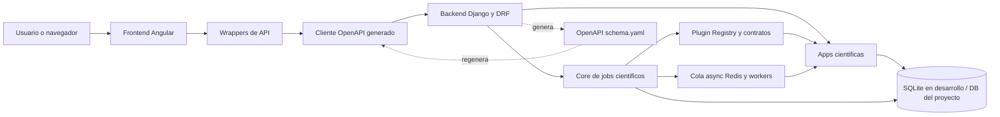
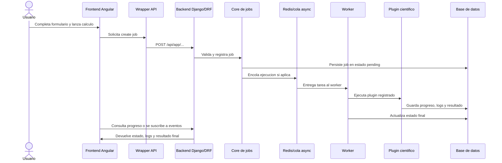
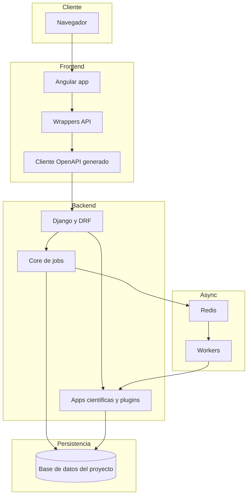
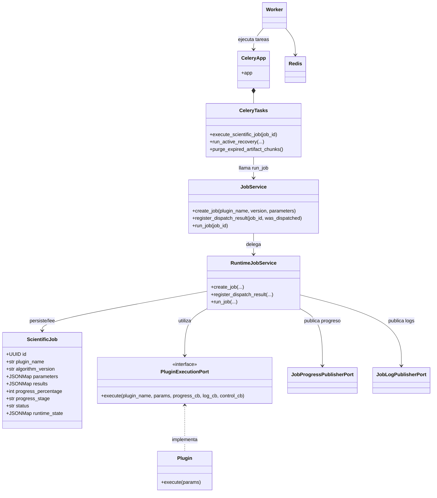
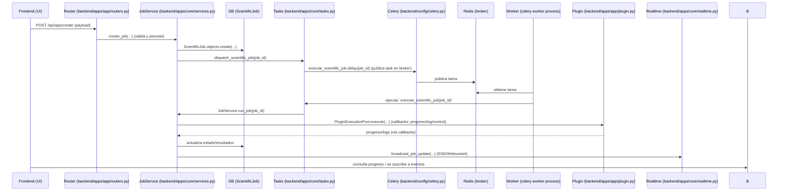
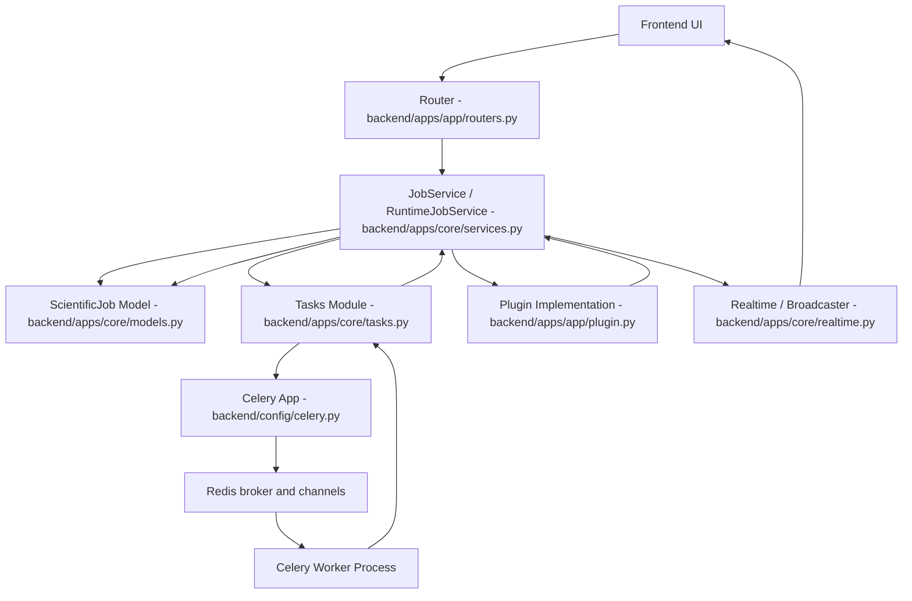
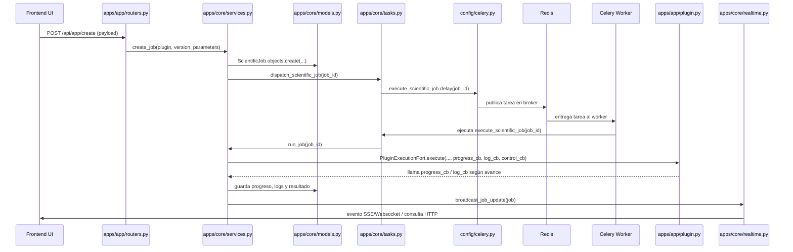

# Chemistry Apps

Repositorio monolítico para aplicaciones científicas de química con backend Django y frontend Angular.

## 1) Requisitos

- Python 3.11+
- Node.js 20+
- npm 11+
- Redis (para ejecución asíncrona)

## 2) Estructura del proyecto

- `backend/`: API Django, core de jobs científicos, plugins por app científica
- `frontend/`: UI Angular y wrappers del cliente OpenAPI
- `scripts/`: automatizaciones de generación de contrato OpenAPI
- `legacy/`: código histórico (en proceso de eliminación)

## 3) Arquitectura del sistema



### ¿Cómo funciona?

1. El usuario interactúa con la interfaz Angular y los componentes delegan la comunicación HTTP a wrappers de API propios del frontend.
2. Los wrappers encapsulan el cliente generado desde OpenAPI, evitando que los componentes dependan directamente del código autogenerado.
3. El backend Django expone endpoints REST para el core de jobs y para cada app científica; desde ahí valida payloads, registra jobs y decide si la ejecución será inmediata o asíncrona.
4. El core centraliza trazabilidad, estado, progreso, logs y control operativo del job; además delega la lógica científica real a plugins registrados por cada app.
5. Cuando una tarea requiere procesamiento asíncrono, el job se despacha a la cola y los workers ejecutan el plugin correspondiente, persistiendo resultados y actualizaciones de estado.
6. El contrato OpenAPI se genera desde el backend y se usa para regenerar el cliente del frontend, manteniendo alineados ambos lados del sistema.

En términos prácticos, la arquitectura separa cuatro responsabilidades: visualización en Angular, contrato y acceso HTTP mediante wrappers, orquestación de jobs en Django y ejecución de lógica científica por plugins desacoplados. Esa separación permite agregar nuevas apps científicas sin rehacer el core compartido ni romper el frontend existente.

### Flujo de ejecución de un job científico



Este flujo permite que el frontend no conozca detalles internos de ejecución. Para la UI, todo trabajo científico es un job con estados, progreso, logs y resultado. Para el backend, cada app científica aporta su plugin y su contrato, mientras que el core reutiliza la misma infraestructura transversal de observabilidad y control.

### Vista lógica de despliegue



En desarrollo local, normalmente se ejecutan al menos cuatro piezas: frontend Angular, backend Django, Redis y el proceso worker. En un entorno productivo la topología puede cambiar a nivel de infraestructura, pero la separación lógica se mantiene: frontend desacoplado, API backend, procesamiento asíncrono y persistencia.

### Guía técnica rápida para onboarding

Si alguien nuevo entra al proyecto, la forma más útil de entenderlo es esta:

1. `backend/apps/core/` contiene la infraestructura transversal: modelos de job, servicios, progreso, logs, control de pausa/reanudación/cancelación y API común.
2. `backend/apps/<app>/` contiene cada capacidad científica desacoplada. Cada app define contratos, serializers, router y plugin ejecutable por el core.
3. `backend/config/urls.py` centraliza la publicación de routers HTTP del core y de cada app científica.
4. `frontend/src/app/core/api/generated/` es código autogenerado desde OpenAPI y no debe editarse manualmente.
5. `frontend/src/app/core/api/` contiene wrappers estables para proteger al resto del frontend de cambios directos en el cliente generado.
6. Los componentes visuales consumen fachadas y servicios de aplicación; la lógica de negocio no debe vivir en plantillas ni en componentes de presentación.
7. `scripts/create_openapi.py` es el punto de sincronización entre backend y frontend cuando cambia un contrato HTTP.

La regla de diseño más importante del repositorio es que una nueva app científica se integra como extensión del sistema, no como excepción. Eso significa reutilizar el core, registrar un plugin, exponer un router propio, documentar el contrato en OpenAPI y dejar que el frontend consuma ese contrato a través de wrappers ya estandarizados.

## Funcionamiento Back

Breve resumen  
El backend separa responsabilidades: API/routers, core de jobs (persistencia, progreso, logs y orquestación), plugins científicos (ejecución de dominio) y el sistema de colas (Celery + Redis). Los diagramas y el mapa siguiente muestran clases clave y la interacción archivo→archivo que hace funcionar el backend.

### Diagrama de clases (vista lógica)


### Diagrama de interacción (archivo → archivo, flujo de un job)


### Mapa de archivos y responsabilidades (referencias)
- **[backend/config/celery.py](backend/config/celery.py)**: crea la instancia Celery, carga settings (`namespace='CELERY'`) y conecta `worker_ready` para disparar `run_active_recovery`.  
- **[backend/config/__init__.py](backend/config/__init__.py)**: reexporta `celery_app` para que `-A config` y herramientas lo detecten.  
- **[backend/config/settings.py](backend/config/settings.py)**: define `CELERY_BROKER_URL`, `CELERY_RESULT_BACKEND`, `CELERY_BEAT_SCHEDULE` y parámetros de recuperación (`JOB_RECOVERY_*`).  
- **[backend/apps/core/tasks.py](backend/apps/core/tasks.py)**: tareas Celery públicas: `execute_scientific_job`, `run_active_recovery`, `purge_expired_artifact_chunks`; y helper `dispatch_scientific_job` (captura fallos de broker).  
- **[backend/apps/core/services.py](backend/apps/core/services.py)**: `JobService`/`RuntimeJobService` — creación, registro de dispatch, ejecución en runtime (persistencia, callbacks de progreso/log, tratamiento de errores y pause/resume).  
- **[backend/apps/core/management/commands/up.py](backend/apps/core/management/commands/up.py)**: comando dev que orquesta `runserver`, inicia Redis local si hace falta y lanza el worker (`python -m celery -A config worker -l info`).  
- **[backend/apps/<app>/routers.py](backend/apps/calculator/routers.py)** (ejemplo): valida request, crea job delegando a `JobService` y llama a `dispatch_scientific_job`.  
- **[backend/apps/<app>/plugin.py](backend/apps/calculator/plugin.py)** (ejemplo): implementación del plugin que implementa la interfaz `PluginExecutionPort` y usa callbacks para progreso/log/control.  
- **[docker-compose.dev.yml](docker-compose.dev.yml)**: define servicios `redis`, `backend`, `celery-worker` y `celery-beat` para desarrollo; usa `redis` como broker en `redis://redis:6379/0`.  
- **[README.md](README.md)**: (esta sección) guía y diagramas.

### Interacción detallada: flujo de archivos y clases

A continuación se muestra de forma más explícita cómo interactúan los archivos y clases principales durante el ciclo de vida de un job: creación desde el router, encolado, ejecución en worker, ejecución del plugin y publicación de progreso/logs.

#### Mapa de interacción (archivo → archivo)


#### Secuencia detallada (funciones y llamadas)


#### Resumen rápido por archivo (qué hace y qué expone)
- `backend/apps/<app>/routers.py`: valida request, crea job con `JobService.create_job()` y solicita encolado con `dispatch_scientific_job(job_id)`.  
- `backend/apps/core/services.py`: `JobService` / `RuntimeJobService` — crea jobs, aplica cache temprana, registra resultado de dispatch, orquesta `run_job()` que maneja estado, callbacks de progreso/log y persistencia.  
- `backend/apps/core/tasks.py`: `dispatch_scientific_job()` (resiliente ante broker caído) y las tareas Celery: `execute_scientific_job`, `run_active_recovery`, `purge_expired_artifact_chunks`.  
- `backend/apps/core/models.py`: definición de `ScientificJob` y campos de trazabilidad (`status`, `progress_*`, `runtime_state`, `results`).  
- `backend/apps/<app>/plugin.py`: implementación del `PluginExecutionPort` — contiene la lógica científica y usa callbacks para informar progreso y logs.  
- `backend/config/celery.py`: instancia de Celery, `config_from_object(...)`, `autodiscover_tasks()` y `worker_ready` para desencadenar recuperación activa.  
- `backend/config/settings.py`: variables `CELERY_BROKER_URL`, `CELERY_RESULT_BACKEND`, `CELERY_BEAT_SCHEDULE` y parámetros `JOB_RECOVERY_*`.  
- `backend/apps/core/realtime.py`: publica actualizaciones de job a frontend (SSE/WebSockets) usando `CHANNEL_LAYERS_REDIS_URL`.  
- `backend/apps/core/management/commands/up.py`: helper dev que garantiza broker, inicia `redis-server` si es necesario y orquesta `runserver` + `celery worker`.  

#### Consejos de depuración rápidos
- Si un job queda en `pending`: revisar `dispatch_scientific_job()` y logs del broker (Redis) y del worker.  
- Ver logs del worker: `docker compose -f docker-compose.dev.yml logs -f celery-worker` o `./venv/bin/python -m celery -A config worker -l info` en consola.  
- Comprobar que `CELERY_BROKER_URL` apunta al broker correcto y que `config/celery.py` carga la app (ver `from config import celery_app`).

### Puntos operativos y comandos útiles
- Levantar todo (dev):  
```bash
docker compose -f docker-compose.dev.yml up
```
- Levantar backend + worker local (sin Docker) (dev):  
```bash
cd backend
./venv/bin/python manage.py up
```
- Levantar solo worker:  
```bash
cd backend
./venv/bin/python -m celery -A config worker -l info
```
- Ver logs del worker (Docker):  
```bash
docker compose -f docker-compose.dev.yml logs -f celery-worker
```

---

## 4) Inicio rápido

### Backend

```bash
cd backend
./venv/bin/python manage.py check
./venv/bin/python manage.py migrate
./venv/bin/python manage.py runserver
```

### Frontend

```bash
cd frontend
npm install
npm start
```

## 5) Flujo OpenAPI (backend -> frontend)

Regenerar contrato y cliente de frontend:

```bash
cd /ruta/al/repositorio
source backend/venv/bin/activate
python scripts/create_openapi.py
```

Este flujo:

1. genera `backend/openapi/schema.yaml`
2. regenera cliente en `frontend/src/app/core/api/generated/`

## 6) Validación recomendada

### Backend

```bash
cd backend
./venv/bin/python manage.py test apps.core apps.easy_rate apps.marcus --verbosity=1
```

### Frontend

```bash
cd frontend
npm run build
```

## 7) Convenciones clave

- No editar manualmente `frontend/src/app/core/api/generated/`.
- Consumir API desde wrappers en `frontend/src/app/core/api/`.
- Mantener lógica de negocio fuera de componentes visuales.
- Mantener tipado estricto y evitar tipos dinámicos ambiguos.

---

## 8) CI/CD y despliegue en producción

### Visión general del pipeline

El pipeline de CI/CD está compuesto por tres workflows en `.github/workflows/`:

| Archivo | Tipo | Propósito |
|---|---|---|
| `ci-deploy.yml` | Orquestador | Ejecuta tests, llama a `build.yml` y `deploy.yml` secuencialmente |
| `build.yml` | Reutilizable | Construye imágenes Docker, genera artefactos comprimidos y crea un Release en GitHub |
| `deploy.yml` | Reutilizable | Valida secrets, genera `.env`, transfiere artefactos por SCP y despliega vía SSH |

**Disparadores:** push a `main` y Pull Requests hacia `main`.

**Flujo resumido:**
```
push/PR → tests (backend + frontend) → build imágenes → crear Release → SCP bundle → SSH docker compose up -d
```

Las imágenes **no se publican en ningún registry**; se comprime el tar con `gzip`, se sube al host vía SCP y se carga con `docker load`.

---

### Secrets requeridos en GitHub

Ve a **Settings → Secrets and variables → Actions** en el repositorio y define los siguientes secrets:

#### Servidor remoto

| Secret | Descripción | Ejemplo |
|---|---|---|
| `VM_HOST` | IP o hostname del servidor | `192.168.1.100` |
| `VM_PORT` | Puerto SSH del servidor | `22` |
| `VM_USER` | Usuario SSH con acceso a Docker | `deploy` |
| `VM_SSH_KEY` | Clave privada SSH (sin passphrase) | contenido de `~/.ssh/id_ed25519` |
| `VM_PROJECT_PATH` | Directorio absoluto en el servidor donde se desplegará el proyecto | `/home/deploy/chemistry-apps` |

#### Base de datos (PostgreSQL)

| Secret | Descripción | Ejemplo |
|---|---|---|
| `DB_NAME` | Nombre de la base de datos | `chemistry_db` |
| `DB_USER` | Usuario de la base de datos | `chemistry_user` |
| `DB_PASSWORD` | Contraseña de la base de datos | `s3cr3t_passw0rd` |
| `DB_PORT` | Puerto interno de PostgreSQL (dentro de la red Docker) | `5432` |

> La base de datos se crea automáticamente en el primer despliegue gracias a las variables `POSTGRES_DB` / `POSTGRES_USER` / `POSTGRES_PASSWORD` que se inyectan al contenedor `postgres:16-alpine`.

#### Django / seguridad

| Secret | Descripción | Ejemplo |
|---|---|---|
| `DJANGO_SECRET_KEY` | Clave secreta de Django (cadena larga aleatoria) | `django-insecure-xxxxxxxxxxx` |
| `ALLOWED_HOSTS` | Hosts permitidos, separados por coma | `back-apps.guzman-lopez.com,localhost` |
| `CORS_ALLOWED_ORIGINS` | Orígenes CORS permitidos, separados por coma, **con protocolo** | `https://apps.guzman-lopez.com` |
| `CSRF_TRUSTED_ORIGINS` | Orígenes de confianza CSRF, separados por coma, **con protocolo** | `https://apps.guzman-lopez.com,https://back-apps.guzman-lopez.com` |
| `BACKEND_PUBLIC_URL` | URL pública del backend. Se usa tanto como `build-arg` en Angular como en el `.env` de producción | `https://back-apps.guzman-lopez.com` |

#### Puertos externos (mapeo host → contenedor)

| Secret | Requerido | Descripción | Ejemplo |
|---|---|---|---|
| `EXTERNAL_BACKEND_PORT` | **Sí** | Puerto del host que se mapeará al backend (evitar conflictos con servicios existentes) | `8080` |
| `EXTERNAL_FRONTEND_PORT` | **Sí** | Puerto del host que se mapeará al frontend | `4210` |
| `REDIS_PORT` | No | Puerto interno de Redis (por defecto `6379`) | `6379` |

> **Verificar puertos disponibles en el servidor** antes de elegir los valores:
> ```bash
> ss -tlnp | grep -E '8080|4210'
> ```

---

### Configuración de Nginx en el servidor

El servidor Nginx actúa como reverse proxy hacia los contenedores Docker. Configuración de ejemplo para los dominios `apps.guzman-lopez.com` (frontend) y `back-apps.guzman-lopez.com` (backend), usando un certificado wildcard `*.guzman-lopez.com`:

```nginx
# Frontend
server {
    listen 443 ssl;
    server_name apps.guzman-lopez.com;

    ssl_certificate     /etc/letsencrypt/live/guzman-lopez.com/fullchain.pem;
    ssl_certificate_key /etc/letsencrypt/live/guzman-lopez.com/privkey.pem;

    location / {
        proxy_pass         http://127.0.0.1:4210;
        proxy_set_header   Host              $host;
        proxy_set_header   X-Real-IP         $remote_addr;
        proxy_set_header   X-Forwarded-For   $proxy_add_x_forwarded_for;
        proxy_set_header   X-Forwarded-Proto $scheme;
    }
}

# Backend (API)
server {
    listen 443 ssl;
    server_name back-apps.guzman-lopez.com;

    ssl_certificate     /etc/letsencrypt/live/guzman-lopez.com/fullchain.pem;
    ssl_certificate_key /etc/letsencrypt/live/guzman-lopez.com/privkey.pem;

    location / {
        proxy_pass         http://127.0.0.1:8080;
        proxy_set_header   Host              $host;
        proxy_set_header   X-Real-IP         $remote_addr;
        proxy_set_header   X-Forwarded-For   $proxy_add_x_forwarded_for;
        proxy_set_header   X-Forwarded-Proto $scheme;

        # WebSockets / SSE
        proxy_http_version 1.1;
        proxy_set_header   Upgrade    $http_upgrade;
        proxy_set_header   Connection "upgrade";
        proxy_read_timeout 3600s;
    }
}

# Redirigir HTTP → HTTPS
server {
    listen 80;
    server_name apps.guzman-lopez.com back-apps.guzman-lopez.com;
    return 301 https://$host$request_uri;
}
```

Los valores `4210` y `8080` deben coincidir con `EXTERNAL_FRONTEND_PORT` y `EXTERNAL_BACKEND_PORT` respectivamente.

---

### Notas de operación

- **Primer despliegue:** la base de datos se crea sola. Las migraciones de Django se ejecutan automáticamente como parte del entrypoint del contenedor backend.
- **Persistencia de datos:** los datos de PostgreSQL y Redis se almacenan en `./docker-data/` dentro de `VM_PROJECT_PATH`. Los archivos de media del backend se almacenan en `./backend/media/`.
- **Limpieza automática de imágenes:** tras cada despliegue se ejecuta `docker image prune -f --filter "until=168h"` para liberar espacio en disco.
- **Formato de CORS/CSRF:** los valores de `CORS_ALLOWED_ORIGINS` y `CSRF_TRUSTED_ORIGINS` deben incluir el protocolo (`https://`) y pueden contener múltiples orígenes separados por coma sin espacios.
- **`BACKEND_PUBLIC_URL`** se usa en dos momentos distintos: como `--build-arg API_BASE_URL` al compilar Angular (genera la URL de la API en el bundle estático) y como variable de entorno en el `.env` de producción para Django.
- **`ALLOWED_HOSTS`** acepta múltiples valores separados por coma: `back-apps.guzman-lopez.com,localhost`.

## 8) Integración de nueva app científica

Para alta de una nueva app científica en backend y su conexión con frontend, seguir el manual:

- `.github/instructions/scientific-app-onboarding.instructions.md`

Resumen mínimo:

1. crear estructura completa de app en `backend/apps/<app>/`
2. registrar app y plugin en startup
3. tipar contratos y serializers de OpenAPI
4. exponer router dedicado
5. validar con `check`, tests y regeneración OpenAPI

## 9) Notas de mantenimiento

- El parser de logs Gaussian usa fixture local en:
  - `backend/libs/gaussian_log_parser/fixtures/`
- Esto evita depender del código `legacy/` para pruebas del parser.

## 10) Levantar en desarrollo y en producción

### Desarrollo local

#### Backend (API + worker)

Opción recomendada con un solo comando:

```bash
cd backend
./venv/bin/python manage.py up
```

Si quieres levantar solo la API HTTP sin Celery:

```bash
cd backend
./venv/bin/python manage.py up --without-celery
```

Alternativa manual en tres terminales:

```bash
# terminal 1
cd backend
redis-server

# terminal 2
cd backend
./venv/bin/python -m celery -A config worker -l info

# terminal 3
cd backend
./venv/bin/python manage.py runserver
```

#### Frontend (Angular)

```bash
cd frontend
npm install
npm start
```

### Producción

#### Backend (Django ASGI + Celery)

1. Definir variables de entorno seguras (mínimo):

```bash
export DJANGO_DEBUG=False
export DJANGO_SECRET_KEY="<clave-segura>"
export DJANGO_ALLOWED_HOSTS="tu-dominio.com,www.tu-dominio.com"
export CELERY_BROKER_URL="redis://127.0.0.1:6379/0"
export CELERY_RESULT_BACKEND="redis://127.0.0.1:6379/0"
```

2. Aplicar migraciones y levantar API ASGI con Daphne:

```bash
cd backend
./venv/bin/python manage.py migrate
./venv/bin/daphne -b 0.0.0.0 -p 8000 config.asgi:application
```

3. Levantar worker de Celery:

```bash
cd backend
./venv/bin/python -m celery -A config worker -l info
```

Nota: en producción, Daphne y Celery deben correr como servicios gestionados (por ejemplo systemd o supervisor), detrás de un reverse proxy (Nginx o equivalente).

#### Frontend (build de producción)

```bash
cd frontend
npm ci
npm run build
```

El contenido generado en `frontend/dist/frontend/` debe publicarse como estático (Nginx, CDN o hosting estático). La API backend se expone por dominio/ruta del reverse proxy.
