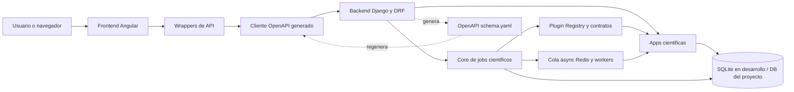
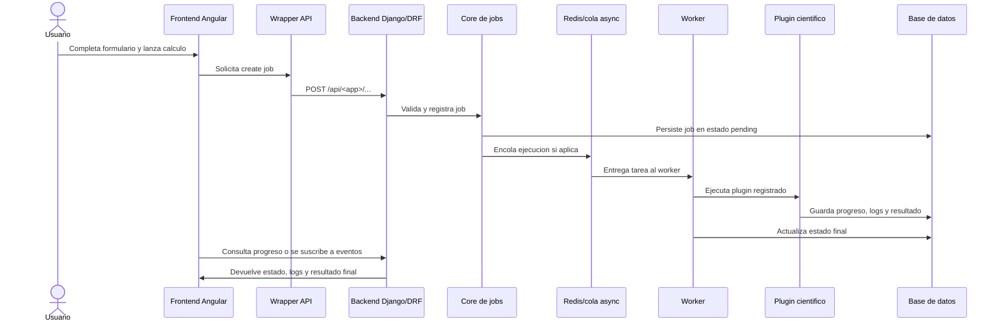
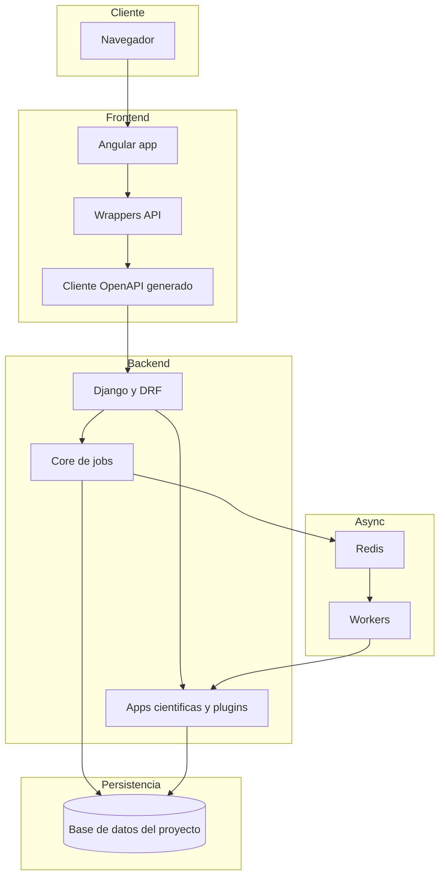

# Chemistry Apps

Repositorio monolítico para aplicaciones científicas de química con backend Django y frontend Angular.

## 1) Requisitos

- Python 3.11+
- Node.js 20+
- npm 11+
- Redis (para ejecución asíncrona)

## 2) Estructura del proyecto

- `backend/`: API Django, core de jobs científicos, plugins por app científica
- `frontend/`: UI Angular y wrappers del cliente OpenAPI
- `scripts/`: automatizaciones de generación de contrato OpenAPI
- `legacy/`: código histórico (en proceso de eliminación)

## 3) Arquitectura del sistema



### ¿Cómo funciona?

1. El usuario interactúa con la interfaz Angular y los componentes delegan la comunicación HTTP a wrappers de API propios del frontend.
2. Los wrappers encapsulan el cliente generado desde OpenAPI, evitando que los componentes dependan directamente del código autogenerado.
3. El backend Django expone endpoints REST para el core de jobs y para cada app científica; desde ahí valida payloads, registra jobs y decide si la ejecución será inmediata o asíncrona.
4. El core centraliza trazabilidad, estado, progreso, logs y control operativo del job; además delega la lógica científica real a plugins registrados por cada app.
5. Cuando una tarea requiere procesamiento asíncrono, el job se despacha a la cola y los workers ejecutan el plugin correspondiente, persistiendo resultados y actualizaciones de estado.
6. El contrato OpenAPI se genera desde el backend y se usa para regenerar el cliente del frontend, manteniendo alineados ambos lados del sistema.

En términos prácticos, la arquitectura separa cuatro responsabilidades: visualización en Angular, contrato y acceso HTTP mediante wrappers, orquestación de jobs en Django y ejecución de lógica científica por plugins desacoplados. Esa separación permite agregar nuevas apps científicas sin rehacer el core compartido ni romper el frontend existente.

### Flujo de ejecución de un job científico



Este flujo permite que el frontend no conozca detalles internos de ejecución. Para la UI, todo trabajo científico es un job con estados, progreso, logs y resultado. Para el backend, cada app científica aporta su plugin y su contrato, mientras que el core reutiliza la misma infraestructura transversal de observabilidad y control.

### Vista lógica de despliegue



En desarrollo local, normalmente se ejecutan al menos cuatro piezas: frontend Angular, backend Django, Redis y el proceso worker. En un entorno productivo la topología puede cambiar a nivel de infraestructura, pero la separación lógica se mantiene: frontend desacoplado, API backend, procesamiento asíncrono y persistencia.

### Guía técnica rápida para onboarding

Si alguien nuevo entra al proyecto, la forma más útil de entenderlo es esta:

1. `backend/apps/core/` contiene la infraestructura transversal: modelos de job, servicios, progreso, logs, control de pausa/reanudación/cancelación y API común.
2. `backend/apps/<app>/` contiene cada capacidad científica desacoplada. Cada app define contratos, serializers, router y plugin ejecutable por el core.
3. `backend/config/urls.py` centraliza la publicación de routers HTTP del core y de cada app científica.
4. `frontend/src/app/core/api/generated/` es código autogenerado desde OpenAPI y no debe editarse manualmente.
5. `frontend/src/app/core/api/` contiene wrappers estables para proteger al resto del frontend de cambios directos en el cliente generado.
6. Los componentes visuales consumen fachadas y servicios de aplicación; la lógica de negocio no debe vivir en plantillas ni en componentes de presentación.
7. `scripts/create_openapi.py` es el punto de sincronización entre backend y frontend cuando cambia un contrato HTTP.

La regla de diseño más importante del repositorio es que una nueva app científica se integra como extensión del sistema, no como excepción. Eso significa reutilizar el core, registrar un plugin, exponer un router propio, documentar el contrato en OpenAPI y dejar que el frontend consuma ese contrato a través de wrappers ya estandarizados.

## 4) Inicio rápido

### Backend

```bash
cd backend
./venv/bin/python manage.py check
./venv/bin/python manage.py migrate
./venv/bin/python manage.py runserver
```

### Frontend

```bash
cd frontend
npm install
npm start
```

## 5) Flujo OpenAPI (backend -> frontend)

Regenerar contrato y cliente de frontend:

```bash
cd /ruta/al/repositorio
source backend/venv/bin/activate
python scripts/create_openapi.py
```

Este flujo:

1. genera `backend/openapi/schema.yaml`
2. regenera cliente en `frontend/src/app/core/api/generated/`

## 6) Validación recomendada

### Backend

```bash
cd backend
./venv/bin/python manage.py test apps.core apps.easy_rate apps.marcus --verbosity=1
```

### Frontend

```bash
cd frontend
npm run build
```

## 7) Convenciones clave

- No editar manualmente `frontend/src/app/core/api/generated/`.
- Consumir API desde wrappers en `frontend/src/app/core/api/`.
- Mantener lógica de negocio fuera de componentes visuales.
- Mantener tipado estricto y evitar tipos dinámicos ambiguos.

## 8) Integración de nueva app científica

Para alta de una nueva app científica en backend y su conexión con frontend, seguir el manual:

- `.github/instructions/scientific-app-onboarding.instructions.md`

Resumen mínimo:

1. crear estructura completa de app en `backend/apps/<app>/`
2. registrar app y plugin en startup
3. tipar contratos y serializers de OpenAPI
4. exponer router dedicado
5. validar con `check`, tests y regeneración OpenAPI

## 9) Notas de mantenimiento

- El parser de logs Gaussian usa fixture local en:
  - `backend/libs/gaussian_log_parser/fixtures/`
- Esto evita depender del código `legacy/` para pruebas del parser.
