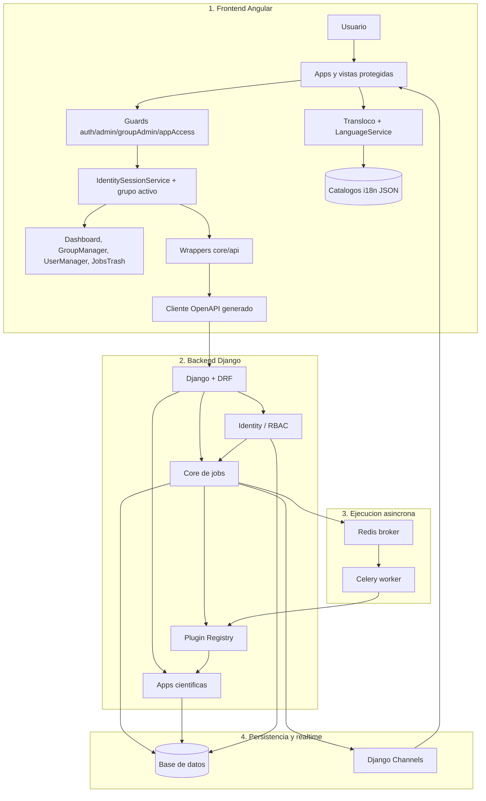
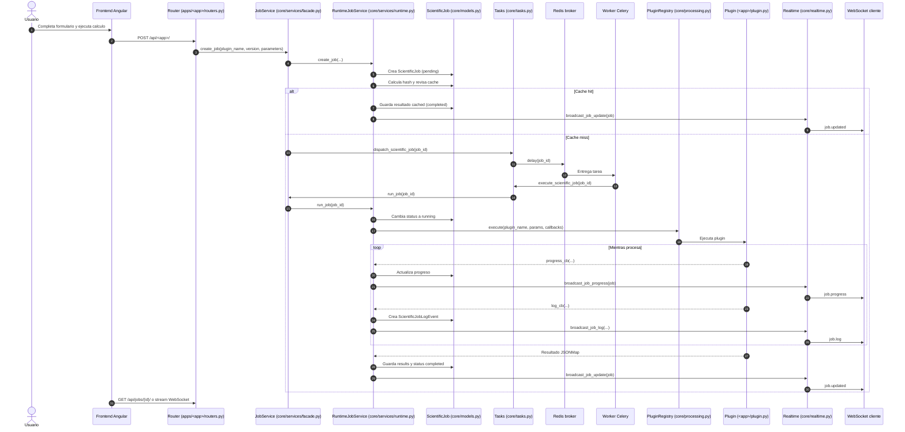
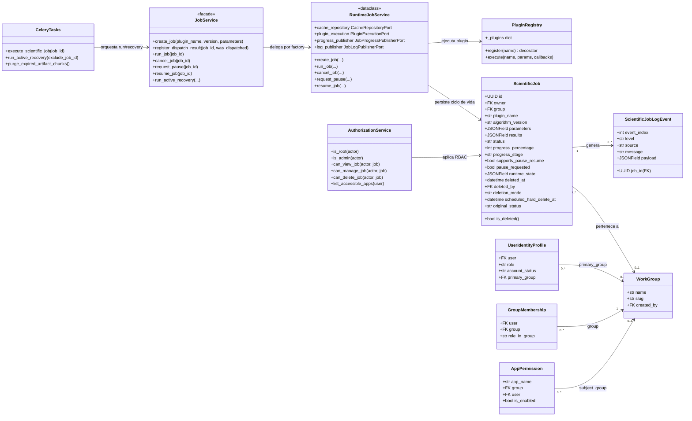
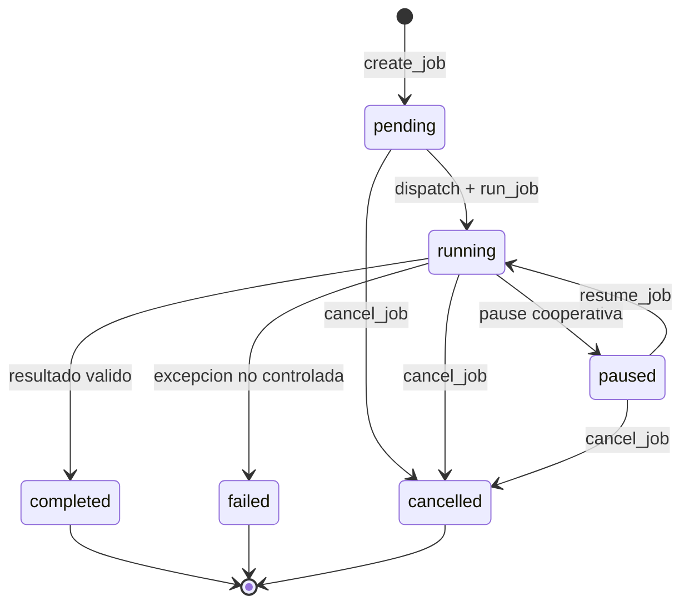
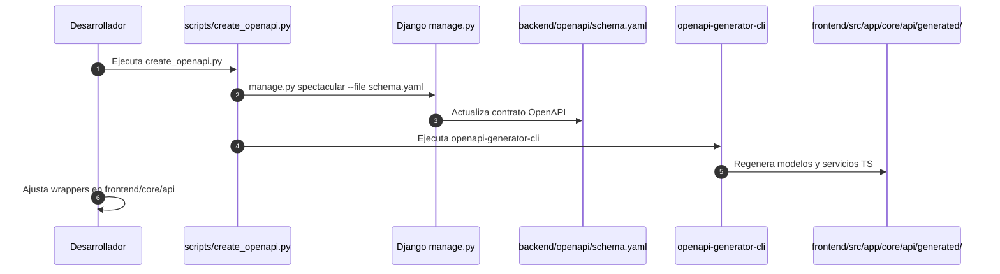
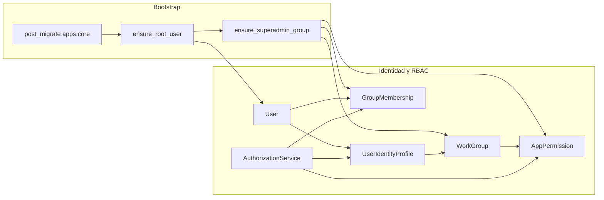
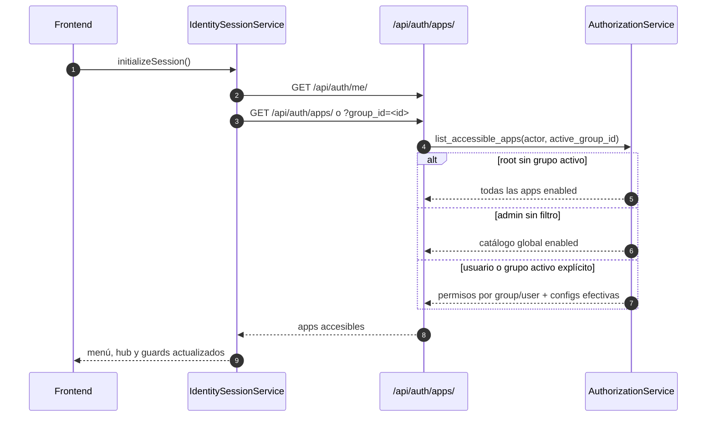
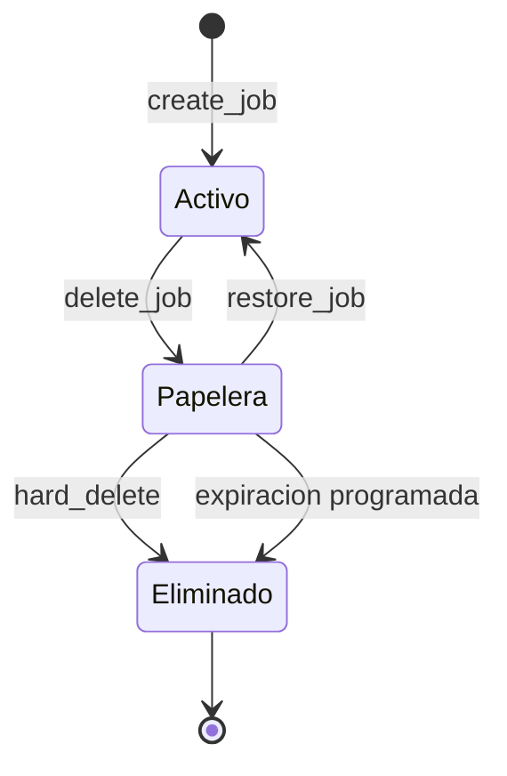

# Chemistry Apps

Repositorio monolítico para aplicaciones científicas de química. El backend en Django orquesta jobs asíncronos reproducibles y el frontend en Angular consume los contratos HTTP generados desde OpenAPI. Cada capacidad científica vive como un plugin independiente que se integra al core sin modificarlo.

---

## Tabla de contenidos

1. [Requisitos del sistema](#1-requisitos-del-sistema)
2. [Estructura del repositorio](#2-estructura-del-repositorio)
3. [Arquitectura general](#3-arquitectura-general)
4. [Ciclo de vida de un job](#4-ciclo-de-vida-de-un-job)
5. [Core del backend](#5-core-del-backend)
6. [Sistema de plugins](#6-sistema-de-plugins)
7. [Apps científicas](#7-apps-científicas)
8. [Frontend Angular](#8-frontend-angular)
9. [Realtime y WebSocket](#9-realtime-y-websocket)
10. [Sistema de caché determinista](#10-sistema-de-caché-determinista)
11. [Artefactos de entrada](#11-artefactos-de-entrada)
12. [Inicio rápido local](#12-inicio-rápido-local)
13. [Docker Compose](#13-docker-compose)
14. [Flujo OpenAPI](#14-flujo-openapi)
15. [CI/CD y despliegue](#15-cicd-y-despliegue)
16. [Calidad de código y SonarQube](#16-calidad-de-código-y-sonarqube)
17. [Agregar una nueva app científica](#17-agregar-una-nueva-app-científica)
18. [Convenciones del proyecto](#18-convenciones-del-proyecto)
19. [Autenticación y autorización](#19-autenticación-y-autorización)
20. [Estrategia de pruebas](#20-estrategia-de-pruebas)
21. [Bootstrap y configuración de entorno](#21-bootstrap-y-configuración-de-entorno)
22. [Internacionalización (i18n)](#22-internacionalización-i18n)
23. [Papelera y soft delete de jobs](#23-papelera-y-soft-delete-de-jobs)

---

## 1) Requisitos del sistema

| Herramienta | Versión mínima | Uso                                               |
| ----------- | -------------- | ------------------------------------------------- |
| Python      | 3.14           | Runtime del backend                               |
| Django      | 6.x            | Framework web y ORM                               |
| Node.js     | 20             | Compilación y servidor de desarrollo frontend     |
| npm         | 11             | Gestión de paquetes frontend                      |
| Redis       | 7              | Broker de Celery y backend de resultados          |
| Daphne      | —              | Servidor ASGI para HTTP + WebSocket en producción |

En desarrollo local se pueden levantar todos los servicios con Docker Compose o bien de forma nativa con un Redis externo.

---

## 2) Estructura del repositorio

```text
chemistry-apps/
├── backend/               # Django 6, DRF, Celery, Channels
│   ├── apps/
│   │   ├── core/                # Infraestructura transversal de jobs e identidad
│   │   │   ├── identity/        # Módulo RBAC: usuarios, grupos, permisos, JWT
│   │   │   │   ├── bootstrap/   # Inicialización idempotente de root y Superadmin
│   │   │   │   └── services/    # AuthorizationService RBAC
│   │   │   ├── routers/         # ViewSet descompuesto en mixins: control, stream
│   │   │   └── services/        # Servicios refactorizados en módulos especializados
│   │   ├── random_numbers/
│   │   ├── molar_fractions/
│   │   ├── tunnel/
│   │   ├── easy_rate/
│   │   ├── marcus/
│   │   ├── smileit/
│   │   ├── sa_score/
│   │   └── toxicity_properties/
│   ├── config/            # Settings, urls, celery, asgi, wsgi
│   └── libs/              # Librerías científicas internas
│       ├── gaussian_log_parser/
│       ├── admet_ai/
│       ├── ambit/
│       ├── brsascore/
│       └── rdkit_sa/
├── frontend/              # Angular 21, standalone components
│   ├── public/
│   │   └── i18n/          # Catálogos JSON por idioma (en, es, fr, ru, zh-CN, hi, de, ja)
│   └── src/app/
│       ├── core/
│       │   ├── api/           # Wrappers sobre el cliente OpenAPI generado
│       │   ├── application/   # Servicios de flujo de trabajo por app científica
│       │   ├── auth/          # Guards funcionales y IdentitySessionService
│       │   ├── i18n/          # LanguageService, TranslocoLoader, idiomas soportados
│       │   └── shared/        # Componentes, constantes y utilidades transversales
│       ├── dashboard/
│       ├── group-manager/     # Gestión de grupos, membresías y permisos por app
│       ├── jobs-monitor/      # Monitor de jobs visibles para la sesión actual
│       ├── jobs-trash/        # Papelera de jobs eliminados (admin)
│       ├── apps-hub/          # Catálogo navegable de apps
│       ├── profile/           # Perfil propio y cambio de contraseña
│       ├── random-numbers/
│       ├── molar-fractions/
│       ├── tunnel/
│       ├── easy-rate/
│       ├── marcus/
│       ├── smileit/
│       ├── sa-score/
│       ├── toxicity-properties/
│       └── user-manager/      # Gestión de usuarios y asignaciones a grupos
├── scripts/               # Generación OpenAPI y reportes de calidad
├── deprecated/            # Código histórico fuera de uso
└── tools/                 # Runtimes Java para librerías externas
```

La carpeta `deprecated/` contiene código anterior sin uso activo. En documentación antigua puede aparecer como `legacy/`.

---

## 3) Arquitectura general

El sistema está dividido en cuatro capas con responsabilidades claras:



### Capa de identidad y RBAC

El módulo `backend/apps/core/identity/` centraliza autenticación JWT, bootstrap administrativo, grupos de trabajo y autorización transversal. `AuthorizationService` resuelve permisos para jobs, apps, grupos y usuarios a partir de roles globales (`root/admin/user`), `primary_group` y membresías explícitas. Los jobs llevan `owner` y `group` como claves foráneas, lo que permite filtrar visibilidad y acciones sin duplicar lógica en cada app científica.

**Capa de presentación**: Angular con lazy loading por ruta. Cada app científica es un componente standalone que únicamente conoce los tipos del cliente generado y los servicios de aplicación de `core/api/`.

**Capa de contrato HTTP**: El cliente OpenAPI se genera automáticamente desde `backend/openapi/schema.yaml`. Los wrappers en `frontend/src/app/core/api/` son la capa estable que protege los componentes de cambios directos en el código generado.

**Capa de orquestación**: El core de Django registra, persiste y coordina el ciclo de vida completo de los jobs. Se encarga de trazabilidad, estados, progreso, logs, caché y recuperación activa. Nunca contiene lógica científica.

**Capa de ejecución**: Los workers Celery ejecutan los plugins en segundo plano. Cada plugin es una función pura registrada en `PluginRegistry` que recibe `JSONMap` y retorna `JSONMap`.

---

## 4) Ciclo de vida de un job



### Estados del job

| Estado      | Descripción                              |
| ----------- | ---------------------------------------- |
| `pending`   | Job creado, esperando ser encolado       |
| `running`   | Worker ejecutando el plugin              |
| `paused`    | Plugin pausado por solicitud cooperativa |
| `completed` | Ejecución terminada con resultados       |
| `failed`    | Error durante la ejecución del plugin    |
| `cancelled` | Cancelado manualmente desde la UI        |

### Resiliencia ante fallos del broker

Si Redis no está disponible cuando el router intenta encolar, `dispatch_scientific_job` captura `OperationalError` y `RedisConnectionError` sin romper la respuesta HTTP. El job queda en estado `pending` con mensaje de progreso observable. La tarea periódica `run_active_recovery` detecta jobs huérfanos y los re-encola cuando el broker vuelve a estar disponible.

---

## 5) Core del backend

El directorio `backend/apps/core/` es el corazón del sistema. Contiene toda la infraestructura transversal que reutilizan todas las apps científicas.

### Modelo principal: `ScientificJob`

Definido en `backend/apps/core/models.py`. Campos clave:

```text
id                  UUID primario, generado automáticamente
plugin_name         Nombre del plugin ejecutado
algorithm_version   Versión del algoritmo para invalidación de caché
status              pending / running / paused / completed / failed / cancelled
parameters          JSONField con los parámetros de entrada
results             JSONField con el payload de salida
error_trace         Traza de error si el job falló
job_hash            SHA-256 del job para cache lookup
cache_hit           True si el resultado se sirvió desde caché
progress_percentage Entero 0-100
progress_stage      pending / queued / running / paused / caching / completed / failed
progress_message    Mensaje corto legible del estado actual
progress_event_index Contador incremental de eventos emitidos
supports_pause_resume Marca si el plugin soporta pausa cooperativa
pause_requested     Señal de control para solicitar pausa desde la UI
runtime_state       JSONField para checkpoint de reanudación
```

El modelo `ScientificJob` incorpora además los campos de propiedad y ciclo de vida de borrado:

```text
owner                   FK al usuario que creó el job (nullable, SET_NULL)
group                   FK al WorkGroup asociado (nullable, SET_NULL)
deleted_at              Marca temporal de envío a papelera (null = activo)
deleted_by              FK al usuario que eliminó el job
deletion_mode           "soft" cuando está en papelera, vacío si está activo
scheduled_hard_delete_at Fecha programada de eliminación definitiva automática
original_status         Estado que tenía el job al ser enviado a la papelera
paused_at               Marca temporal del último momento en pausa
resumed_at              Marca temporal de la última reanudación
last_heartbeat_at       Última señal de vida del proceso de ejecución
recovery_attempts       Contador de reintentos de recuperación activa
max_recovery_attempts   Límite de reintentos (default: 5)
```

El modelo `ScientificJobLogEvent` almacena cada evento de log con nivel (`info/warning/error/debug`), fuente, mensaje y payload JSON opcional.

El modelo `ScientificJobInputArtifact` y `ScientificJobInputArtifactChunk` persisten los archivos de entrada en la base de datos para trazabilidad completa y reintentos reproducibles.

### Diagrama de clases del core



### Arquitectura de puertos y adaptadores

`RuntimeJobService` no depende directamente del ORM ni de Celery. Recibe puertos (Protocols de Python) e inyecta adaptadores concretos en el factory:

| Puerto                     | Adaptador                           | Responsabilidad                      |
| -------------------------- | ----------------------------------- | ------------------------------------ |
| `CacheRepositoryPort`      | `DjangoCacheRepositoryAdapter`      | Lee y escribe `ScientificCacheEntry` |
| `PluginExecutionPort`      | `DjangoPluginExecutionAdapter`      | Ejecuta función del `PluginRegistry` |
| `JobProgressPublisherPort` | `DjangoJobProgressPublisherAdapter` | Persiste y broadcast progreso        |
| `JobLogPublisherPort`      | `DjangoJobLogPublisherAdapter`      | Persiste y broadcast log events      |

Esta separación permite reemplazar cualquier adaptador en pruebas sin necesidad de mockear ORM ni Celery directamente.

### Factory y singleton de servicio

`backend/apps/core/factory.py` expone `build_job_service()` decorado con `@lru_cache(maxsize=1)`. Retorna siempre la misma instancia `RuntimeJobService` compuesta con los adaptadores Django por defecto. Routers, tasks y recuperación activa consumen el mismo singleton.

### Mapa de archivos del core

| Archivo                                       | Responsabilidad                                                                                 |
| --------------------------------------------- | ----------------------------------------------------------------------------------------------- |
| `models.py`                                   | Entidades persistentes: jobs, identidad, caché, artefactos, grupos, permisos                    |
| `ports.py`                                    | Interfaces Protocol para todos los adaptadores                                                  |
| `processing.py`                               | `PluginRegistry`: registro y despacho de funciones de plugin                                    |
| `services/facade.py`                          | `JobService`: fachada estática para consumidores externos                                       |
| `services/runtime.py`                         | `RuntimeJobService`: orquestación completa del ciclo de vida                                    |
| `services/cache_operations.py`                | Lógica de consulta y escritura de caché                                                         |
| `services/callbacks.py`                       | Construcción de callbacks de progreso y log                                                     |
| `services/config.py`                          | Configuración por defecto del servicio de runtime                                               |
| `services/execution.py`                       | Coordinación de la ejecución efectiva del plugin                                                |
| `services/job_control.py`                     | Lógica de pausa, reanudación y cancelación                                                      |
| `services/log_helpers.py`                     | Helpers de log internos                                                                         |
| `services/recovery.py`                        | Recuperación activa de jobs huérfanos                                                           |
| `services/terminal_states.py`                 | Transiciones a estados terminales: completed / failed                                           |
| `factory.py`                                  | Composición de servicio con adaptadores por defecto                                             |
| `adapters.py`                                 | Implementaciones concretas de los puertos para Django                                           |
| `cache.py`                                    | `generate_job_hash()`: hash SHA-256 determinista para caché                                     |
| `tasks.py`                                    | Tareas Celery: `execute_scientific_job`, `run_active_recovery`, `purge_expired_artifact_chunks` |
| `realtime.py`                                 | Construcción y broadcasting de eventos por Django Channels                                      |
| `consumers.py`                                | `JobsStreamConsumer`: WebSocket consumer con filtros                                            |
| `routing.py`                                  | Mapa de rutas WebSocket                                                                         |
| `app_registry.py`                             | `ScientificAppRegistry`: valida unicidad de plugins y rutas en startup                          |
| `base_router.py`                              | `ScientificAppViewSetMixin`: mixin con endpoints comunes para todas las apps                    |
| `artifacts.py`                                | `ScientificInputArtifactStorageService`: persistencia chunked de archivos                       |
| `exceptions.py`                               | `JobPauseRequested`: señal de control para pausa cooperativa                                    |
| `reporting.py`                                | Generadores de reportes CSV y log para descarga                                                 |
| `declarative_api.py`                          | `DeclarativeJobAPI`: helpers para contratos declarativos en routers                             |
| `smiles_batch.py`                             | `normalize_named_smiles_entries()`: normalización compartida de lotes de SMILES                 |
| `runtime_tools.py`                            | Verificación de herramientas externas (AMBIT, Java) en arranque                                 |
| `routers/viewset.py`                          | `JobViewSet`: endpoints REST de jobs con RBAC                                                   |
| `routers/_job_control_mixin.py`               | Mixin: pause, resume, cancel, progress                                                          |
| `routers/_job_stream_mixin.py`                | Mixin: SSE, logs, log events                                                                    |
| `identity/routers.py`                         | Endpoints de autenticación, perfil, usuarios, grupos y permisos                                 |
| `identity/services/authorization_service.py`  | `AuthorizationService`: RBAC centralizado                                                       |
| `identity/schemas.py`                         | Serializadores del dominio de identidad                                                         |
| `identity/bootstrap/root_user.py`             | Bootstrap idempotente del usuario root inicial                                                  |
| `identity/bootstrap/superadmin_group.py`      | Bootstrap idempotente del grupo Superadmin                                                      |
| `identity/startup.py`                         | Hook `post_migrate` que dispara el bootstrap de identidad                                       |
| `management/commands/up.py`                   | Comando dev que arranca API + worker con auto-reload                                            |
| `management/commands/ensure_root_user.py`     | Comando manual para garantizar root sin ejecutar migrations                                     |
| `management/commands/ensure_runtime_tools.py` | Comando para verificar y descargar herramientas externas                                        |

---

## 6) Sistema de plugins

### Registro de un plugin

Cada app científica registra su función de dominio decorándola con `@PluginRegistry.register("nombre")` en su `plugin.py`. El nombre debe coincidir exactamente con el `PLUGIN_NAME` definido en `definitions.py` de la misma app.

```python
from apps.core.processing import PluginRegistry

@PluginRegistry.register("random_numbers")
def random_numbers_plugin(
    parameters: JSONMap,
    report_progress: PluginProgressCallback,
    emit_log: PluginLogCallback,
    request_control_action: PluginControlCallback,
) -> JSONMap:
    # lógica pura de dominio
    ...
    return {"result": value}
```

El `PluginRegistry` acepta funciones con uno, dos, tres o cuatro argumentos (introspección por `inspect.signature`). Los callbacks son opcionales: si el plugin no los declara no recibe callbacks.

### Callbacks disponibles

| Callback                 | Firma                                                            | Uso                                                 |
| ------------------------ | ---------------------------------------------------------------- | --------------------------------------------------- |
| `PluginProgressCallback` | `(percentage: int, stage: str, message: str) -> None`            | Reporta avance al frontend                          |
| `PluginLogCallback`      | `(level: str, source: str, message: str, payload: dict) -> None` | Emite eventos de log trazables                      |
| `PluginControlCallback`  | `() -> str`                                                      | Consulta señal de control: `"continue"` o `"pause"` |

### Pausa cooperativa

Si el usuario solicita pausa desde la UI, el backend marca `pause_requested = True` en el job. El plugin consulta periódicamente el `PluginControlCallback` y cuando detecta `"pause"` lanza `JobPauseRequested(checkpoint={...})`. `RuntimeJobService` captura esta excepción, persiste el checkpoint en `runtime_state` y mueve el job a estado `paused`. Al reanudar, `resume_job` carga el checkpoint y ejecuta el plugin de nuevo con estado previo restaurado.



### Auto-registro durante startup de Django

Cada app tiene un `AppConfig` en su `apps.py` que llama `ScientificAppRegistry.register(definition)` dentro de `ready()`. Si dos apps intentan registrar el mismo `plugin_name` o el mismo prefijo de ruta, Django falla en el startup con `ImproperlyConfigured`, garantizando detección temprana de conflictos.

---

## 7) Apps científicas

### Catálogo completo

| App                   | Plugin                | Descripción científica                                                                                                                                          |
| --------------------- | --------------------- | --------------------------------------------------------------------------------------------------------------------------------------------------------------- |
| `random_numbers`      | `random_numbers`      | Generación por lotes con semilla determinista desde URL remota, progreso incremental y pausa cooperativa con checkpoint.                                        |
| `molar_fractions`     | `molar_fractions`     | Fracciones molares ácido-base f0..fn. Parámetros: lista de pKa, pH en modo puntual (`single`) o rango (`range`). Retorna tabla por pH con todas las fracciones. |
| `tunnel`              | `tunnel`              | Corrección de efecto túnel asimétrica de Eckart. Registra traza completa de modificaciones a los parámetros de entrada y los logs de ajuste.                    |
| `easy_rate`           | `easy_rate`           | Constantes de velocidad TST + corrección Eckart + difusión opcional. Entrada: archivos de log Gaussian. Produce tabla de k por temperatura.                     |
| `marcus`              | `marcus`              | Energía de reorganización, barrera de activación y constantes cinéticas por teoría de Marcus. Requiere seis archivos de log Gaussian (R, P, TS, R+, P+, TS+).   |
| `smileit`             | `smileit`             | Generación combinatoria de estructuras SMILES con bloques de asignación y catálogo de sustituyentes. Exporta CSV y reporte de derivados.                        |
| `sa_score`            | `sa_score`            | Puntuación de accesibilidad sintética para lotes de SMILES usando AMBIT, BRSAScore y RDKit como métodos configurables.                                          |
| `toxicity_properties` | `toxicity_properties` | Predicciones ADMET-AI (LD50, Ames, DevTox y más) para lotes de moléculas desde SMILES.                                                                          |

### Estructura interna de cada app

Toda app científica sigue la misma plantilla de archivos:

```text
backend/apps/<app>/
├── __init__.py
├── apps.py          # AppConfig: registra app y plugin en startup
├── definitions.py   # Constantes: PLUGIN_NAME, prefijos de ruta, variantes
├── types.py         # TypedDicts de entrada, salida y estado intermedio
├── schemas.py       # Serializers DRF para validación HTTP
├── routers.py       # ViewSet: create() + build_csv_content()
├── contract.py      # Contrato declarativo para OpenAPI
├── plugin.py        # Función de dominio registrada en PluginRegistry
└── tests.py         # Pruebas unitarias e integración
```

### Plugin plantilla en pruebas del core

La app `calculator` ya no forma parte del catálogo productivo. Para seguir validando el desacoplamiento del `core`, el repositorio conserva un plugin sintético de calculadora solo dentro de la suite de tests del core.

Ese plugin de prueba existe para verificar hashing, ejecución de plugins, caché y contratos genéricos del ciclo de vida de jobs sin depender de una app científica real ni de archivos de entrada complejos.

### Cómo funciona `random_numbers` (pausa cooperativa)

`random_numbers` demuestra el ciclo completo de pausa y reanudación:

1. El plugin recibe `count` (cantidad de números) y opcionalmente `seed_url` remota.
2. Genera números en lotes de 10. Tras cada lote llama `report_progress()`.
3. Antes de generar el siguiente lote consulta `request_control_action()`. Si el resultado es `"pause"`, construye un checkpoint con los números ya generados y lanza `JobPauseRequested(checkpoint=...)`.
4. `RuntimeJobService` captura la señal, persiste el checkpoint en `runtime_state`, mueve el job a `paused`.
5. Al reanudar, el plugin recibe los parámetros originales más el `runtime_state` con el checkpoint y continúa desde donde se detuvo.

### Cómo funciona `molar_fractions`

La app calcula las fracciones `f0, f1, ..., fn` de un sistema ácido-base poliprótico:

- Entrada: lista de valores `pka_values` (entre 1 y N pKa) y `ph_mode: "single" | "range"`.
- En modo `single` evalúa un pH específico. En modo `range` genera una grilla desde `ph_start` hasta `ph_end` con `ph_step`.
- Para cada punto de pH calcula los denominadores y numeradores de la ecuación de Henderson-Hasselbalch generalizada.
- Retorna una tabla (lista de filas `{ph, f0, f1, ..., fn}`) y metadatos con la cantidad de ácidos y el rango evaluado.

### Cómo funciona `easy_rate`

`easy_rate` orquesta el cálculo de constantes de velocidad a partir de archivos Gaussian:

1. El router recibe upload multipart con hasta 5 archivos Gaussian (reactivo, producto, estado de transición, más variantes).
2. Los archivos se persisten como `ScientificJobInputArtifact` en la base de datos (sin filesystem).
3. El plugin los reconstruye desde DB con `ScientificInputArtifactStorageService`, los parsea con `GaussianLogParser` y construye `EasyRateStructureSnapshot` por tipo de estructura.
4. `_tst_physics.py` calcula la constante de velocidad TST aplicando la corrección de túnel de Eckart asimétrica y opcionalmente la corrección por difusión.
5. Retorna tabla de `k` por temperatura con los valores de energía libre, entalpía y frecuencia imaginaria empleados.

### Cómo funciona `marcus`

Similar a `easy_rate` pero con teoría de Marcus para transferencia de electrones:

- Requiere exactamente 6 archivos Gaussian: reactivo (R), producto (P), estado de transición (TS), más las formas iónicas correspondientes (R+, P+, TS+).
- Calcula la energía de reorganización (`λ`) como diferencia de energías verticales entre geometrías.
- Calcula la barrera de activación (`ΔG‡`) desde la relación de Marcus.
- Calcula la constante cinética `k` incluyendo difusión si se activa el parámetro.
- Los valores de conversión se definen como constantes: `HARTREE_TO_KCAL = 627.5095`, `KB = 1.38066e-23`, `AVOGADRO = 6.02e23`.

### Cómo funciona `smileit`

`smileit` genera derivados moleculares de forma combinatoria:

- El usuario define la molécula base como SMILES y bloques de asignación que especifican en qué átomos se realizan sustituciones.
- Cada bloque contiene una lista de sustituyentes (del catálogo o definidos inline con SMILES propio).
- El motor genera todas las combinaciones posibles sin repetición por posición.
- Las estructuras se canonizan con RDKit antes de ser devueltas.
- El resultado incluye la lista de SMILES derivados, el conteo total y un reporte de asignaciones.
- Soporta exportes CSV y ZIP desde los endpoints de reporte.

### Cómo funciona `sa_score` y `toxicity_properties`

Ambas apps procesan lotes de SMILES:

- `sa_score` ejecuta los métodos AMBIT, BRSAScore y/o RDKit-SA según la configuración. Cada método produce un score entre 1 y 10, donde valores bajos indican alta accesibilidad sintética. Usa librerías internas en `backend/libs/`.
- `toxicity_properties` usa el modelo ADMET-AI para predecir LD50, potencial mutagénico (test de Ames) y toxicidad en el desarrollo. Retorna una tabla por molécula con todos los campos predichos.

---

## 8) Frontend Angular

### Tecnologías

- Angular 21 con componentes standalone y lazy loading por ruta.
- Módulo `@angular/forms` con Reactive Forms para todos los formularios científicos.
- RxJS 7 para streams de progreso y eventos WebSocket.
- `openapi-generator-cli` 7.x para generar el cliente desde `schema.yaml`.
- `@jsverse/transloco` para internacionalización reactiva (ver [sección 22](#22-internacionalización-i18n)).
- Vitest para pruebas unitarias.

### Rutas de la aplicación

| Ruta                   | Componente                    | Guard             | Descripción                             |
| ---------------------- | ----------------------------- | ----------------- | --------------------------------------- |
| `/`                    | → `/dashboard`                | —                 | Redirección por defecto                 |
| `/login`               | `LoginComponent`              | —                 | Inicio de sesión JWT con redirección    |
| `/dashboard`           | `DashboardComponent`          | `authGuard`       | Resumen por rol, apps y jobs recientes  |
| `/profile`             | `ProfileComponent`            | `authGuard`       | Edición de perfil y contraseña          |
| `/admin/identity`      | → `/admin/users`              | —                 | Redirección de compatibilidad           |
| `/admin/groups`        | `GroupManagerComponent`       | `groupAdminGuard` | Gestión de grupos, miembros y permisos  |
| `/admin/users`         | `UserManagerComponent`        | `groupAdminGuard` | Gestión de usuarios y asignaciones      |
| `/jobs`                | `JobsMonitorComponent`        | `authGuard`       | Monitor de jobs visibles para la sesión |
| `/jobs/trash`          | `JobsTrashComponent`          | `adminGuard`      | Papelera de jobs eliminados             |
| `/apps`                | `AppsHubComponent`            | `authGuard`       | Catálogo navegable de apps disponibles  |
| `/random-numbers`      | `RandomNumbersComponent`      | `appAccessGuard`  | Generación de números aleatorios        |
| `/molar-fractions`     | `MolarFractionsComponent`     | `appAccessGuard`  | Fracciones molares                      |
| `/tunnel`              | `TunnelComponent`             | `appAccessGuard`  | Corrección efecto túnel                 |
| `/easy-rate`           | `EasyRateComponent`           | `appAccessGuard`  | Cinética TST + Eckart                   |
| `/marcus`              | `MarcusComponent`             | `appAccessGuard`  | Marcus Theory                           |
| `/smileit`             | `SmileitComponent`            | `appAccessGuard`  | Generador SMILES combinatorio           |
| `/sa-score`            | `SaScoreComponent`            | `appAccessGuard`  | SA Score                                |
| `/toxicity-properties` | `ToxicityPropertiesComponent` | `appAccessGuard`  | ADMET-AI                                |

La ruta `random-numbers` tiene `visibleInMenus: false` en la configuración de apps: existe y funciona pero no aparece en el menú ni en el hub. Se usa como app mínima de demostración y validación.

### Guards y navegación condicionada por sesión

- `authGuard`: exige sesión válida y redirige a `/login?redirectTo=<ruta>` cuando el usuario no está autenticado.
- `adminGuard`: permite acceso solo a roles globales `root` y `admin`; cubre `/jobs/trash`.
- `groupAdminGuard`: permite acceso a `root`, admins globales y usuarios que sean admin de al menos un grupo; cubre `/admin/groups` y `/admin/users`.
- `appAccessGuard`: valida si el `appKey` de la ruta está habilitado para la sesión actual; si no, redirige al hub `/apps`.

Todos los guards usan `IdentitySessionService.initializeSession()` como fuente reactiva de sesión. La inicialización es idempotente: la segunda llamada usa el estado ya cacheado en memoria sin generar peticiones HTTP adicionales.

La barra superior y el catálogo de apps no son estáticos: se construyen a partir de `SCIENTIFIC_APP_ROUTE_ITEMS` y de `IdentitySessionService`, que filtra por permisos efectivos resueltos desde el backend.

Además, el frontend distingue entre:

- grupo activo persistido en `localStorage` (`chemistry-apps.active-group-id`),
- modo de vista root global o acotado a grupo (`chemistry-apps.root-view-context`),
- helpers visuales para decidir si una eliminación será `soft` o `hard` según rol y ownership.

### Estado de sesión y configuración compartida

El frontend persiste los tokens JWT en `localStorage` bajo las claves `chemistry-apps.access-token` y `chemistry-apps.refresh-token`. Durante el bootstrap, `IdentitySessionService` carga:

1. perfil actual del usuario (`/api/auth/me/`),
2. apps accesibles (`/api/auth/apps/` o `/api/auth/apps/?group_id=<id>` según el grupo activo),
3. contexto de grupo activo y permisos de visibilidad/gestión para jobs.

`frontend/src/app/core/shared/constants.ts` centraliza `API_BASE_URL`, `WEBSOCKET_BASE_URL` y `JOBS_WEBSOCKET_URL`. La URL WebSocket se deriva automáticamente desde la base REST, evitando hardcodear hosts distintos para `/api` y `/ws`.

Además, varias apps soportan deep-linking a resultados históricos con `?jobId=<uuid>`. El dashboard y el jobs monitor reutilizan ese patrón para abrir directamente la app asociada mostrando el resultado del job seleccionado.

### Estructura de `core/`

```text
frontend/src/app/core/
├── api/
│   ├── generated/                    # NO EDITAR MANUALMENTE
│   │   ├── api/                      # Servicios generados por openapi-generator
│   │   └── model/                    # Tipos generados
│   ├── types/                        # Tipos propios y adaptadores de vista
│   ├── jobs-api.service.ts           # Fachada principal para todos los endpoints REST
│   ├── jobs-streaming-api.service.ts # Streaming: SSE, WebSocket, polling, logs
│   ├── smileit-api.service.ts        # Operaciones específicas de Smileit
│   ├── api-download.utils.ts         # Descarga de reportes CSV y ZIP
│   └── interceptors/                 # Interceptores HTTP (auth, errores)
├── application/              # Servicios de flujo de trabajo por app
│   ├── base-job-workflow.service.ts  # Clase base con polling/streaming genérico
│   ├── easy-rate-workflow.service.ts
│   ├── marcus-workflow.service.ts
│   ├── molar-fractions-workflow.service.ts
│   ├── random-numbers-workflow.service.ts
│   ├── sa-score-workflow.service.ts
│   ├── smileit-workflow.service.ts
│   ├── toxicity-properties-workflow.service.ts
│   ├── tunnel-workflow.service.ts
│   ├── jobs-monitor.facade.service.ts # Fachada para el monitor y papelera
│   └── ketcher-frame.service.ts      # Integración con editor Ketcher
├── auth/
│   ├── auth.guards.ts                # authGuard, adminGuard, groupAdminGuard, appAccessGuard
│   └── identity-session.service.ts   # Gestión reactiva de sesión JWT, grupo activo y RBAC visual
├── i18n/
│   ├── language.service.ts           # Cambio y persistencia del idioma activo
│   ├── supported-languages.ts        # Catálogo tipado de idiomas soportados
│   ├── transloco.loader.ts           # Loader HTTP para archivos JSON de i18n
│   └── testing-transloco.provider.ts # Helper para pruebas con Transloco
└── shared/
    ├── components/                   # Componentes reutilizables: filtros, acciones
    ├── scientific-apps.config.ts     # SCIENTIFIC_APP_DEFINITIONS y metadata de rutas
    └── constants.ts                  # API_BASE_URL, WEBSOCKET_BASE_URL
```

### Separación de responsabilidades en el frontend

Los componentes de cada app científica no llaman directamente al código generado. El flujo es:

```text
Componente → jobs-api.service.ts (wrapper) → generated/api/*.service.ts → HTTP
```

`jobs-api.service.ts` centraliza: creación de jobs para todas las apps, polling de estado, streaming SSE, cancelación, pausa/reanudación, descarga de reportes y listas de jobs con filtros. Este único punto de entrada evita que los componentes tengan que manejar detalles del cliente HTTP.

`jobs-streaming-api.service.ts` encapsula tres patrones de observabilidad:

1. **SSE (`streamJobEvents`)**: `EventSource` nativo hacia `/api/jobs/{id}/events/`. Emite `JobProgressSnapshot` en cada evento `job.progress` y completa cuando el job llega a estado terminal.
2. **WebSocket (`connectToJobsStream`)**: conecta a `ws/jobs/stream/` con los query params de filtro. Emite todos los eventos en tiempo real clasificados por tipo.
3. **Polling (`pollJobProgress`)**: `interval` RxJS con `switchMap` para apps que prefieren polling explícito a streaming.

### Servicios de flujo de trabajo (`application/`)

Cada app científica tiene su propio `*-workflow.service.ts` en `core/application/`. Estos servicios encapsulan:

- creación del job (llamada a `JobsApiService`),
- suscripción al stream de progreso (SSE o polling vía `BaseJobWorkflowService`),
- estado reactivo local del resultado y errores.

`BaseJobWorkflowService` provee la lógica de polling/streaming común. Los workflows específicos solo definen el método de creación y la transformación de resultados. Esto evita que los componentes gestionen el ciclo de vida del job directamente.

`JobsMonitorFacadeService` encapsula todas las operaciones del monitor global y la papelera: listar jobs (activos o eliminados), cancelar, restaurar, eliminar permanentemente y gestionar filtros.

### Registro del catálogo en el frontend

`frontend/src/app/core/shared/scientific-apps.config.ts` tiene el array `SCIENTIFIC_APP_DEFINITIONS` con la metadata de cada app: `key`, `title`, `description`, `visibleInMenus`. La función `createScientificAppRouteItem` construye el objeto completo con `routePath` y `available`. Los componentes de menú consumen `VISIBLE_SCIENTIFIC_APP_ROUTE_ITEMS`.

---

## 9) Realtime y WebSocket

### Canal WebSocket

El endpoint WebSocket principal es `ws/jobs/stream/`. Se conecta mediante:

```text
ws://<host>/ws/jobs/stream/?job_id=<id>&plugin_name=<name>&include_logs=true&include_snapshot=true&active_only=false
```

Todos los query params son opcionales. El comportamiento por defecto (sin params) suscribe al stream global de todos los jobs con snapshot inicial y logs incluidos.

### Query params del consumer

| Parámetro          | Tipo   | Default | Descripción                                       |
| ------------------ | ------ | ------- | ------------------------------------------------- |
| `job_id`           | string | —       | Filtra por un job específico                      |
| `plugin_name`      | string | —       | Filtra por tipo de app científica                 |
| `include_logs`     | bool   | `true`  | Incluye eventos `job.log` en el stream            |
| `include_snapshot` | bool   | `true`  | Envía snapshot inicial de jobs al conectar        |
| `active_only`      | bool   | `false` | Solo incluye jobs en estado activo en el snapshot |

### Grupos de Channel Layers

`realtime.py` publica en tres grupos simultáneamente según el tipo de broadcast:

| Grupo      | Nombre                      | Cuándo se usa                            |
| ---------- | --------------------------- | ---------------------------------------- |
| Global     | `jobs.global`               | Todos los eventos de todos los jobs      |
| Por plugin | `jobs.plugin.<plugin_name>` | Eventos de una app científica específica |
| Por job    | `jobs.job.<job_id>`         | Eventos de un job particular             |

Los nombres de grupo normalizan el identificador: reemplazan `_` por `-` y eliminan caracteres especiales para compatibilidad con Django Channels.

### Tipos de eventos

| Evento          | Cuándo se emite           | Payload                                            |
| --------------- | ------------------------- | -------------------------------------------------- |
| `jobs.snapshot` | Al conectar el WebSocket  | Lista de jobs con su estado actual                 |
| `job.updated`   | Cambio de estado del job  | `ScientificJob` serializado completo               |
| `job.progress`  | Actualización de progreso | `JobProgressSnapshot` con porcentaje/etapa/mensaje |
| `job.log`       | Nuevo evento de log       | `JobLogEntry` con nivel, fuente, mensaje y payload |

### SSE como alternativa al WebSocket

Para casos donde WebSocket no es adecuado, el backend expone `/api/jobs/{id}/events/` como Server-Sent Events. `jobs-streaming-api.service.ts` implementa `streamJobEvents()` usando `EventSource` nativo del navegador.

---

## 10) Sistema de caché determinista

El sistema evita re-ejecutar cálculos costosos cuando los parámetros son idénticos.

### Generación del hash

`backend/apps/core/cache.py` expone `generate_job_hash()`:

```python
def generate_job_hash(
    plugin_name: str,
    version: str,
    parameters: JSONMap,
    input_file_signatures: list[str] | None = None,
) -> str:
```

El hash es SHA-256 de un JSON canónico con `sort_keys=True` que incluye `plugin_name`, `version`, `parameters` y las firmas SHA-256 de los archivos de entrada (ordenadas). Invariante ante cambios en el orden de las claves del diccionario de parámetros.

### Flujo de caché

1. Al crear el job, `RuntimeJobService` genera el hash y consulta `CacheRepositoryPort.get_cached_result()`.
2. Si hay cache hit: copia los resultados al job, lo marca con `cache_hit=True` y lo mueve directamente a `completed` sin pasar por la cola.
3. Si hay cache miss: el job sigue el flujo normal de ejecución asíncrona.
4. Al completar exitosamente, verifica el tamaño del payload contra el límite configurado por plugin (`get_result_cache_payload_limit_bytes`). Si cabe, persiste en `ScientificCacheEntry`.

### Límites y expiración

El límite de caché es configurable por plugin en `settings.py`. Payloads que exceden el límite no se cachean para evitar degradar la base de datos con resultados muy voluminosos. La tarea `purge_expired_artifact_chunks` corre diariamente y elimina los bytes binarios de artefactos con TTL vencido, preservando los metadatos (hash, nombre de archivo, tamaño) para trazabilidad.

---

## 11) Artefactos de entrada

Las apps que procesan archivos Gaussian (`easy_rate`, `marcus`) no los guardan en filesystem. Todo se persiste en la base de datos en formato chunked.

### Flujo de persistencia

1. El router recibe `multipart/form-data` con los archivos Gaussian.
2. `ScientificInputArtifactStorageService.store_artifact()` calcula el SHA-256 del archivo, lo divide en chunks y los persiste en `ScientificJobInputArtifactChunk`.
3. El `ScientificJobInputArtifact` registra metadatos: nombre original, content type, SHA-256 y tamaño.
4. El plugin reconstruye el archivo a bytes con `reconstruct_artifact_bytes()` y lo procesa en memoria.

### Política de retención

- Archivos ≤ `ARTIFACT_INLINE_THRESHOLD_KB`: permanentes en DB.
- Archivos > umbral: reciben un `expires_at` calculado desde `ARTIFACT_LARGE_FILE_TTL_DAYS`.
- La tarea Celery `purge_expired_artifact_chunks` (beat schedule: diario) elimina los chunks de artefactos vencidos pero preserva el registro `ScientificJobInputArtifact` con sus metadatos para mantener la trazabilidad del job.

---

## 12) Inicio rápido local

### Backend (nativo)

```bash
cd backend
python3.14 -m pip install --upgrade pip poetry
poetry config virtualenvs.in-project true
poetry env use python3.14
poetry install --with dev --no-interaction --no-ansi

# Aplicar migraciones y arrancar server + worker
poetry run python manage.py migrate
poetry run python manage.py up
```

El comando `up` es un comando de gestión personalizado que arranca Django Daphne y Celery worker en paralelo con auto-reload. Es el punto de entrada estándar para desarrollo.

Si solo se necesita la API HTTP sin worker asíncrono:

```bash
poetry run python manage.py up --without-celery
```

En este modo los jobs quedan en `pending` hasta que se levante un worker. Útil para desarrollo de routers y serializers sin necesitar Redis.

### Frontend (nativo)

```bash
cd frontend
npm install
npm start
```

La app queda disponible en `http://localhost:4200`. El proxy de desarrollo redirige `/api/` y `/ws/` al backend en `http://localhost:8000`.

Flujo recomendado de verificación inicial:

```bash
# 1) Verificar que el schema del backend responde
curl http://localhost:8000/api/schema/ > /dev/null && echo listo

# 2) Abrir la pantalla de acceso del frontend
xdg-open http://localhost:4200/login
```

Tras iniciar sesión, la ruta por defecto es `/dashboard`, no `/jobs`.

### Celery beat (tareas periódicas)

Para ejecutar también las tareas programadas (recuperación activa, purga de artefactos):

```bash
cd backend
poetry run python -m celery -A config beat -l info --scheduler django_celery_beat.schedulers:DatabaseScheduler
```

---

## 13) Docker Compose

El archivo `docker-compose.dev.yml` levanta el entorno completo con cinco servicios:

```bash
docker compose -f docker-compose.dev.yml up --build
```

| Servicio        | Imagen              | Descripción                                                  |
| --------------- | ------------------- | ------------------------------------------------------------ |
| `redis`         | `redis:7-alpine`    | Broker y backend de resultados Celery                        |
| `backend`       | Dockerfile backend  | Django con `--without-celery`, ejecuta `migrate` al arrancar |
| `celery-worker` | Dockerfile backend  | Worker Celery conectado al broker Redis                      |
| `celery-beat`   | Dockerfile backend  | Scheduler de tareas periódicas                               |
| `frontend`      | Dockerfile frontend | `npm install && npm start` con hot reload                    |

En producción existe `docker-compose.yml` sin hot reload, con variables de entorno en lugar de configuración de desarrollo.

Si falta `tools/external/ambitSA/SyntheticAccessibilityCli.jar`, el backend intenta descargarlo desde el mirror histórico `http://web.uni-plovdiv.bg/nick/ambit-tools/SyntheticAccessibilityCli.jar`, que es la única excepción HTTP permitida para este artefacto. También puede sobrescribirse con `AMBIT_JAR_DOWNLOAD_URL` usando una URL HTTPS. En modo no estricto el arranque continúa aunque la descarga falle, pero las rutas que dependan de AMBIT fallarán hasta instalar ese artefacto.

---

## 14) Flujo OpenAPI

El contrato HTTP entre backend y frontend se mantiene sincronizado mediante `openapi-generator-cli`. El flujo completo es:



### Comando de regeneración

### Prerrequisitos

Antes de regenerar el contrato y el cliente, asegúrate de tener instaladas las dependencias del frontend:

```bash
cd frontend
npm install
cd ..
```

Si `node_modules` no existe o está incompleto, `scripts/create_openapi.py` intentará ejecutar `npm install` automáticamente.

```bash
# Desde la raíz del repositorio
cd backend
poetry run python ../scripts/create_openapi.py
```

El script ejecuta secuencialmente:

1. `manage.py spectacular --file backend/openapi/schema.yaml` para generar el spec.
2. `npm run api:generate` con la configuración en `frontend/openapitools.json` para regenerar el cliente.

### Reglas de uso del cliente generado

- `frontend/src/app/core/api/generated/` es código autogenerado y **no debe editarse manualmente**.
- Si se necesita cambiar cómo se llama a un endpoint, modificar el wrapper en `jobs-api.service.ts` o en el servicio específico de la app.
- Si cambia el serializer o el ViewSet del backend, regenerar el spec y el cliente antes de adaptar el frontend.

### drf-spectacular en el backend

Cada ViewSet usa decoradores `@extend_schema` de `drf-spectacular` para documentar parámetros, respuestas y ejemplos. El schema resultante sigue la especificación OpenAPI 3.0 y es la fuente canónica del contrato.

---

## 15) CI/CD y despliegue

### Pipelines en GitHub Actions

El directorio `.github/workflows/` define tres workflows:

**`ci-deploy.yml`** — orquestador principal:

- Se activa en push a `main`/`dev` y en PRs hacia `main`.
- Ejecuta matriz de validación: backend (`python manage.py test`) y frontend (`npm run build`).
- En push a `main`: llama a `build.yml` para construir imágenes y crear release, luego a `deploy.yml` para desplegar.

**`build.yml`** — build y release:

- Construye la imagen Docker del backend para validar que el contenedor de producción compile correctamente.
- Construye la imagen Docker del frontend usando el build-arg `API_BASE_URL`, alimentado desde el secret `BACKEND_PUBLIC_URL`.
- Genera un bundle `tar.gz` del repositorio y publica también `docker-compose.yml` como assets del release.
- No publica imágenes Docker versionadas en el release; el workflow sirve como validación de build y empaquetado del código de despliegue.

**`deploy.yml`** — despliegue remoto:

- Valida que los secrets requeridos estén presentes.
- Genera un archivo `.env.deploy` con la configuración efectiva del despliegue.
- Copia el bundle al servidor remoto con SCP.
- Conecta por SSH, descomprime el bundle y ejecuta `docker compose up`.

### Secrets requeridos para deploy

| Secret                                         | Descripción                                           |
| ---------------------------------------------- | ----------------------------------------------------- |
| `VM_HOST`                                      | IP o hostname del servidor                            |
| `VM_PORT`                                      | Puerto SSH                                            |
| `VM_USER`                                      | Usuario SSH                                           |
| `VM_SSH_KEY`                                   | Clave privada SSH (o `VM_SSH_KEY_BASE64`)             |
| `VM_PROJECT_PATH`                              | Ruta en el servidor donde se despliega                |
| `DJANGO_SECRET_KEY`                            | Clave secreta de Django                               |
| `DB_NAME`, `DB_USER`, `DB_PASSWORD`, `DB_PORT` | Credenciales PostgreSQL                               |
| `ALLOWED_HOSTS`                                | Hosts permitidos por Django                           |
| `CORS_ALLOWED_ORIGINS`                         | Orígenes CORS permitidos                              |
| `CSRF_TRUSTED_ORIGINS`                         | Orígenes de confianza para CSRF                       |
| `BACKEND_PUBLIC_URL`                           | URL pública del backend (usada en build del frontend) |
| `EXTERNAL_BACKEND_PORT`                        | Puerto externo del backend                            |
| `EXTERNAL_FRONTEND_PORT`                       | Puerto externo del frontend                           |

### Despliegue manual en producción

Si se necesita desplegar sin GitHub Actions:

```bash
# Backend ASGI con WebSocket
cd backend
poetry run python manage.py migrate
poetry run daphne -b 0.0.0.0 -p 8000 config.asgi:application

# Workers en terminales separadas
poetry run python -m celery -A config worker -l info --concurrency 4
poetry run python -m celery -A config beat -l info

# Frontend (build estático servido por Nginx)
cd frontend
npm ci
npm run build
# Los archivos resultantes en dist/ se sirven con Nginx
```

---

## 16) Calidad de código y SonarQube

### Generar artefactos de análisis

```bash
cd /ruta/al/repositorio
bash scripts/generate_sonar_coverage.sh && echo listo
```

El script genera:

| Artefacto                                        | Descripción                                          |
| ------------------------------------------------ | ---------------------------------------------------- |
| `backend/ruff.json`                              | Reporte de linting Ruff en formato JSON              |
| `backend/coverage.xml`                           | Cobertura de pruebas Python en formato Cobertura XML |
| `frontend/eslint.json`                           | Reporte ESLint en formato JSON                       |
| `frontend/coverage/frontend/lcov.info`           | Cobertura de pruebas Angular en formato lcov         |
| `frontend/coverage/frontend/coverage-final.json` | Cobertura en formato JSON para SonarQube             |

### Configuración central

`sonar-project.properties` en la raíz define: `sonar.projectKey`, rutas de fuentes, exclusiones de código generado, paths de cobertura y rutas de reportes de lint.

El código en `frontend/src/app/core/api/generated/` queda excluido del análisis ya que es código autogenerado.

### Backend: Ruff + pytest

```bash
cd backend
# Lint
poetry run ruff check . --output-format json > ruff.json

# Cobertura
poetry run pytest --cov=apps --cov-report=xml:coverage.xml
```

### Frontend: ESLint + Vitest

```bash
cd frontend
# Lint
npx eslint . --format json > eslint.json

# Tests con cobertura
npm run test:coverage:ci
```

---

## 17) Agregar una nueva app científica

Para agregar una nueva capacidad científica al sistema, se siguen estos pasos sin modificar el core:

### 1. Crear la estructura de archivos

```bash
mkdir backend/apps/nueva_app
```

Archivos requeridos:

```text
backend/apps/nueva_app/
├── __init__.py
├── apps.py         # AppConfig con registro en ScientificAppRegistry
├── definitions.py  # PLUGIN_NAME, prefijos de ruta, constantes de dominio
├── types.py        # TypedDicts Input, Result y tipos de dominio
├── schemas.py      # Serializers DRF para validación HTTP
├── routers.py      # ViewSet hereda ScientificAppViewSetMixin
├── contract.py     # Contrato declarativo para OpenAPI
├── plugin.py       # @PluginRegistry.register(PLUGIN_NAME)
└── tests.py        # Tests unitarios del plugin y router
```

### 2. Registrar en `apps.py`

```python
from django.apps import AppConfig
from apps.core.app_registry import ScientificAppRegistry, ScientificAppDefinition

class NuevaAppConfig(AppConfig):
    name = "apps.nueva_app"

    def ready(self) -> None:
        from . import plugin  # activa el @PluginRegistry.register
        ScientificAppRegistry.register(
            ScientificAppDefinition(
                app_config_name=self.name,
                plugin_name="nueva_app",
                api_route_prefix="nueva-app",
                api_base_path="/api/nueva-app/",
                route_basename="nueva-app",
            )
        )
```

### 3. Registrar en `INSTALLED_APPS` y en `urls.py`

En `backend/config/settings.py`:

```python
INSTALLED_APPS = [
    ...
    "apps.nueva_app",
]
```

En `backend/config/urls.py`:

```python
from apps.nueva_app.routers import NuevaAppViewSet
router.register("nueva-app", NuevaAppViewSet, basename="nueva-app")
```

### 4. Implementar el plugin

```python
from apps.core.processing import PluginRegistry
from apps.core.types import JSONMap, PluginProgressCallback, PluginLogCallback

@PluginRegistry.register("nueva_app")
def nueva_app_plugin(
    parameters: JSONMap,
    report_progress: PluginProgressCallback,
    emit_log: PluginLogCallback,
) -> JSONMap:
    report_progress(10, "running", "Iniciando cálculo...")
    emit_log("info", "nueva_app.plugin", "Parámetros recibidos", parameters)
    # ... lógica científica
    report_progress(100, "completed", "Cálculo terminado.")
    return {"resultado": valor}
```

### 5. Validar la integración

```bash
cd backend
poetry run python manage.py check && echo listo
poetry run python manage.py test apps.nueva_app --verbosity=2 && echo listo
poetry run python ../scripts/create_openapi.py && echo listo
```

### 6. Registrar en el frontend

En `frontend/src/app/core/shared/scientific-apps.config.ts` agregar la definición al array `SCIENTIFIC_APP_DEFINITIONS`. En `frontend/src/app/app.routes.ts` agregar la ruta con lazy loading al componente específico.

---

## 18) Convenciones del proyecto

### Backend

- Los plugins deben ser funciones puras sin dependencias HTTP ni de ORM. La lógica de acceso a la base de datos va en `services/runtime.py` o en los callbacks.
- Los serializers DRF validan la entrada en el router antes de llegar al servicio. No hay validación en el plugin que pueda hacerse en el serializer.
- Los `TypedDict` de entrada y resultado son la documentación viva del contrato de cada plugin. Toda modificación al contrato requiere actualizar tipos, serializer y OpenAPI.
- Los tests unitarios del plugin no usan `create_job` ni el cliente HTTP. Llaman directamente a la función del plugin con callbacks mock.
- Los imports entre apps científicas están prohibidos: si dos apps necesitan código compartido, mueve ese código a `backend/libs/`.
- Los archivos deben mantenerse entre 200 y 400 líneas. Si un archivo crece más, dividirlo en módulos especializados.

### Frontend

- No editar archivos en `frontend/src/app/core/api/generated/`. Toda la interacción con el backend va a través de los wrappers en `core/api/`.
- Los componentes de cada app solo dependen de `JobsApiService` (o el servicio específico de su app) y de tipos de `core/api/types/`. No importan servicios generados directamente.
- La lógica de estado reactivo (polling, streaming, cancelación) vive en servicios de aplicación o en el propio componente con Signals/Observables. No en templates.
- El código generado se regenera con cada cambio de contrato del backend. No hay que adaptar ni parchar el código generado: si hay inconsistencia, regenerar.

### General

- El contrato OpenAPI es la fuente de verdad para la interfaz entre backend y frontend.
- Las pruebas cubren puntos públicos e internos a través de la API pública del componente bajo prueba.
- El tipado estático es obligatorio en Python (mypy/pyright) y TypeScript (strict mode). Se evita `# type: ignore` y `@ts-ignore` salvo justificación documentada.
- Las migraciones de Django se generan y aplican antes de cualquier despliegue. No se editan migraciones ya aplicadas en producción.

---

## 19) Autenticación y autorización

La plataforma incorpora un dominio transversal de identidad con JWT, roles jerárquicos, grupos de trabajo colaborativos y permisos granulares por app. Toda la lógica de autorización está centralizada en `AuthorizationService` sin duplicación en los routers de apps científicas.

### Diagrama de identidad, grupos y bootstrap root



### Flujo de autenticación

1. El usuario inicia sesión contra `POST /api/auth/login/`.
2. El backend retorna `access` y `refresh` tokens JWT.
3. El frontend persiste ambos tokens en `localStorage`.
4. `IdentitySessionService` consulta `GET /api/auth/me/` y `GET /api/auth/apps/` para reconstruir la sesión.
5. Si el access token expiró, el frontend intenta `POST /api/auth/refresh/` automáticamente.

Configuración real de JWT en backend:

- `ACCESS_TOKEN_LIFETIME = 30 minutos`
- `REFRESH_TOKEN_LIFETIME = 7 días`
- `ROTATE_REFRESH_TOKENS = True`
- `BLACKLIST_AFTER_ROTATION = True`

### Roles globales

| Rol     | Alcance principal                                                                |
| ------- | -------------------------------------------------------------------------------- |
| `root`  | Acceso total a identidad, grupos, permisos por app, jobs y papelera              |
| `admin` | Gestión administrativa en los grupos que administra y acceso global al catálogo  |
| `user`  | Acceso a sus apps habilitadas y a jobs propios o visibles por membresía de grupo |

### Reglas operativas por rol

- `root` puede crear cualquier usuario, incluyendo otros `root`, eliminar usuarios, editar reglas `AppPermission` por usuario o grupo, y administrar cualquier `WorkGroup`.
- `root` se bootstrappea automáticamente tras `migrate`; si no existe un superusuario, se crea uno con `ROOT_USERNAME`, `ROOT_BOOTSTRAP_EMAIL` y `ROOT_PASSWORD`. Si `ROOT_PASSWORD` no está definido, el valor inicial es `admin123` y debe cambiarse inmediatamente.
- El mismo bootstrap crea el grupo `Superadmin`, asigna al root una membresía `admin`, fija ese grupo como `primary_group` si faltaba y genera `AppPermission(is_enabled=True)` para todas las apps registradas.
- Un `admin` global no puede crear usuarios `root` ni manipular reglas por usuario; solo puede operar sobre grupos que administra y usuarios que compartan alguno de esos grupos.
- Un usuario con `role=user` puede acceder a áreas administrativas solo si posee al menos una `GroupMembership` con `role_in_group=admin`; en ese caso entra por `groupAdminGuard`, pero su alcance sigue limitado a esos grupos.

### Modelo RBAC transversal

Las entidades de identidad viven en `backend/apps/core/models.py`:

| Modelo                | Responsabilidad                                            |
| --------------------- | ---------------------------------------------------------- |
| `WorkGroup`           | Grupo colaborativo de trabajo                              |
| `UserIdentityProfile` | Rol global, avatar, email verificado y grupo primario      |
| `GroupMembership`     | Relación explícita usuario ↔ grupo con `role_in_group`     |
| `AppPermission`       | Regla de habilitación por grupo o por usuario para una app |
| `UserAppConfig`       | Configuración personalizada de una app para un usuario     |
| `GroupAppConfig`      | Configuración compartida de una app a nivel de grupo       |

Restricciones importantes:

- `AppPermission` permite exactamente un sujeto: o `group` o `user`, nunca ambos.
- `GroupAppConfig` se resuelve por grupo y `UserAppConfig` sobrescribe a nivel de usuario en la configuración efectiva.
- La visibilidad y gestión de jobs se resuelven por ownership, rol y membresías; el grupo primario se usa además para configuración efectiva y para etiquetar contexto activo en la UI.
- El frontend replica solo la capa visual de autorización; la decisión final siempre está en el backend.

### Reglas de grupos y usuarios

- `WorkGroupsView`: `root` lista todos los grupos; un `admin` no-root solo ve grupos en los que tiene membresía `admin`.
- Al crear un grupo, un `admin` queda asignado automáticamente como admin de ese grupo. Si no tenía `primary_group`, ese grupo pasa a serlo.
- `GroupMembershipDetailView` impide dejar un grupo sin administradores y bloquea remover la última membresía de un usuario no-root si eso lo dejaría sin grupo válido.
- `WorkGroupDetailView` bloquea eliminar un grupo si algún usuario perdería su único grupo utilizable tras la operación.
- `IdentityUserDetailView` permite autoedición básica del propio perfil, pero los campos administrativos (`role`, `account_status`, `primary_group_id`, `is_staff`, `is_active`) requieren alcance administrativo válido.

### Endpoints de identidad y sesión

| Endpoint                                                 | Uso                                                                 |
| -------------------------------------------------------- | ------------------------------------------------------------------- |
| `POST /api/auth/login/`                                  | Obtiene par JWT inicial                                             |
| `POST /api/auth/refresh/`                                | Rota el access token                                                |
| `GET /api/auth/me/`                                      | Retorna perfil del usuario autenticado                              |
| `GET /api/auth/apps/`                                    | Lista apps accesibles con RBAC ya resuelto                          |
| `GET /api/auth/apps/?group_id=<id>`                      | Evalúa apps accesibles en el contexto de un grupo activo            |
| `GET/PATCH /api/auth/app-configs/<app_name>/`            | Consulta o modifica configuración efectiva del usuario para una app |
| `GET/POST /api/identity/users/`                          | Administración de usuarios                                          |
| `PATCH/DELETE /api/identity/users/<id>/`                 | Actualiza o elimina usuarios                                        |
| `GET/POST /api/identity/groups/`                         | Administración de grupos                                            |
| `PATCH/DELETE /api/identity/groups/<id>/`                | Actualiza o elimina un grupo                                        |
| `GET/PATCH /api/identity/groups/<id>/app-configs/<app>/` | Configuración compartida por grupo para una app                     |
| `GET/POST /api/identity/memberships/`                    | Membresías usuario ↔ grupo                                          |
| `PATCH/DELETE /api/identity/memberships/<id>/`           | Actualiza o elimina membresías                                      |
| `GET/POST /api/identity/app-permissions/`                | Permisos por app a usuario o grupo                                  |
| `PATCH/DELETE /api/identity/app-permissions/<id>/`       | Actualiza o elimina permisos por app                                |

### Componentes frontend vinculados al dominio de identidad

- `LoginComponent`: autenticación JWT con parámetro opcional `redirectTo`.
- `DashboardComponent`: resumen de jobs, usuarios, grupos y apps visibles para la sesión actual.
- `ProfileComponent`: edición del perfil propio, email y cambio de contraseña.
- `GroupManagerComponent`: consola de grupos, miembros, roles dentro del grupo y permisos por app.
- `UserManagerComponent`: consola de usuarios, roles globales, grupo primario y memberships.
- `JobsTrashComponent`: papelera de jobs eliminados con acciones de restauración y eliminación permanente (solo admin/root).
- `AppsHubComponent`: catálogo filtrado por `route_key` accesible.

### Resolución de catálogo y grupo activo



### Relación de jobs con usuarios y grupos

Cada `ScientificJob` lleva `owner` (FK al creador) y `group` (FK al `WorkGroup` asociado). `AuthorizationService` resuelve visibilidad y gestión con reglas distintas:

1. `root`: ve, gestiona, restaura y elimina cualquier job.
2. `admin`: puede ver jobs propios y jobs de cualquier grupo al que pertenezca; solo gestiona o restaura jobs de grupos dentro de su alcance.
3. `user`: puede ver jobs propios y jobs de grupos donde tenga membresía, pero solo gestiona sus propios jobs.
4. La primera eliminación de `root` y `admin` es siempre `soft delete` hacia la papelera; para el propietario `user`, la eliminación puede ser directa.

Esta resolución se aplica en el `JobViewSet` antes de serializar la respuesta, sin requerir código adicional en cada app científica.

---

## 20) Estrategia de pruebas

El proyecto mezcla pruebas Django tradicionales, `pytest` para cobertura backend y Vitest para el frontend Angular.

### Pruebas en backend

Ejecución rápida de suites Django:

```bash
cd backend
poetry run python manage.py test && echo listo
```

Cobertura con pytest:

```bash
cd backend
poetry run pytest --cov=apps --cov-report=xml:coverage.xml && echo listo
```

Detalles operativos relevantes:

- `backend/conftest.py` configura `DJANGO_SETTINGS_MODULE=config.settings` automáticamente.
- En tests se fuerza `USE_INMEMORY_CHANNEL_LAYER=true` para evitar depender de Redis real al emitir eventos por Channels.
- Los tests de plugins llaman directamente a la función registrada con callbacks mock, sin pasar por HTTP.

### Pruebas en frontend

Suite interactiva local:

```bash
cd frontend
npm test
```

Suite puntual sin watch:

```bash
cd frontend
npm run test -- --watch=false
```

Cobertura CI:

```bash
cd frontend
npm run test:coverage:ci && echo listo
```

Patrones de prueba usados en el frontend:

- componentes standalone con `TestBed`,
- servicios envueltos por wrappers de `core/api/`,
- validación del estado resultante y del render, no de detalles internos,
- uso de `vi.spyOn(...)` en specs Vitest.

### Qué valida actualmente CI

- backend: `python manage.py test`
- frontend: `npm run build`

La ejecución de Vitest con cobertura está preparada para uso local y para SonarQube, pero hoy no forma parte de la matriz principal de `ci-deploy.yml`.

---

## 21) Bootstrap y configuración de entorno

### `.env` local y prioridad de configuración

`backend/config/settings.py` carga automáticamente `backend/.env` si existe. La prioridad efectiva es:

1. variables del entorno del sistema,
2. archivo `.env` local,
3. defaults definidos en `settings.py`.

Esto permite ejecutar el proyecto tanto desde terminal local como desde contenedores o runners CI sin depender del editor utilizado.

### Variables operativas relevantes

| Variable                     | Uso                                            |
| ---------------------------- | ---------------------------------------------- |
| `DJANGO_SECRET_KEY`          | Clave secreta del backend                      |
| `DJANGO_DEBUG`               | Activa/desactiva modo debug                    |
| `DJANGO_ALLOWED_HOSTS`       | Lista CSV de hosts válidos                     |
| `ENABLE_CORS`                | Habilita integración con `django-cors-headers` |
| `ROOT_USERNAME`              | Usuario root inicial bootstrap                 |
| `ROOT_PASSWORD`              | Password root inicial bootstrap                |
| `ROOT_BOOTSTRAP_EMAIL`       | Email del usuario root inicial                 |
| `OPENAPI_SERVER_URLS`        | URLs publicadas en el schema OpenAPI           |
| `USE_INMEMORY_CHANNEL_LAYER` | Fuerza Channels en memoria, útil en tests      |

En frontend, `src/environments/environment.ts` y `environment.production.ts` solo definen `apiBaseUrl`; el resto de URLs se derivan desde `core/shared/constants.ts`.

### Bootstrap de identidad tras migraciones

El dominio de identidad ejecuta bootstrap automático al finalizar `migrate` mediante la señal `post_migrate` en `backend/apps/core/identity/startup.py`.

Ese bootstrap garantiza:

1. creación idempotente del usuario root inicial,
2. creación idempotente del grupo `Superadmin`,
3. membresía administrativa del root dentro de ese grupo,
4. asignación del grupo primario del root cuando corresponde,
5. creación de `AppPermission(is_enabled=True)` para todas las apps registradas en el `ScientificAppRegistry` dentro del grupo Superadmin.

Si `ROOT_PASSWORD` no está definido, el bootstrap usa `admin123` como contraseña inicial. Ese valor existe para facilitar un primer arranque local y debe sustituirse por una credencial segura en cualquier entorno persistente o compartido.

Este comportamiento está cubierto por tests en `backend/apps/core/identity/test_identity_extended.py`.

El bootstrap también puede ejecutarse manualmente sin correr migraciones:

```bash
cd backend
poetry run python manage.py ensure_root_user && echo listo
```

Y para verificar y descargar herramientas externas (AMBIT, Java) sin reiniciar el servidor:

```bash
cd backend
poetry run python manage.py ensure_runtime_tools && echo listo
```

### Configuración de producción del frontend

La imagen Docker del frontend reemplaza `http://localhost:8000` en `environment.production.ts` usando el build-arg `API_BASE_URL`. Esto permite compilar la SPA con la URL pública real del backend sin editar archivos manualmente.

### Recomendación de entorno local mínima

```bash
# backend/.env
DJANGO_DEBUG=true
DJANGO_ALLOWED_HOSTS=127.0.0.1,localhost,0.0.0.0
ROOT_USERNAME=admin
ROOT_PASSWORD=admin123
ROOT_BOOTSTRAP_EMAIL=admin@chemistry.local
```

Tras `manage.py migrate`, el usuario root y el grupo Superadmin quedan disponibles automáticamente si aún no existen.

---

## 22) Internacionalización (i18n)

La interfaz del frontend está completamente traducida mediante `@jsverse/transloco`. Los catálogos de traducción se cargan de forma lazy por demanda, sin incluir todos los idiomas en el bundle inicial.

### Idiomas soportados

<!-- markdownlint-disable MD060 -->

| Código  | Nombre           | Nombre nativo |
| ------- | ---------------- | ------------- |
| `en`    | English          | English       |
| `es`    | Spanish          | Español       |
| `fr`    | French           | Français      |
| `ru`    | Russian          | Русский       |
| `zh-CN` | Mandarin Chinese | 中文（简体）  |
| `hi`    | Hindi            | हिन्दी        |
| `de`    | German           | Deutsch       |
| `ja`    | Japanese         | 日本語        |

<!-- markdownlint-enable MD060 -->

El idioma por defecto es `en`. El selector de idioma en la barra superior persiste la preferencia en `localStorage` bajo la clave `chemistry-apps.language-preference`.

### Arquitectura de i18n

```text
frontend/public/i18n/          # Catálogos JSON uno por idioma
│   ├── en.json
│   ├── es.json
│   ├── fr.json
│   ├── ru.json
│   ├── zh-CN.json
│   ├── hi.json
│   ├── de.json
│   └── ja.json
frontend/src/app/core/i18n/
│   ├── language.service.ts           # LanguageService: cambio reactivo de idioma
│   ├── supported-languages.ts        # SUPPORTED_LANGUAGE_OPTIONS con código, nombre y bandera
│   ├── transloco.loader.ts           # TranslocoHttpLoader: GET /i18n/<lang>.json
│   └── testing-transloco.provider.ts # Helper para pruebas unitarias
```

`LanguageService` es un servicio `providedIn: 'root'` que expone:

- `activeLanguageCode`: Signal reactivo con el código activo.
- `languageOptions`: array inmutable de opciones con código, nombre, nombre nativo y emoji de bandera.
- `initializeLanguage()`: llamado en el bootstrap, lee la preferencia guardada.
- `setLanguage(code)`: cambia el idioma activo, sincroniza Transloco y persiste en `localStorage`.

`TranslocoHttpLoader` descarga el archivo JSON del idioma solicitado desde `/i18n/<lang>.json`. Si el código de idioma no es reconocido, cae de vuelta a `en` para evitar peticiones a rutas inexistentes.

### Uso en componentes

Los componentes usan el pipe `translocoPipe` de Transloco para traducir claves:

```html
<span>{{ 'common.jobStatus.completed' | transloco }}</span>
<button>{{ 'jobs.actions.cancel' | transloco }}</button>
```

Para traducciones programáticas en servicios y componentes se inyecta `TranslocoService`:

```typescript
const label = this.translocoService.translate("trash.fallback.unknownActor")
```

### Agregar un nuevo idioma

1. Crear `frontend/public/i18n/<lang>.json` copiando la estructura de `en.json` y traduciendo los valores.
2. Agregar el código al array `SUPPORTED_LANGUAGE_CODES` en `supported-languages.ts`.
3. Agregar la entrada correspondiente en `SUPPORTED_LANGUAGE_OPTIONS` con `name`, `nativeName` y `flagEmoji`.

No se requiere cambio en el backend ni regenerar el cliente OpenAPI.

---

## 23) Papelera y soft delete de jobs

El sistema implementa borrado lógico (soft delete) para los jobs científicos. Los jobs eliminados no se borran de la base de datos: se envían a una papelera desde la que pueden restaurarse o eliminarse definitivamente.

### Campos de borrado en `ScientificJob`

| Campo                      | Descripción                                                                           |
| -------------------------- | ------------------------------------------------------------------------------------- |
| `deleted_at`               | Marca temporal del envío a papelera. `null` = job activo.                             |
| `deleted_by`               | FK al usuario que realizó el borrado.                                                 |
| `deletion_mode`            | `"soft"` cuando el job está en papelera; vacío si está activo.                        |
| `scheduled_hard_delete_at` | Fecha programada para eliminación automática definitiva.                              |
| `original_status`          | Estado del job al momento de enviarlo a papelera (permite restaurarlo correctamente). |

La propiedad `is_deleted` retorna `True` cuando `deleted_at is not None`.

### Flujo de borrado y restauración



1. **Borrado suave**: cualquier usuario puede enviar su propio job a la papelera; admin y root pueden borrar jobs de otros usuarios dentro de su alcance RBAC.
2. **Restauración**: solo roles `admin` y `root` pueden restaurar jobs desde la papelera. Se recupera el `original_status` del job.
3. **Eliminación definitiva**: solo `root` puede eliminar permanentemente. Los registros de artefactos, logs y cache asociados al job se desconectan mediante `SET_NULL`.
4. **Expiración automática**: la tarea Celery `purge_expired_artifact_chunks` también puede limpiar jobs de la papelera cuando `scheduled_hard_delete_at` es alcanzado.

### Endpoints de papelera

| Endpoint                       | Uso                                         | Acceso mínimo |
| ------------------------------ | ------------------------------------------- | ------------- |
| `DELETE /api/jobs/{id}/`       | Envía el job a la papelera (soft delete)    | propietario   |
| `POST /api/jobs/{id}/restore/` | Restaura el job desde la papelera           | admin         |
| `DELETE /api/jobs/{id}/hard/`  | Eliminación definitiva                      | root          |
| `GET /api/jobs/?deleted=true`  | Lista jobs en la papelera (para el monitor) | admin         |

### Vista frontend: `JobsTrashComponent`

La ruta `/jobs/trash` protegida por `adminGuard` muestra la papelera con:

- filtros por estado (`completed`, `failed`, `cancelled`) y por plugin,
- botón de restauración individual,
- botón de eliminación permanente con confirmación,
- columna de `deleted_by` para trazabilidad del actor de borrado.

`JobsMonitorFacadeService` expone `loadDeletedJobs()`, `restoreJob(id)` y `deleteJob(id)` como métodos reutilizables tanto en `JobsTrashComponent` como en el monitor general.
