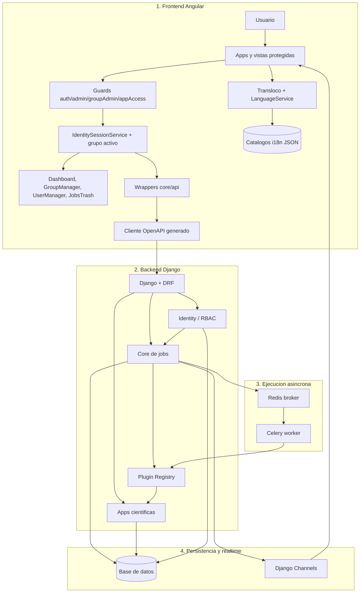
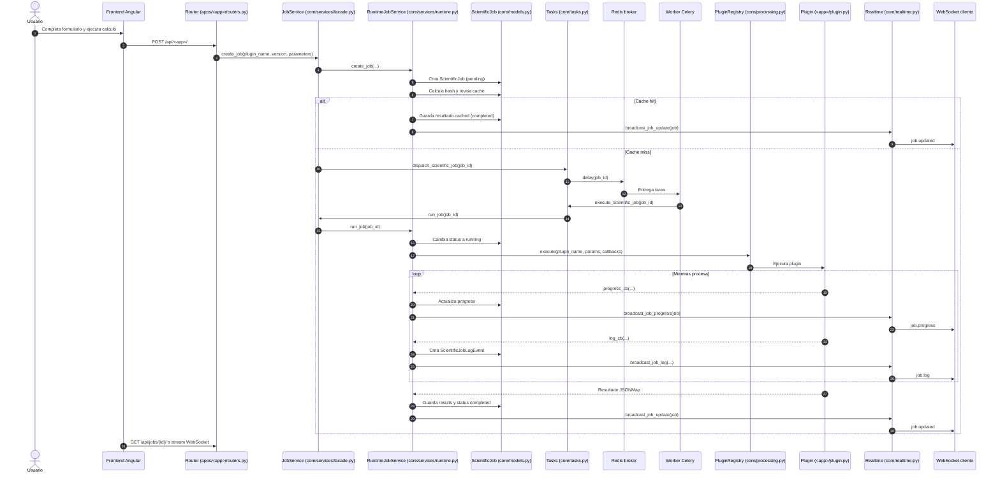
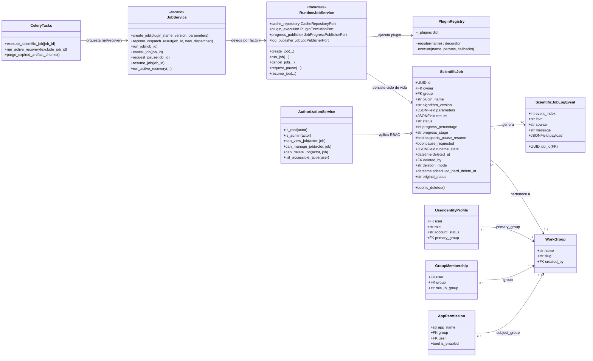
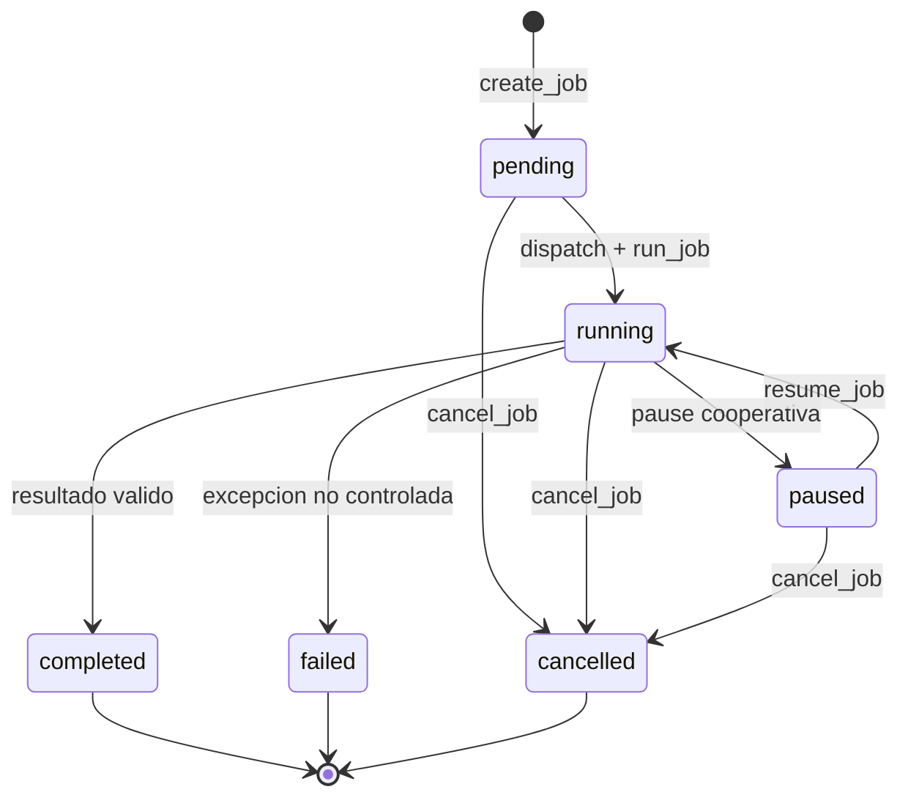
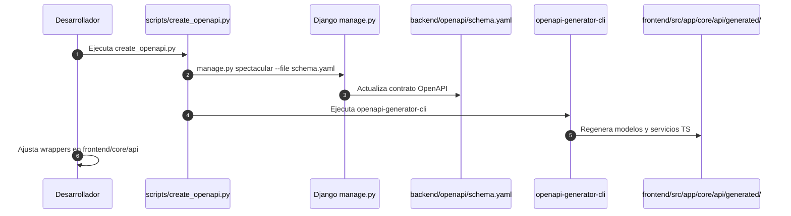
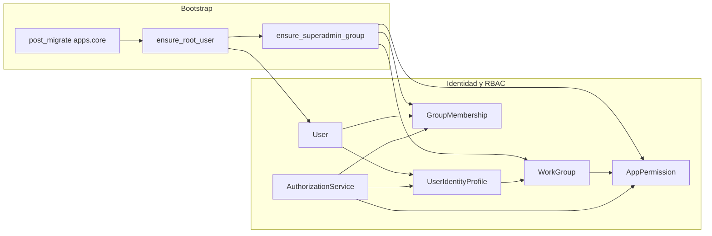
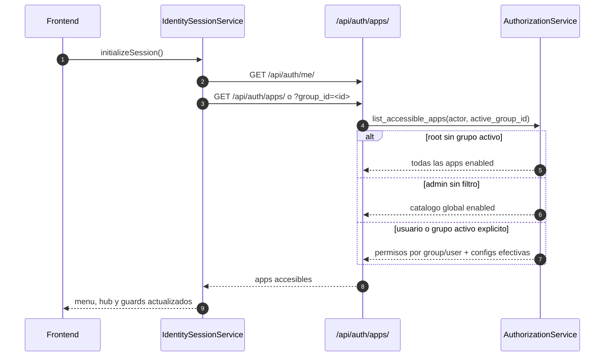
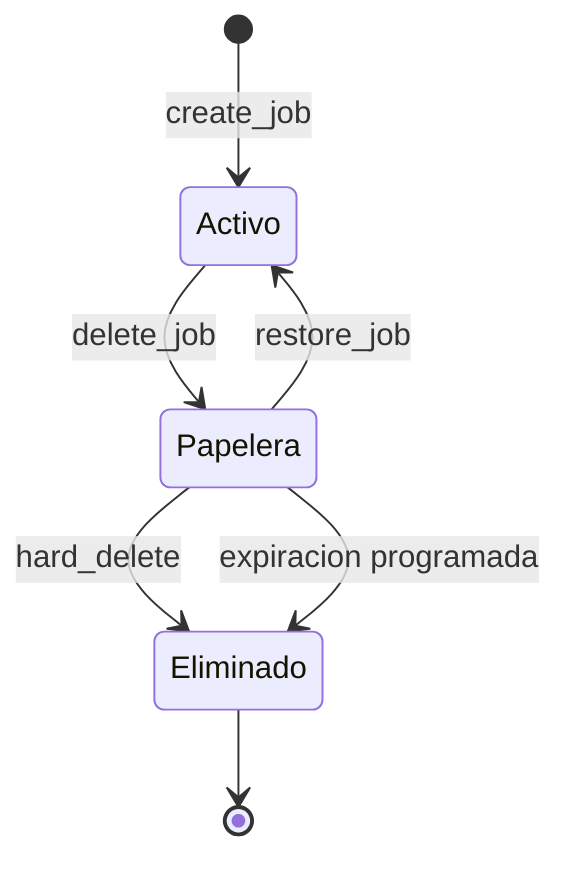

# Chemistry Apps

> **Lectura obligatoria para desarrollo:** `AGENTS.md` es la guía canónica del proyecto (comandos, contratos de plugin, puertos, guards). Este README describe el sistema; para programar, lee `AGENTS.md` primero.

Monorepo de aplicaciones científicas de química. Backend Django 6 + DRF + Celery + Channels con jobs asíncronos reproducibles; frontend Angular 21 standalone que consume contratos OpenAPI. Cada capacidad científica es un plugin independiente registrado en el core sin modificarlo.

## Contenido

1. [Requisitos](#1-requisitos)
2. [Estructura del repositorio](#2-estructura-del-repositorio)
3. [Arquitectura general](#3-arquitectura-general)
4. [Ciclo de vida de un job](#4-ciclo-de-vida-de-un-job)
5. [Core del backend](#5-core-del-backend)
6. [Sistema de plugins](#6-sistema-de-plugins)
7. [Apps científicas](#7-apps-científicas)
8. [Frontend Angular](#8-frontend-angular)
9. [Realtime, caché y artefactos](#9-realtime-caché-y-artefactos)
10. [Inicio rápido local](#10-inicio-rápido-local)
11. [Docker Compose](#11-docker-compose)
12. [Flujo OpenAPI](#12-flujo-openapi)
13. [CI/CD, pruebas y SonarQube](#13-cicd-pruebas-y-sonarqube)
14. [Agregar una nueva app científica](#14-agregar-una-nueva-app-científica)
15. [Convenciones](#15-convenciones)
16. [Autenticación y autorización](#16-autenticación-y-autorización)
17. [Entorno, i18n y papelera](#17-entorno-i18n-y-papelera)
18. [Puertos y URLs](#18-puertos-y-urls)

## 1) Requisitos

| Herramienta | Versión | Uso |
| ----------- | ------- | --- |
| Python / Django | 3.14 / 6.x | Backend, ORM |
| Node.js / npm | 20 / 11 | Frontend |
| Redis | 7 | Broker Celery y resultados |
| Daphne | — | ASGI (HTTP + WebSocket en producción) |

SQLite en dev, PostgreSQL en prod. Docker Compose levanta todo; en nativo basta un Redis externo.

## 2) Estructura del repositorio

```text
chemistry-apps/
├── backend/            # Django 6, DRF, Celery, Channels
│   ├── apps/core/      # Jobs, identidad, RBAC, caché, realtime (nunca importa apps)
│   ├── apps/<app>/     # molar_fractions, tunnel, easy_rate, marcus,
│   │                   # smileit, sa_score, toxicity_properties, cadma_py
│   ├── config/         # settings, urls, celery, asgi
│   └── libs/           # gaussian_log_parser, admet_ai, ambit, brsascore, rdkit_sa
├── frontend/src/app/   # core/ (api, application, auth, i18n, shared),
│                       # dashboard, apps-hub, jobs-monitor, <app>/
└── scripts/            # create_openapi.py, cobertura Sonar
```

Reglas: `core/` nunca importa apps; las apps no se importan entre sí (código común en `backend/libs/`); plugins con nombre único en `PluginRegistry`. Ver `AGENTS.md`.

## 3) Arquitectura general

Cuatro capas: presentación Angular (lazy loading, standalone), contrato OpenAPI generado, orquestación Django (jobs, caché, realtime; sin lógica científica) y ejecución Celery (plugins como funciones puras `JSONMap → JSONMap`).


```mermaid
flowchart TB
  U[Usuario]

  subgraph L1[1. Frontend Angular]
    F[Apps y vistas protegidas]
    AUTH[Guards auth/admin/groupAdmin/appAccess]
    SESSION[IdentitySessionService + grupo activo]
    ADMINUI[Dashboard, GroupManager, UserManager, JobsTrash]
    WRAP[Wrappers core/api]
    GEN[Cliente OpenAPI generado]
    I18N[Transloco + LanguageService]
    LANG[(Catalogos i18n JSON)]

    U --> F
    F --> AUTH
    AUTH --> SESSION
    SESSION --> ADMINUI
    SESSION --> WRAP
    WRAP --> GEN
    F --> I18N
    I18N --> LANG
  end

  subgraph L2[2. Backend Django]
    API[Django + DRF]
    CORE[Core de jobs]
    ID[Identity / RBAC]
    APPS[Apps cientificas]
    REG[Plugin Registry]

    API --> CORE
    API --> ID
    API --> APPS
    CORE --> REG
    REG --> APPS
    ID --> CORE
  end

  subgraph L3[3. Ejecucion asincrona]
    REDIS[Redis broker]
    CELERY[Celery worker]

    CORE --> REDIS
    REDIS --> CELERY
    CELERY --> REG
  end

  subgraph L4[4. Persistencia y realtime]
    DB[(Base de datos)]
    CH[Django Channels]

    CORE --> DB
    APPS --> DB
    ID --> DB
    CORE --> CH
    CH --> F
  end

  GEN --> API
```

Identidad y RBAC (`AuthorizationService`, roles `root/admin/user`, `WorkGroup`, `AppPermission`) filtran jobs por `owner`/`group` sin duplicar lógica en cada app.

## 4) Ciclo de vida de un job

`POST /api/<app>/` → `create_job` (pending) → hash SHA-256 y consulta de caché → hit: `completed` directo; miss: Celery ejecuta el plugin con callbacks de progreso/log/control → `completed`/`failed` (o `paused` cooperativo) → broadcast realtime en cada cambio.


```mermaid
sequenceDiagram
  autonumber
  actor U as Usuario
  participant F as Frontend Angular
  participant R as Router (apps/<app>/routers.py)
  participant JS as JobService (core/services/facade.py)
  participant RJS as RuntimeJobService (core/services/runtime.py)
  participant DB as ScientificJob (core/models.py)
  participant T as Tasks (core/tasks.py)
  participant Redis as Redis broker
  participant WK as Worker Celery
  participant PR as PluginRegistry (core/processing.py)
  participant P as Plugin (<app>/plugin.py)
  participant RT as Realtime (core/realtime.py)
  participant WS as WebSocket cliente

  U->>F: Completa formulario y ejecuta calculo
  F->>R: POST /api/<app>/
  R->>JS: create_job(plugin_name, version, parameters)
  JS->>RJS: create_job(...)
  RJS->>DB: Crea ScientificJob (pending)
  RJS->>DB: Calcula hash y revisa cache

  alt Cache hit
    RJS->>DB: Guarda resultado cached (completed)
    RJS->>RT: broadcast_job_update(job)
    RT->>WS: job.updated
  else Cache miss
    JS->>T: dispatch_scientific_job(job_id)
    T->>Redis: delay(job_id)
    Redis->>WK: Entrega tarea
    WK->>T: execute_scientific_job(job_id)
    T->>JS: run_job(job_id)
    JS->>RJS: run_job(job_id)
    RJS->>DB: Cambia status a running
    RJS->>PR: execute(plugin_name, params, callbacks)
    PR->>P: Ejecuta plugin

    loop Mientras procesa
      P-->>RJS: progress_cb(...)
      RJS->>DB: Actualiza progreso
      RJS->>RT: broadcast_job_progress(job)
      RT->>WS: job.progress
      P-->>RJS: log_cb(...)
      RJS->>DB: Crea ScientificJobLogEvent
      RJS->>RT: broadcast_job_log(...)
      RT->>WS: job.log
    end

    P-->>RJS: Resultado JSONMap
    RJS->>DB: Guarda results y status completed
    RJS->>RT: broadcast_job_update(job)
    RT->>WS: job.updated
  end

  F->>R: GET /api/jobs/{id}/ o stream WebSocket
```

Estados: `pending → running → completed | failed | cancelled`, con pausa cooperativa `running → paused → running`. Si Redis cae al encolar, el job queda en `pending` y `run_active_recovery` lo re-encola al volver el broker.

## 5) Core del backend

`backend/apps/core/` concentra infraestructura transversal: jobs, identidad, caché, artefactos y realtime. `JobService` (fachada) delega en `RuntimeJobService` (orquestación), construido una sola vez vía `build_job_service()` en `factory.py`.

Modelo `ScientificJob` (`core/models.py`): `id` UUID, `plugin_name`, `algorithm_version`, `status`, `parameters`/`results` (JSON), `job_hash` SHA-256, `cache_hit`, `progress_percentage`/`progress_stage`/`progress_message`, `supports_pause_resume`, `pause_requested`, `runtime_state` (checkpoint), `owner`/`group` (FK), `deleted_at`/`deleted_by`/`deletion_mode`/`scheduled_hard_delete_at`/`original_status` (soft delete) y contadores de recuperación (`recovery_attempts`, `last_heartbeat_at`). Logs en `ScientificJobLogEvent`; archivos en `ScientificJobInputArtifact(+Chunk)`.


```mermaid
classDiagram
  direction LR

  class AuthorizationService {
    +is_root(actor)
    +is_admin(actor)
    +can_view_job(actor, job)
    +can_manage_job(actor, job)
    +can_delete_job(actor, job)
    +list_accessible_apps(user)
  }

  class JobService {
    <<facade>>
    +create_job(plugin_name, version, parameters)
    +register_dispatch_result(job_id, was_dispatched)
    +run_job(job_id)
    +cancel_job(job_id)
    +request_pause(job_id)
    +resume_job(job_id)
    +run_active_recovery(...)
  }

  class RuntimeJobService {
    <<dataclass>>
    +cache_repository CacheRepositoryPort
    +plugin_execution PluginExecutionPort
    +progress_publisher JobProgressPublisherPort
    +log_publisher JobLogPublisherPort
    +create_job(...)
    +run_job(...)
    +cancel_job(...)
    +request_pause(...)
    +resume_job(...)
  }

  class PluginRegistry {
    +_plugins dict
    +register(name) decorator
    +execute(name, params, callbacks)
  }

  class CeleryTasks {
    +execute_scientific_job(job_id)
    +run_active_recovery(exclude_job_id)
    +purge_expired_artifact_chunks()
  }

  class ScientificJob {
    +UUID id
    +FK owner
    +FK group
    +str plugin_name
    +str algorithm_version
    +JSONField parameters
    +JSONField results
    +str status
    +int progress_percentage
    +str progress_stage
    +bool supports_pause_resume
    +bool pause_requested
    +JSONField runtime_state
    +datetime deleted_at
    +FK deleted_by
    +str deletion_mode
    +datetime scheduled_hard_delete_at
    +str original_status
    +bool is_deleted()
  }

  class WorkGroup {
    +str name
    +str slug
    +FK created_by
  }

  class UserIdentityProfile {
    +FK user
    +str role
    +str account_status
    +FK primary_group
  }

  class GroupMembership {
    +FK user
    +FK group
    +str role_in_group
  }

  class AppPermission {
    +str app_name
    +FK group
    +FK user
    +bool is_enabled
  }

  class ScientificJobLogEvent {
    +UUID job_id (FK)
    +int event_index
    +str level
    +str source
    +str message
    +JSONField payload
  }

  JobService --> RuntimeJobService : delega por factory
  RuntimeJobService --> PluginRegistry : ejecuta plugin
  RuntimeJobService --> ScientificJob : persiste ciclo de vida
  CeleryTasks --> JobService : orquesta run/recovery
  AuthorizationService --> ScientificJob : aplica RBAC

  ScientificJob "1" --> "0..*" ScientificJobLogEvent : genera
  ScientificJob "0..*" --> "0..1" WorkGroup : pertenece a
  UserIdentityProfile "0..*" --> "0..1" WorkGroup : primary_group
  GroupMembership "0..*" --> "1" WorkGroup : group
  AppPermission "0..*" --> "0..1" WorkGroup : subject_group
```

Puertos/adaptadores: `RuntimeJobService` recibe 4 puertos (caché, ejecución de plugin, progreso, logs) e inyecta adaptadores Django; reemplazables en tests sin mockear ORM/Celery. Tabla de puertos y mapa de archivos del core en `AGENTS.md`.

## 6) Sistema de plugins

Función pura registrada con `@PluginRegistry.register("nombre")` (debe coincidir con `PLUGIN_NAME`). Recibe `(parameters, report_progress, emit_log, request_control_action)` —los callbacks son opcionales por introspección— y retorna `JSONMap`. Contrato completo en `AGENTS.md`.

```python
@PluginRegistry.register("nombre")
def mi_plugin(parameters, report_progress, emit_log, request_control_action):
    report_progress(10, "running", "Iniciando cálculo...")
    ...
    return {"result": value}
```

Pausa cooperativa: la UI marca `pause_requested`; el plugin consulta el callback de control y lanza `JobPauseRequested(checkpoint)`; al reanudar se restaura `runtime_state`. Cada app registra unicidad de plugin/ruta en `ready()` vía `ScientificAppRegistry` (conflicto = `ImproperlyConfigured` en startup).


```mermaid
stateDiagram-v2
  [*] --> pending: create_job
  pending --> running: dispatch + run_job

  running --> paused: pause cooperativa
  paused --> running: resume_job

  pending --> cancelled: cancel_job
  running --> cancelled: cancel_job
  paused --> cancelled: cancel_job

  running --> completed: resultado valido
  running --> failed: excepcion no controlada

  completed --> [*]
  failed --> [*]
  cancelled --> [*]
```

## 7) Apps científicas

| App | Plugin | Qué hace |
| --- | ------ | -------- |
| `molar_fractions` | `molar_fractions` | Fracciones molares f0..fn ácido-base; pH puntual (`single`) o rango (`range`) desde lista de pKa. |
| `tunnel` | `tunnel` | Corrección de efecto túnel asimétrica de Eckart, con traza de ajustes. |
| `easy_rate` | `easy_rate` | Constantes TST + Eckart + difusión opcional desde logs Gaussian; tabla k por T. |
| `marcus` | `marcus` | Transferencia de electrones: λ, ΔG‡ y k desde 6 logs Gaussian (R, P, TS, R+, P+, TS+). |
| `smileit` | `smileit` | Generación combinatoria SMILES (base + bloques de sustituyentes, canonización RDKit, CSV/ZIP). |
| `sa_score` | `sa_score` | SA score 1–10 por lotes SMILES (AMBIT, BRSAScore, RDKit). |
| `toxicity_properties` | `toxicity_properties` | ADMET-AI por lotes: LD50, Ames, DevTox y más. |
| `cadma_py` | `cadma_py` | Ranking de compuestos vs familia de referencia con fórmula configurable (pesos, intervalos ADME). |

Plantilla común: `apps.py`, `definitions.py`, `types.py`, `schemas.py`, `routers.py`, `contract.py`, `plugin.py`, `tests.py`.

**`cadma_py`**: wizard de 4 pasos (familia de referencia → candidatos por Smile-it/jobs previos/CSV → fórmula de ranking → resultados con gráficas). Backend con `CadmaReferenceLibrary` (paper, DOI) y muestras semilla (`neuro`, `rett`); frontend con `CadmaPyWorkflowService` e importador CSV con mapeo de columnas.

## 8) Frontend Angular

Flujo: componente standalone (signals) → workflow service (`core/application/`) → `JobsApiService` (wrapper estable) → cliente OpenAPI generado → HTTP/SSE/WebSocket. Nunca se importa `generated/` desde componentes. Detalle de capas, guards y workflow base en `AGENTS.md`.

Rutas: `/apps` (hub y landing post-login), `/jobs`, `/jobs/trash` (admin), `/admin/groups`, `/admin/users` y una por app (`/molar-fractions`, `/tunnel`, `/easy-rate`, `/marcus`, `/smileit`, `/sa-score`, `/toxicity-properties`, `/cadma-py`), protegidas por `authGuard`/`appAccessGuard`. `/dashboard` es redirect de compatibilidad a `/apps`. Catálogo en `SCIENTIFIC_APP_DEFINITIONS`; deep-linking con `?jobId=<uuid>`. Observabilidad vía `jobs-streaming-api.service.ts` (SSE, WebSocket, polling). i18n con Transloco (ver §17).

## 9) Realtime, caché y artefactos

WebSocket `ws/jobs/stream/` con filtros opcionales (`job_id`, `plugin_name`, `include_logs`, `include_snapshot`, `active_only`); SSE alternativo `GET /api/jobs/{id}/events/`. Broadcast en 3 grupos Channels: global, por plugin y por job. Eventos: `jobs.snapshot`, `job.updated`, `job.progress`, `job.log`.

Caché determinista: SHA-256 de (`plugin_name`, versión, parámetros ordenados, firmas de archivos). Hit → `completed` con `cache_hit=True` sin encolar; al completar se guarda si el payload cabe en el límite por plugin.

Artefactos (`easy_rate`, `marcus`): upload multipart → chunks en DB (`ScientificInputArtifactStorageService`) → el plugin reconstruye en memoria. Archivos grandes con TTL y purga diaria; metadatos siempre trazables. Parser Gaussian en `backend/libs/gaussian_log_parser/` (ver docstrings del módulo).

## 10) Inicio rápido local

```bash
cd backend && poetry install --with dev --no-interaction
poetry run python manage.py migrate && poetry run python manage.py up  # API + worker
cd frontend && npm install && npm start  # http://localhost:4200
```

`up --without-celery` levanta solo la API (jobs quedan en `pending`). Verificar: `curl http://localhost:8000/api/schema/` y abrir `/login` (redirige a `/dashboard`). Beat opcional para tareas periódicas. Comandos de test/lint por capa en `AGENTS.md`.

## 11) Docker Compose

```bash
docker compose -f docker-compose.dev.yml up --build
```

Servicios: `redis`, `backend` (migrate + API sin worker), `celery-worker`, `celery-beat`, `frontend` (hot reload). `docker-compose.yml` es la variante de producción (sin hot reload, por variables de entorno). Si falta el JAR de AMBIT, el backend intenta descargarlo una vez; sin él solo fallan las rutas AMBIT.

## 12) Flujo OpenAPI

Contrato generado con drf-spectacular (`@extend_schema`) → `scripts/create_openapi.py` → cliente TS. `generated/` no se edita; cambios de llamada van en wrappers `core/api/`.


```mermaid
sequenceDiagram
  autonumber
  participant DEV as Desarrollador
  participant SCRIPT as scripts/create_openapi.py
  participant DJANGO as Django manage.py
  participant SPEC as backend/openapi/schema.yaml
  participant GEN as openapi-generator-cli
  participant CLIENT as frontend/src/app/core/api/generated/

  DEV->>SCRIPT: Ejecuta create_openapi.py
  SCRIPT->>DJANGO: manage.py spectacular --file schema.yaml
  DJANGO->>SPEC: Actualiza contrato OpenAPI
  SCRIPT->>GEN: Ejecuta openapi-generator-cli
  GEN->>CLIENT: Regenera modelos y servicios TS
  DEV->>DEV: Ajusta wrappers en frontend/core/api
```

## 13) CI/CD, pruebas y SonarQube

Tres workflows: `ci-deploy.yml` (valida backend `manage.py test` + frontend `npm run build`; en `main` encadena build+deploy), `build.yml` (imágenes y bundle de release), `deploy.yml` (SCP + SSH + compose). Secrets de VM/DB/Django/CORS en el workflow. Despliegue manual: `migrate` + `daphne config.asgi:application` + worker + beat + `npm run build` servido por Nginx.

Tests: backend `manage.py test` (plugins se prueban directo con callbacks mock; Channels en memoria), frontend Vitest (`npm test`, cobertura `test:coverage:ci`). SonarQube en `localhost:9000` (`chemistry-apps`); generar antes `bash scripts/generate_sonar_coverage.sh`. Cobertura ~79.5% backend, ~82.6% frontend. Comandos exactos en `AGENTS.md`.

## 14) Agregar una nueva app científica

1. Crear `backend/apps/<nombre>/` con los 8 archivos plantilla (§7).
2. Registrar en `apps.py` (`ScientificAppRegistry`) + import del plugin en `ready()`.
3. Añadir a `INSTALLED_APPS` y al router en `config/urls.py`.
4. Implementar plugin puro con progreso/logs y `return JSONMap`.
5. Validar: `manage.py check`, `test apps.<nombre>`, regenerar OpenAPI.
6. Frontend: definición en `scientific-apps.config.ts` + ruta lazy + componente con `JobsApiService`.

Ver `AGENTS.md` para el código exacto de cada paso.

## 15) Convenciones

Plugins puros (sin HTTP/ORM); validación en serializers DRF; `TypedDict`s como contrato vivo; sin imports entre apps (común en `libs/`); archivos de 200–400 líneas; tipado estricto sin `Any`/`@ts-ignore` injustificado; OpenAPI como fuente de verdad; migraciones antes de desplegar. Frontend: standalone, signals, `@if`/`@for`, `input()`/`output()`, sin `any` ni acceso a `generated/`.

## 16) Autenticación y autorización

JWT (`access` 30 min, `refresh` 7 días con rotación): `POST /api/auth/login/` → `localStorage` → `IdentitySessionService` (`/api/auth/me/`, `/api/auth/apps/`) → refresco proactivo. `AuthorizationService` centraliza RBAC: roles `root/admin/user`, `WorkGroup` + `GroupMembership`, `AppPermission` (un solo sujeto: grupo o usuario). Guards y reglas operativas por rol en `AGENTS.md`.


```mermaid
flowchart LR
  subgraph Bootstrap
    MIGRATE[post_migrate apps.core]
    ROOT[ensure_root_user]
    SUPER[ensure_superadmin_group]
  end

  subgraph Dominio[Identidad y RBAC]
    USER[User]
    PROFILE[UserIdentityProfile]
    GROUP[WorkGroup]
    MEMBER[GroupMembership]
    PERM[AppPermission]
    AUTHZ[AuthorizationService]
  end

  MIGRATE --> ROOT --> SUPER
  SUPER --> GROUP
  SUPER --> MEMBER
  SUPER --> PERM
  ROOT --> USER
  USER --> PROFILE
  PROFILE --> GROUP
  USER --> MEMBER
  GROUP --> PERM
  AUTHZ --> PROFILE
  AUTHZ --> MEMBER
  AUTHZ --> PERM
```

Bootstrap tras `migrate` (`post_migrate`): root idempotente (default `admin123`, cambiar en entornos reales), grupo `Superadmin` con permisos de todas las apps. Manual: `manage.py ensure_root_user`. Catálogo visible resuelto por `list_accessible_apps(actor, grupo_activo)`.


```mermaid
sequenceDiagram
  autonumber
  participant UI as Frontend
  participant SS as IdentitySessionService
  participant API as /api/auth/apps/
  participant AZ as AuthorizationService

  UI->>SS: initializeSession()
  SS->>API: GET /api/auth/me/
  SS->>API: GET /api/auth/apps/ o ?group_id=<id>
  API->>AZ: list_accessible_apps(actor, active_group_id)
  alt root sin grupo activo
    AZ-->>API: todas las apps enabled
  else admin sin filtro
    AZ-->>API: catalogo global enabled
  else usuario o grupo activo explicito
    AZ-->>API: permisos por group/user + configs efectivas
  end
  API-->>SS: apps accesibles
  SS-->>UI: menu, hub y guards actualizados
```

Jobs llevan `owner`/`group`: root ve y gestiona todo; admin gestiona en su alcance; user gestiona lo propio. La decisión final siempre es del backend.

## 17) Entorno, i18n y papelera

**Entorno**: `settings.py` carga `backend/.env` (prioridad: sistema > `.env` > defaults). Claves: `DJANGO_SECRET_KEY/DEBUG/ALLOWED_HOSTS`, `ROOT_USERNAME/PASSWORD/BOOTSTRAP_EMAIL`, `OPENAPI_SERVER_URLS`, `USE_INMEMORY_CHANNEL_LAYER`. Frontend solo define `apiBaseUrl` por entorno. Mínimo local: `DEBUG=true`, hosts locales y credencial root.

**i18n**: Transloco con catálogos lazy en `public/i18n/` (8 idiomas: `en es fr ru zh-CN hi de ja`, default `en`, preferencia en `localStorage`). Nuevo idioma: añadir JSON + entrada en `supported-languages.ts`.

**Papelera**: soft delete (`deleted_at`, `deleted_by`, `deletion_mode`, `scheduled_hard_delete_at`, `original_status`). `DELETE /api/jobs/{id}/` envía a papelera; restauración para admin/root; borrado definitivo para root; expiración automática.


```mermaid
stateDiagram-v2
  [*] --> Activo: create_job
  Activo --> Papelera: delete_job
  Papelera --> Activo: restore_job
  Papelera --> Eliminado: hard_delete
  Papelera --> Eliminado: expiracion programada
  Eliminado --> [*]
```

Vista `/jobs/trash` (`adminGuard`) con filtros, restauración y borrado permanente vía `JobsMonitorFacadeService`.

## 18) Puertos y URLs

| Servicio | URL |
| -------- | --- |
| Backend API | `http://localhost:8000` |
| Frontend | `http://localhost:4200` |
| Schema OpenAPI | `http://localhost:8000/api/schema/` |
| WebSocket | `ws://localhost:8000/ws/jobs/stream/` |
| SonarQube | `http://localhost:9000` |
